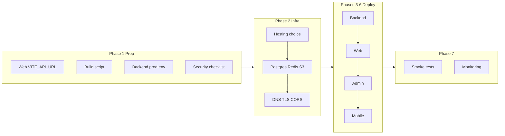

# Go-Live Deployment Plan

## Current state

| Component          | Status          | Notes                                                                                                                         |
| ------------------ | --------------- | ----------------------------------------------------------------------------------------------------------------------------- |
| **Backend**        | Ready           | Spring Boot, prod profile, Dockerfile correct for monorepo ([Dockerfile](Dockerfile))                                         |
| **Web**            | Config gap      | Uses [config/api.config.ts](config/api.config.ts) `DEFAULT_API_BASE_URL` (localhost); no `VITE_`* build-time override         |
| **Admin**          | Ready           | `NEXT_PUBLIC_API_URL` at build time; [build-production.sh](scripts/build-production.sh) passes it                             |
| **Mobile**         | Ready           | Release uses `TAMIXA_API_BASE_URL` / `TAMIXA_WEB_APP_URL` ([composeApp/build.gradle.kts](mobile/composeApp/build.gradle.kts)) |
| **CI**             | Build/test only | [.github/workflows/ci.yml](.github/workflows/ci.yml) runs backend + web + admin build; no deploy jobs                         |
| **Docker Compose** | Staging         | [docker-compose.yml](docker-compose.yml) uses dev profile and `POSTGRES_`*; prod needs `DATABASE_`* on host                   |

---

## Phase 1: Pre-deployment readiness

### 1.1 Fix web production API URL

The web app reads API base from [config/api.config.ts](config/api.config.ts) (hardcoded `http://localhost:8080`). For production builds it must use the API URL at build time.

- **Option A:** In [config/api.config.ts](config/api.config.ts), export a value that in Vite/build context reads `import.meta.env.VITE_API_URL` with fallback to `DEFAULT_API_BASE_URL`. Ensure [web/vite.config.ts](web/vite.config.ts) and [web/src/lib/api.ts](web/src/lib/api.ts) use it (web imports from `config/`).
- **Option B:** Keep config as-is and document that production builds must run from a fork that sets the base URL in config (not ideal).

Recommend **Option A**: add `VITE_API_URL` support and set it in [scripts/build-production.sh](scripts/build-production.sh) for web (e.g. `VITE_API_URL="$API_URL" npm run build` in the web step).

### 1.2 Production build script

- [scripts/build-production.sh](scripts/build-production.sh): For the web step, pass `VITE_API_URL="$API_URL"` (or `VITE_API_BASE_URL`) when calling `npm run build` so the web bundle points to the production API.
- Ensure [admin](admin) build receives `NEXT_PUBLIC_API_URL` (already does via script).

### 1.3 Backend production env (required)

From [docs/DEPLOYMENT_CHECKLIST.md](docs/DEPLOYMENT_CHECKLIST.md), [docs/PRODUCTION_UPGRADE.md](docs/PRODUCTION_UPGRADE.md), and [application-prod.yml](backend/src/main/resources/application-prod.yml):

| Variable                                                               | Required    | Purpose                                                                                  |
| ---------------------------------------------------------------------- | ----------- | ---------------------------------------------------------------------------------------- |
| `SPRING_PROFILES_ACTIVE`                                               | Yes         | Set to `prod`                                                                            |
| `JWT_SECRET`                                                           | Yes         | ≥256 bits; startup fails in prod if default                                              |
| `CORS_ALLOWED_ORIGINS`                                                 | Yes         | Comma-separated, e.g. `https://app.tamixa.com,https://admin.tamixa.com` (no `*` in prod) |
| `DATABASE_URL`                                                         | Yes         | Full JDBC URL                                                                            |
| `DATABASE_USERNAME` / `DATABASE_PASSWORD`                              | Yes         | DB credentials                                                                           |
| `OPENAI_API_KEY` / `GEMINI_API_KEY`                                    | Per config  | Story generation per `AI_LLM_PROVIDER`; translation per `TRANSLATION_PROVIDER`; Gemini covers / Veo when enabled |
| `VOICE_ENCRYPTION_KEY`                                                 | Yes         | 32-byte Base64 AES for voice embeddings                                                  |
| `TRANSLATION_PROVIDER`                                                 | Prod        | Set to `openai` (not simulated)                                                          |
| `REDIS_HOST` / `REDIS_PORT`                                            | If used     | Redis for caches                                                                         |
| `S3_BUCKET`, `S3_REGION`, `AWS_ACCESS_KEY_ID`, `AWS_SECRET_ACCESS_KEY` | If using S3 | Audio/storage; or `STORAGE_TYPE` alternative                                             |
| `MAGIC_LINK_BASE_URL`                                                  | Yes         | e.g. `https://app.tamixa.com`                                                            |
| `SEED_ADMIN_ENABLED`                                                   | Prod        | `false`                                                                                  |
| `DEV_OTP_CODE`                                                         | Prod        | Unset or remove                                                                          |

Optional: Kafka (`KAFKA_BOOTSTRAP_SERVERS`), Stripe/Zoho, SendGrid, TTS/narration keys. See [.env.example](.env.example) and backend docs.

### 1.4 Security checklist (from [docs/SECURITY.md](docs/SECURITY.md))

- Strong `JWT_SECRET`; no default in prod  
- `CORS_ALLOWED_ORIGINS` explicit; no `*` with credentials  
- `SEED_ADMIN_ENABLED=false`  
- `DEV_OTP_CODE` unset in prod  
- Stripe/Zoho webhook secrets set and kept secret  
- Secrets from env/secrets manager, not committed

---

## Phase 2: Infrastructure and hosting

### 2.1 Choose hosting (one strategy)

| Option        | Backend                    | Web                    | Admin                    | DB / Redis / Kafka                                          |
| ------------- | -------------------------- | ---------------------- | ------------------------ | ----------------------------------------------------------- |
| **Railway**   | Deploy Docker              | Static or service      | Service                  | Managed Postgres + Redis; Kafka → Confluent Cloud if needed |
| **Render**    | Docker or native           | Static site            | Web service              | Managed Postgres + Redis                                    |
| **Fly.io**    | Fly app                    | Static / edge          | Fly app                  | Fly Postgres; Redis/Kafka external or Fly                   |
| **AWS / GCP** | ECS, Cloud Run, or EKS/GKE | S3+CloudFront / static | Same or separate service | RDS/Cloud SQL, ElastiCache/Memorystore, MSK/Pub-Sub         |

Decide up front so env vars and DNS are consistent.

### 2.2 Provision

- **PostgreSQL:** Production instance; run Flyway (backend startup) or apply migrations manually once.
- **Redis:** If the app uses Redis in prod (sessions/cache), provision and set `REDIS_HOST`/`REDIS_PORT`.
- **Kafka:** Optional for MVP; if deferred, story generation can stay synchronous; create topics when enabling (see [docs/DEPLOYMENT_CHECKLIST.md](docs/DEPLOYMENT_CHECKLIST.md) §6).
- **S3 (or equivalent):** Bucket and IAM for audio/assets; set `S3`_* and `AWS_`* (or equivalent).
- **Domains and TLS:** e.g. `api.tamixa.com`, `app.tamixa.com`, `admin.tamixa.com`; TLS at load balancer or reverse proxy.

### 2.3 DNS and CORS

- Point `api.`* to backend, `app.`* to web, `admin.`* to admin.
- Set `CORS_ALLOWED_ORIGINS` to exact web and admin origins (e.g. `https://app.tamixa.com,https://admin.tamixa.com`).
- Set `MAGIC_LINK_BASE_URL` to the web app URL (e.g. `https://app.tamixa.com`).

---

## Phase 3: Deploy backend

1. **Build image:** From repo root, `docker build -t tamixa-backend:prod .` (uses [Dockerfile](Dockerfile) and `backend/`).
2. **Run with prod env:** Pass all required env vars (no `POSTGRES_`* for prod; use `DATABASE_URL`, `DATABASE_USERNAME`, `DATABASE_PASSWORD`). Set `SPRING_PROFILES_ACTIVE=prod`.
3. **Expose:** Single port (e.g. 8080) behind HTTPS (termination at LB or reverse proxy).
4. **Health:** Configure readiness/liveness to use `/actuator/health` and `/actuator/health/readiness` (already enabled).
5. **Verify:** `curl https://api.tamixa.com/actuator/health` and optionally run a quick login/register against the API.

---

## Phase 4: Deploy web app

1. **Build:** From repo root, `API_URL=https://api.tamixa.com ./scripts/build-production.sh --web-only` (after Phase 1.1–1.2, so `VITE_API_URL` is set). Or from `web/`: `VITE_API_URL=https://api.tamixa.com npm run build`.
2. **Host:** Deploy `web/dist/` to static hosting (Vercel, Netlify, Cloudflare Pages, S3+CloudFront, or nginx).
3. **Routing:** SPA fallback: all routes serve `index.html`; static assets from `dist/`.
4. **Verify:** Open `https://app.tamixa.com`, login/register, and confirm API calls go to `https://api.tamixa.com`.

---

## Phase 5: Deploy admin dashboard

1. **Build:** `API_URL=https://api.tamixa.com ./scripts/build-production.sh --admin-only` (sets `NEXT_PUBLIC_API_URL`).
2. **Host:** Deploy as Node/Next.js app (Vercel, Render, Fly, or Docker) or static export if applicable. Restrict access (e.g. VPN or IP allowlist) so only admins can reach it.
3. **Verify:** Log in with a user that has `ADMIN` role; confirm dashboard and API calls work ([admin/DEPLOYMENT.md](admin/DEPLOYMENT.md)).

---

## Phase 6: Mobile release (Android)

1. **Release build:**
  `./gradlew :composeApp:assembleRelease -PTAMIXA_API_BASE_URL=https://api.tamixa.com -PTAMIXA_WEB_APP_URL=https://app.tamixa.com`  
   (or use [scripts/build-production.sh](scripts/build-production.sh) `--mobile-only` with `API_URL` set).
2. **Signing:** Configure release signing in [mobile/composeApp/build.gradle.kts](mobile/composeApp/build.gradle.kts) (keystore, key alias, passwords); produce signed AAB/APK.
3. **Distribute:** Upload to Play Console (internal track first recommended); or distribute signed APK for side-loading.
4. **Verify:** Install build, complete register → add child → generate story → play audio; open “Manage” subscription and confirm it opens `https://app.tamixa.com/subscription`.

---

## Phase 7: Post-deploy verification and monitoring

### 7.1 Smoke tests

- **Backend:** `curl` health and readiness; test login/register and one protected endpoint.
- **Web:** Register → Login → Dashboard → Add child → Generate story → Play → Subscription → Logout ([docs/DEPLOYMENT_CHECKLIST.md](docs/DEPLOYMENT_CHECKLIST.md) §4).
- **Admin:** Login (ADMIN) → Dashboard → Parents / Curated stories / Subscriptions.
- **Mobile:** Same flow as Phase 6 verify; ensure API and web URLs are production.

Optional: Run Playwright smoke tests against staging/prod URLs ([e2e/README.md](e2e/README.md)) with `WEB_BASE_URL` and `ADMIN_BASE_URL` set to production (or a staging copy).

### 7.2 Monitoring and rollback

- **Health:** Use actuator health (and Prometheus if enabled) for alerts.
- **Uptime:** External checks (e.g. UptimeRobot) on `https://api.tamixa.com/actuator/health`.
- **Errors:** Optional: Sentry or similar for backend and frontends.
- **Rollback:** Keep previous Docker image and deploy artifacts; document rollback steps (redeploy previous image, revert DNS if needed).

---

## Phase 8: Optional CI/CD deploy

- Add a deploy job in [.github/workflows/ci.yml](.github/workflows/ci.yml) (e.g. on push to `main` or on tag) that:
  - Builds backend Docker image and pushes to a registry.
  - Builds web and admin with production API URL and deploys to chosen host (e.g. Vercel/Render/Fly).
- Use GitHub secrets for `API_URL`, `JWT_SECRET`, `DATABASE`_*, and other secrets; never log them.
- Keep deploy steps idempotent and reversible (e.g. blue/green or versioned deploys).

---

## High-level flow

---

## File reference

| Purpose               | File(s)                                                                                            |
| --------------------- | -------------------------------------------------------------------------------------------------- |
| Backend prod config   | [backend/src/main/resources/application-prod.yml](backend/src/main/resources/application-prod.yml) |
| Backend Docker build  | [Dockerfile](Dockerfile)                                                                           |
| Full backend env list | [.env.example](.env.example), [docs/DEPLOYMENT_CHECKLIST.md](docs/DEPLOYMENT_CHECKLIST.md) §2                |
| Web API base          | [config/api.config.ts](config/api.config.ts) (add VITE_ support)                                   |
| Production build      | [scripts/build-production.sh](scripts/build-production.sh)                                         |
| Admin deploy          | [admin/DEPLOYMENT.md](admin/DEPLOYMENT.md)                                                         |
| Security              | [docs/SECURITY.md](docs/SECURITY.md)                                                                         |
| E2E smoke             | [e2e/README.md](e2e/README.md)                                                                     |

---

## Risks and mitigations

- **Kafka not ready:** Use synchronous story generation; add Kafka and topics later ([DEPLOYMENT_PLAN_3_DAYS.md](DEPLOYMENT_PLAN_3_DAYS.md)).
- **S3 not configured:** Audio streaming may fail; set `S3`** and `AWS`** (or equivalent) before go-live.
- **Play Store review delay:** Use internal testing track for launch; production track when approved.
- **Web pointing to wrong API:** Implement Phase 1.1 so production web build always uses `VITE_API_URL`.

