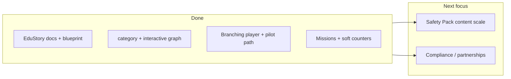

# What next: after EduStory documentation

## Where you are

- **Documentation:** [docs/EDUSTORY_PRODUCT_VISION.md](docs/EDUSTORY_PRODUCT_VISION.md) (simulator §3, ecosystem §3.9), [docs/EDUSTORY_INDIA_PROBLEMS_AND_FEATURES.md](docs/EDUSTORY_INDIA_PROBLEMS_AND_FEATURES.md), [docs/EDUSTORY_CONTENT_MATRIX_AND_ROADMAP.md](docs/EDUSTORY_CONTENT_MATRIX_AND_ROADMAP.md) (engineering §8, twelve-month §10), [docs/EDUSTORY_VALUES_AND_PRINCIPLES.md](docs/EDUSTORY_VALUES_AND_PRINCIPLES.md), [docs/admin/EDUSTORY_SIMULATOR_CONTENT_BLUEPRINT.md](docs/admin/EDUSTORY_SIMULATOR_CONTENT_BLUEPRINT.md) (authoring), [docs/admin/EDU_METADATA_CONVENTIONS.md](docs/admin/EDU_METADATA_CONVENTIONS.md) (taxonomy, `interactive_graph`).
- **Code today (high level):** Library stories carry **category/theme** and optional `**interactive_graph`** JSON; admin can edit graphs; mobile parses `interactiveGraph` and runs **branching playback** in the edu flow (`[ModelStory.kt](mobile/composeApp/src/commonMain/kotlin/com/tamixa/domain/ModelStory.kt)`, `[TamixaNavHost.kt](mobile/composeApp/src/commonMain/kotlin/com/tamixa/navigation/TamixaNavHost.kt)`). Post-episode **missions** and **life-skill choice** APIs follow [EDU_METADATA_CONVENTIONS.md](docs/admin/EDU_METADATA_CONVENTIONS.md).

## Recommended sequence (90-day focus)

### 1. Product and data conventions (1–2 weeks)

- **Define allowed values** for `category` (and/or theme prefixes) for **Fun**, **Edu**, and future **simulator** series—document in repo (short `docs/admin/EDU_METADATA_CONVENTIONS.md` or appendix in matrix §8).
- **Admin:** enforce or suggest values (dropdown/validation) when saving library stories so content ops do not drift.
- **Mobile (first):** explicit **Edu** entry point (tab or filter) aligned with docs §3.9 priority: **Safety Pack** discoverable separately from Fun.

### 2. Branching MVP (weeks 2–6)

- **Design:** decision graph storage—options: JSON column on library story / new `library_story_segment` (or episode) table with `next_on_choice_a/b/c` and asset URLs; align with [backend/NARRATION_ARCHITECTURE.md](docs/backend/NARRATION_ARCHITECTURE.md) for stream URLs per segment.
- **Player:** pause at chapter end → choice overlay (WhatsApp-style for scam pilot per vision §3.1) → request next segment URL.
- **CMS/admin:** minimal editor for one pilot story tree (electricity/customer-care scam pattern per matrix §10 checklist).

### 3. “Painkiller” content + offline bridge (parallel)

- **Content:** one **~5 min** interactive **scam-theater** pilot in **1–2 languages** before scaling to 5×3.
- **Family mission card v0:** static text after episode (from CMS field), no ML—matches [EDUSTORY_PRODUCT_VISION.md](docs/EDUSTORY_PRODUCT_VISION.md) §3.9.1.
- **Printable decision journal:** v0 = PDF template linked from story metadata or static marketing page.

### 4. Life bars beta (after pilot works)

- **Backend:** store per-child (or per-profile) **soft counters** or **flags** updated from tagged choice outcomes—keep mapping **author-defined** (vision §3.2); **no** parent-facing fake percentages until legal/product review.

### 5. Compliance and partnerships (ongoing)

- **Helplines** on mental-health-adjacent Edu: verify numbers before UI ([EDUSTORY_INDIA_PROBLEMS_AND_FEATURES.md](docs/EDUSTORY_INDIA_PROBLEMS_AND_FEATURES.md) §10).
- **Badges / NGO “verify”:** no public claims until contracts ([EDUSTORY_VALUES_AND_PRINCIPLES.md](docs/EDUSTORY_VALUES_AND_PRINCIPLES.md) §4).

## What not to do yet

- Full **dual POV + bridge report**, **heritage story-builder**, and **dialect AI** at scale—defer until **scam pilot + missions** prove completion and trust (per your own §3.9 sequencing).

## Optional immediate actions (no code)

- **Hire/interim:** interactive narrative designer for **decision trees** (matrix §10 checklist).
- **Internal:** one-page “MVP scope” from §10 Phase A only, for engineering sizing.

## If you want a different “next”

Say whether the priority is **mobile Edu lane only**, **admin metadata only**, or **full branching spike**—that changes the first sprint scope.