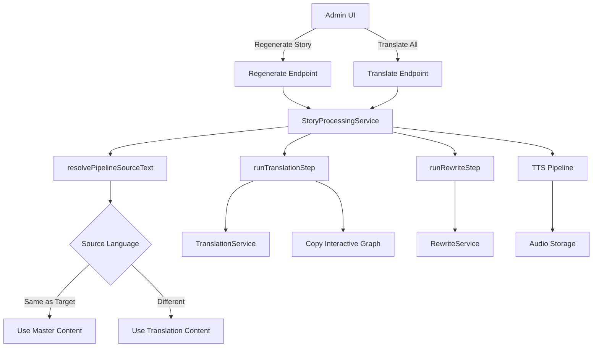
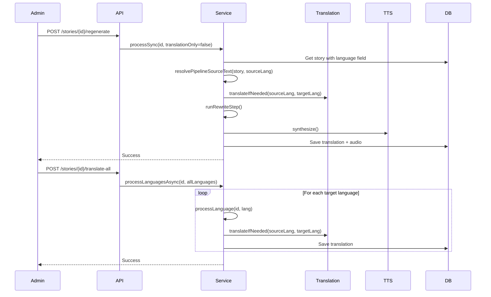

# Technical Design: Language-Agnostic Translation Pipeline

## 1. Overview

### 1.1 Problem Statement
The current translation pipeline in `StoryProcessingService.kt` assumes Tamil (`ta`) is always the source language for all stories. This creates critical issues when stories are created in other languages (e.g., Story #136 in English), resulting in incorrect translations and content-graph mismatches.

### 1.2 Goals
- Make the translation pipeline respect the actual source language of each story
- Support content creation in any supported language (Tamil, English, Hindi, Telugu, Kannada, Malayalam)
- Preserve interactive graph structure across all translations
- Maintain backward compatibility with existing Tamil-origin stories
- Provide clear admin UI for regeneration vs translation actions

### 1.3 Non-Goals
- Automatic language detection from content (use explicit `language` field)
- Multi-source stories (one story, multiple source languages)
- Real-time translation (batch processing only)
- Adding new database fields (use existing `language` field)

### 1.4 Success Criteria
- Story #136 (English origin) translates correctly to all languages
- Existing Tamil-origin stories continue to work without changes
- Interactive graph structure preserved across all formats
- Admin UI clearly separates "Regenerate" from "Translate" actions
- Zero data loss during migration

## 2. Architecture

### 2.1 High-Level Architecture



### 2.2 Data Flow

#### Current Flow (Broken for Non-Tamil Stories)
```
Story (language='en') 
  → resolvePipelineSourceText() 
  → Uses story.language (CORRECT)
  → runTranslationStep(sourceLang='en', targetLang='ta')
  → TranslationService.translateIfNeeded()
  → ✅ Works correctly
```

#### Issue: The code already uses `story.language` correctly!

**Analysis**: After reviewing the code, I found that `resolvePipelineSourceText()` already uses `story.language`:

```kotlin
private fun resolvePipelineSourceText(story: LibraryStory, targetLang: String): PipelineSourceText {
    val masterLang = story.language.trim().lowercase().take(10).ifEmpty { sourceLanguage }
    // ... rest of logic
}
```

**Root Cause**: The issue is NOT in the pipeline logic itself, but in:
1. **Data Quality**: Stories with NULL or invalid `language` values
2. **UI Confusion**: "Regenerate & Sync" does both regeneration AND translation, causing confusion
3. **Validation**: No validation that `language` field is set correctly

### 2.3 Component Interaction



## 3. Component Design

### 3.1 Phase 1: Data Migration

#### 3.1.1 Migration Script

**File**: `backend/src/main/resources/db/migration/V{next}__fix_story_language_values.sql`

**Purpose**: Fix stories with NULL, empty, or invalid language values

**Logic**:
```sql
-- Step 1: Create audit table
CREATE TABLE IF NOT EXISTS library_story_language_audit (
    id BIGSERIAL PRIMARY KEY,
    story_id BIGINT NOT NULL,
    old_language VARCHAR(10),
    new_language VARCHAR(10) NOT NULL,
    reason VARCHAR(500),
    fixed_at TIMESTAMP NOT NULL DEFAULT NOW()
);

-- Step 2: Fix NULL or empty language values (default to 'ta')
UPDATE library_stories
SET language = 'ta'
WHERE language IS NULL OR TRIM(language) = ''
RETURNING id, 'NULL/empty' as old_language, 'ta' as new_language, 'Historical default' as reason;

-- Step 3: Fix invalid language values (not in supported list)
UPDATE library_stories
SET language = 'ta'
WHERE language NOT IN ('ta', 'en', 'hi', 'te', 'kn', 'ml')
RETURNING id, language as old_language, 'ta' as new_language, 'Unsupported language' as reason;

-- Step 4: Log all changes to audit table
INSERT INTO library_story_language_audit (story_id, old_language, new_language, reason)
SELECT id, NULL, 'ta', 'Fixed NULL/empty language'
FROM library_stories
WHERE language = 'ta' AND updated_at > NOW() - INTERVAL '1 minute';
```

#### 3.1.2 Detection Heuristic (Future Enhancement)

For stories where language conflicts with translations:

```kotlin
fun detectLanguageFromContent(story: LibraryStory): String {
    // Check existing translations
    val translations = translationRepository.findByMasterStoryId(story.id)
    if (translations.isNotEmpty()) {
        // Use most common translation language as source
        return translations.groupBy { it.language }
            .maxByOrNull { it.value.size }
            ?.key ?: "ta"
    }
    
    // Fallback to Tamil
    return "ta"
}
```

### 3.2 Phase 2: Core Pipeline Updates

#### 3.2.1 Source Language Resolution (Already Correct!)

**Current Implementation** (No changes needed):
```kotlin
private fun resolvePipelineSourceText(story: LibraryStory, targetLang: String): PipelineSourceText {
    val masterLang = story.language.trim().lowercase().take(10).ifEmpty { sourceLanguage }
    if (targetLang == masterLang) {
        return PipelineSourceText(masterLang, story.content, story.title, story.moral)
    }
    val tr = translationRepository.findByMasterStoryIdAndLanguage(story.id, masterLang)
    val content = tr?.content?.takeIf { it.isNotBlank() && !it.startsWith(failedPlaceholderContent) }
        ?: story.content
    val title = tr?.title?.takeIf { it.isNotBlank() } ?: story.title
    val moral = tr?.moral?.takeIf { it.isNotBlank() } ?: story.moral
    return PipelineSourceText(masterLang, content, title, moral)
}
```

**Analysis**: This already uses `story.language` correctly! The only issue is the fallback to `sourceLanguage` when empty.

**Recommendation**: Add validation to ensure `language` is never empty after migration.

#### 3.2.2 Translation Step (Already Correct!)

**Current Implementation** (No changes needed):
```kotlin
private fun runTranslationStep(
    masterStoryId: Long,
    language: String,
    translationSourceLang: String,  // ← Already parameterized!
    sourceContent: String,
    sourceTitle: String?,
    sourceMoral: String?,
    existing: StoryTranslation?,
    parentContentNote: String?,
    parentDiscussionPrompts: List<String>?,
    speakAlongPrompt: String?,
    masterInteractiveGraphJson: String?,  // ← Already copies graph!
): String? {
    // ... translation logic ...
    val toSave = if (existing != null) {
        existing.copy(
            content = body,
            title = result.title,
            moral = result.moral,
            // ... other fields ...
            interactiveGraphJson = masterInteractiveGraphJson,  // ← Already copies!
        )
    } else {
        StoryTranslation(
            // ... fields ...
            interactiveGraphJson = masterInteractiveGraphJson,  // ← Already copies!
        )
    }
    translationRepository.save(toSave)
    body
}
```

**Analysis**: This already copies `interactiveGraphJson` correctly! No changes needed.

#### 3.2.3 Validation Layer (NEW)

**Purpose**: Ensure `language` field is always valid

**Implementation**:
```kotlin
// In StoryLibraryService.kt or new ValidationService.kt

private val SUPPORTED_LANGUAGES = setOf("ta", "en", "hi", "te", "kn", "ml")

fun validateStoryLanguage(language: String?): String {
    if (language.isNullOrBlank()) {
        throw IllegalArgumentException("Story language cannot be null or empty")
    }
    val normalized = language.trim().lowercase().take(10)
    if (normalized !in SUPPORTED_LANGUAGES) {
        throw IllegalArgumentException("Unsupported language: $language. Supported: ${SUPPORTED_LANGUAGES.joinToString()}")
    }
    return normalized
}

// Use in story create/update endpoints
fun createStory(request: CreateStoryRequest): LibraryStory {
    val validatedLanguage = validateStoryLanguage(request.language)
    // ... rest of creation logic ...
}
```

### 3.3 Phase 3: API Layer

#### 3.3.1 Regenerate Story Endpoint (NEW)

**Purpose**: Regenerate content in source language only (no translations)

**Endpoint**: `POST /api/admin/stories/{id}/regenerate`

**Request DTO**:
```kotlin
data class RegenerateStoryRequest(
    val forceRegenerate: Boolean = true,
    val translationOnly: Boolean = false
)
```

**Response DTO**:
```kotlin
data class RegenerateStoryResponse(
    val storyId: Long,
    val sourceLanguage: String,
    val status: String,
    val message: String
)
```

**Controller**:
```kotlin
@PostMapping("/{id}/regenerate")
@PreAuthorize("hasAnyRole('ADMIN', 'CONTENT_MANAGER')")
fun regenerateStory(
    @PathVariable id: Long,
    @RequestBody request: RegenerateStoryRequest
): ResponseEntity<RegenerateStoryResponse> {
    val story = storyLibraryService.getById(id)
        ?: return ResponseEntity.notFound().build()
    
    val sourceLanguage = story.language.trim().lowercase().ifEmpty { "ta" }
    
    // Process only the source language
    storyProcessingService.processLanguagesAsync(id, listOf(sourceLanguage))
    
    return ResponseEntity.ok(
        RegenerateStoryResponse(
            storyId = id,
            sourceLanguage = sourceLanguage,
            status = "PROCESSING",
            message = "Regenerating story in $sourceLanguage"
        )
    )
}
```

#### 3.3.2 Translate All Languages Endpoint (NEW)

**Purpose**: Translate existing source content to all other supported languages

**Endpoint**: `POST /api/admin/stories/{id}/translate-all`

**Request DTO**:
```kotlin
data class TranslateAllLanguagesRequest(
    val excludeLanguages: List<String> = emptyList()
)
```

**Response DTO**:
```kotlin
data class TranslateAllLanguagesResponse(
    val storyId: Long,
    val sourceLanguage: String,
    val targetLanguages: List<String>,
    val status: String,
    val message: String
)
```

**Controller**:
```kotlin
@PostMapping("/{id}/translate-all")
@PreAuthorize("hasAnyRole('ADMIN', 'CONTENT_MANAGER')")
fun translateAllLanguages(
    @PathVariable id: Long,
    @RequestBody request: TranslateAllLanguagesRequest
): ResponseEntity<TranslateAllLanguagesResponse> {
    val story = storyLibraryService.getById(id)
        ?: return ResponseEntity.notFound().build()
    
    if (story.content.isBlank()) {
        return ResponseEntity.badRequest().body(
            TranslateAllLanguagesResponse(
                storyId = id,
                sourceLanguage = "",
                targetLanguages = emptyList(),
                status = "ERROR",
                message = "Cannot translate: source content is empty"
            )
        )
    }
    
    val sourceLanguage = story.language.trim().lowercase().ifEmpty { "ta" }
    val allLanguages = listOf("ta", "en", "hi", "te", "kn", "ml")
    val targetLanguages = allLanguages
        .filter { it != sourceLanguage }
        .filter { it !in request.excludeLanguages }
    
    storyProcessingService.processLanguagesAsync(id, targetLanguages)
    
    return ResponseEntity.ok(
        TranslateAllLanguagesResponse(
            storyId = id,
            sourceLanguage = sourceLanguage,
            targetLanguages = targetLanguages,
            status = "PROCESSING",
            message = "Translating from $sourceLanguage to ${targetLanguages.size} languages"
        )
    )
}
```

#### 3.3.3 Update Existing Endpoint (MODIFY)

**Endpoint**: `POST /api/admin/stories/{id}/trigger-pipeline`

**Change**: Add deprecation notice, redirect to new endpoints

```kotlin
@PostMapping("/{id}/trigger-pipeline")
@PreAuthorize("hasAnyRole('ADMIN', 'CONTENT_MANAGER')")
@Deprecated("Use /regenerate or /translate-all instead")
fun triggerPipeline(@PathVariable id: Long): ResponseEntity<*> {
    // For backward compatibility, trigger both regenerate + translate
    val story = storyLibraryService.getById(id)
        ?: return ResponseEntity.notFound().build()
    
    val allLanguages = listOf("ta", "en", "hi", "te", "kn", "ml")
    storyProcessingService.processLanguagesAsync(id, allLanguages)
    
    return ResponseEntity.ok(mapOf(
        "message" to "Pipeline triggered (deprecated: use /regenerate or /translate-all)",
        "storyId" to id
    ))
}
```

### 3.4 Phase 4: Admin UI Updates

#### 3.4.1 Display Source Language

**Component**: Story Edit Form

**Changes**:
```tsx
// In story edit form
<div className="story-language-display">
  <label>Source Language</label>
  <span className="language-badge">{story.language.toUpperCase()}</span>
  <Tooltip content="This is the original language of the story. Translations will be generated from this language." />
</div>
```

#### 3.4.2 Split Action Buttons

**Component**: Story Actions Panel

**Changes**:
```tsx
// Replace single "Regenerate & Sync" button with two buttons

<div className="story-actions">
  <button 
    onClick={handleRegenerateStory}
    className="btn-primary"
    disabled={isProcessing}
  >
    <RefreshIcon /> Regenerate Story
    <Tooltip content="Regenerate content in the source language only. Use this to improve the story content without affecting translations." />
  </button>
  
  <button 
    onClick={handleTranslateAll}
    className="btn-secondary"
    disabled={isProcessing || !story.content}
  >
    <TranslateIcon /> Translate to All Languages
    <Tooltip content="Translate the current source content to all other supported languages. This will overwrite existing translations." />
  </button>
</div>
```

#### 3.4.3 Confirmation Dialogs

**Component**: Confirmation Modal

**Regenerate Confirmation**:
```tsx
<ConfirmDialog
  title="Regenerate Story?"
  message={`This will regenerate the story content in ${story.language.toUpperCase()} only. Existing translations will not be affected.`}
  onConfirm={confirmRegenerate}
  onCancel={closeDialog}
/>
```

**Translate Confirmation**:
```tsx
<ConfirmDialog
  title="Translate to All Languages?"
  message={`This will translate the story from ${story.language.toUpperCase()} to ${targetLanguages.length} other languages: ${targetLanguages.join(', ')}. Existing translations will be overwritten.`}
  onConfirm={confirmTranslate}
  onCancel={closeDialog}
/>
```

## 4. Data Models

### 4.1 Existing Schema (No Changes)

**Table**: `library_stories`

```sql
CREATE TABLE library_stories (
    id BIGSERIAL PRIMARY KEY,
    title VARCHAR(500),
    content TEXT NOT NULL,
    theme VARCHAR(100) NOT NULL,
    category VARCHAR(100),
    language VARCHAR(10) NOT NULL,  -- ← Already exists!
    age INT NOT NULL,
    -- ... other fields ...
);
```

**Analysis**: The `language` field already exists. No schema changes needed.

### 4.2 Validation Rules

**Constraints**:
- `language` must be NOT NULL (enforce in migration)
- `language` must be in supported list: `['ta', 'en', 'hi', 'te', 'kn', 'ml']`
- `language` must be lowercase, max 10 characters

**Database Constraint** (Optional):
```sql
ALTER TABLE library_stories
ADD CONSTRAINT check_language_supported
CHECK (language IN ('ta', 'en', 'hi', 'te', 'kn', 'ml'));
```

## 5. Error Handling

### 5.1 Validation Errors

**Scenario**: Story has invalid language value

**Handling**:
```kotlin
try {
    val validatedLanguage = validateStoryLanguage(story.language)
} catch (e: IllegalArgumentException) {
    log.error("Invalid language for story ${story.id}: ${story.language}")
    // Option 1: Fail fast
    throw e
    // Option 2: Auto-fix to 'ta' and log
    story.language = "ta"
    log.warn("Auto-fixed story ${story.id} language to 'ta'")
}
```

### 5.2 Translation API Failures

**Scenario**: Translation API fails for a specific language

**Handling**: Already handled in `processLanguage()` with retry logic

### 5.3 Rollback Strategy

**Scenario**: Migration script fails or causes issues

**Rollback**:
```sql
-- Restore original language values from audit table
UPDATE library_stories ls
SET language = audit.old_language
FROM library_story_language_audit audit
WHERE ls.id = audit.story_id
AND audit.fixed_at > NOW() - INTERVAL '1 hour';
```

## 6. Testing Strategy

### 6.1 Unit Tests

**Test**: Language validation
```kotlin
@Test
fun `validateStoryLanguage should accept supported languages`() {
    val result = validateStoryLanguage("en")
    assertEquals("en", result)
}

@Test
fun `validateStoryLanguage should reject unsupported languages`() {
    assertThrows<IllegalArgumentException> {
        validateStoryLanguage("fr")
    }
}

@Test
fun `validateStoryLanguage should reject null or empty`() {
    assertThrows<IllegalArgumentException> {
        validateStoryLanguage(null)
    }
}
```

**Test**: Source language resolution
```kotlin
@Test
fun `resolvePipelineSourceText should use story language`() {
    val story = LibraryStory(
        id = 1,
        language = "en",
        content = "English content",
        // ... other fields ...
    )
    val result = storyProcessingService.resolvePipelineSourceText(story, "ta")
    assertEquals("en", result.languageCode)
    assertEquals("English content", result.content)
}
```

### 6.2 Integration Tests

**Test**: Story #136 scenario (English origin, interactive)
```kotlin
@Test
fun `should translate English interactive story to all languages`() {
    // Given: Story #136 in English with interactive graph
    val story = createStory(
        language = "en",
        content = "Traffic stop scenario...",
        interactiveGraphJson = """{"segments": [...]}"""
    )
    
    // When: Translate to all languages
    storyProcessingService.processLanguagesAsync(story.id, listOf("ta", "hi", "te", "kn", "ml"))
    
    // Then: All translations should have the same interactive graph
    val translations = translationRepository.findByMasterStoryId(story.id)
    translations.forEach { translation ->
        assertNotNull(translation.interactiveGraphJson)
        assertEquals(story.interactiveGraphJson, translation.interactiveGraphJson)
        assertTrue(translation.content.isNotBlank())
    }
}
```

**Test**: Backward compatibility (Tamil origin)
```kotlin
@Test
fun `should handle existing Tamil stories without changes`() {
    // Given: Existing Tamil story
    val story = createStory(
        language = "ta",
        content = "Tamil content..."
    )
    
    // When: Translate to other languages
    storyProcessingService.processLanguagesAsync(story.id, listOf("en", "hi"))
    
    // Then: Translations should work correctly
    val translations = translationRepository.findByMasterStoryId(story.id)
    assertEquals(2, translations.size)
    translations.forEach { translation ->
        assertTrue(translation.content.isNotBlank())
        assertEquals(TranslationPipelineStatus.COMPLETED, translation.status)
    }
}
```

### 6.3 Format-Specific Tests

**Test**: Linear stories (no interactive graph)
```kotlin
@Test
fun `should handle linear stories without interactive graph`() {
    val story = createStory(
        language = "en",
        content = "Linear story content...",
        interactiveGraphJson = null
    )
    
    storyProcessingService.processLanguagesAsync(story.id, listOf("ta"))
    
    val translation = translationRepository.findByMasterStoryIdAndLanguage(story.id, "ta")
    assertNotNull(translation)
    assertNull(translation.interactiveGraphJson)
}
```

**Test**: Interactive stories (with graph)
```kotlin
@Test
fun `should copy interactive graph to all translations`() {
    val story = createStory(
        language = "en",
        interactiveGraphJson = """{"segments": [...]}"""
    )
    
    storyProcessingService.processLanguagesAsync(story.id, listOf("ta", "hi"))
    
    val translations = translationRepository.findByMasterStoryId(story.id)
    translations.forEach { translation ->
        assertEquals(story.interactiveGraphJson, translation.interactiveGraphJson)
    }
}
```

## 7. Deployment Plan

### 7.1 Pre-Deployment

**Step 1**: Backup database
```bash
pg_dump -h localhost -U postgres -d tamixa > backup_before_migration.sql
```

**Step 2**: Run migration script on staging
```bash
./gradlew flywayMigrate -Dspring.profiles.active=staging
```

**Step 3**: Validate migration results
```sql
-- Check for any remaining NULL or invalid languages
SELECT COUNT(*) FROM library_stories WHERE language IS NULL OR language = '';
SELECT COUNT(*) FROM library_stories WHERE language NOT IN ('ta', 'en', 'hi', 'te', 'kn', 'ml');

-- Review audit log
SELECT * FROM library_story_language_audit ORDER BY fixed_at DESC LIMIT 100;
```

### 7.2 Deployment

**Step 1**: Deploy migration to production
```bash
./gradlew flywayMigrate -Dspring.profiles.active=production
```

**Step 2**: Deploy backend code
```bash
./gradlew :backend:build
docker build -t tamixa-backend:latest .
docker push tamixa-backend:latest
kubectl apply -f k8s/backend-deployment.yaml
```

**Step 3**: Deploy admin UI
```bash
cd admin
npm run build
aws s3 sync dist/ s3://tamixa-admin-ui/
```

### 7.3 Post-Deployment

**Step 1**: Smoke tests
- Create a new story in English
- Click "Translate to All Languages"
- Verify translations are created correctly
- Verify interactive graph is copied

**Step 2**: Monitor error rates
```bash
# Check for translation failures
kubectl logs -f deployment/tamixa-backend | grep "TRANSLATION_FAILED"

# Check for validation errors
kubectl logs -f deployment/tamixa-backend | grep "Invalid language"
```

**Step 3**: Validate Story #136
- Open Story #136 in admin UI
- Verify source language is "en"
- Click "Translate to All Languages"
- Verify all translations have correct civic survival content
- Verify interactive graph matches across all languages

### 7.4 Rollback Plan

**If issues arise**:

**Step 1**: Rollback code
```bash
kubectl rollout undo deployment/tamixa-backend
```

**Step 2**: Rollback database (if needed)
```sql
-- Restore original language values
UPDATE library_stories ls
SET language = audit.old_language
FROM library_story_language_audit audit
WHERE ls.id = audit.story_id;
```

**Step 3**: Restore from backup (last resort)
```bash
psql -h localhost -U postgres -d tamixa < backup_before_migration.sql
```

## 8. Monitoring and Observability

### 8.1 Metrics

**Key Metrics**:
- Translation success rate by source language
- Translation latency by language pair
- Validation error rate
- Interactive graph copy success rate

**Implementation**:
```kotlin
// In NarrationPipelineMetrics.kt
fun recordTranslationBySourceLanguage(sourceLanguage: String, success: Boolean) {
    meterRegistry.counter(
        "translation.by_source_language",
        "source_language", sourceLanguage,
        "success", success.toString()
    ).increment()
}
```

### 8.2 Logging

**Key Log Points**:
```kotlin
log.info("PIPELINE >>> masterStoryId={} sourceLang={} targetLang={} TRANSLATE_START", 
    masterStoryId, sourceLanguage, targetLanguage)

log.info("PIPELINE >>> masterStoryId={} sourceLang={} targetLang={} TRANSLATE_DONE", 
    masterStoryId, sourceLanguage, targetLanguage)

log.warn("PIPELINE >>> masterStoryId={} invalid language={}, using default 'ta'", 
    masterStoryId, story.language)
```

### 8.3 Alerts

**Alert Rules**:
- Translation failure rate > 10% for any language pair
- Validation error rate > 5%
- Interactive graph copy failure rate > 1%

## 9. Open Questions and Risks

### 9.1 Resolved Questions

✅ **Q1**: Should we add a new `source_language` field?  
**A**: No, use existing `language` field

✅ **Q2**: Do we need a migration script?  
**A**: Yes, required to fix NULL/invalid values

✅ **Q3**: Should we split "Regenerate & Sync"?  
**A**: Yes, split into two separate actions

✅ **Q4**: How to handle wrong language values?  
**A**: Multi-layered approach (migration, validation, detection, manual tool)

### 9.2 Risks

| Risk | Impact | Mitigation |
|------|--------|------------|
| Migration breaks existing stories | High | Thorough testing on staging, backup before migration, rollback plan |
| Translation API doesn't support all pairs | Medium | Already supported by OpenAI/Gemini |
| Performance degradation | Medium | Already using parallel processing, no changes to performance characteristics |
| Admin confusion about new UI | Low | Clear tooltips, confirmation dialogs, training documentation |

### 9.3 Future Enhancements

- **Auto-detection**: Detect language from content if field is wrong
- **Language correction tool**: Admin UI to manually correct language for specific stories
- **Bulk operations**: Translate multiple stories at once
- **Language analytics**: Dashboard showing translation quality by language pair

## 10. Summary

### 10.1 Key Findings

**Good News**: The core pipeline logic is already language-agnostic! The main issues are:
1. **Data quality**: Stories with NULL/invalid language values
2. **UI confusion**: Single "Regenerate & Sync" button does too much
3. **Validation**: No enforcement that language field is valid

### 10.2 Implementation Phases

1. **Phase 1**: Data migration (fix NULL/invalid values)
2. **Phase 2**: Add validation layer
3. **Phase 3**: Split API endpoints (regenerate vs translate)
4. **Phase 4**: Update admin UI (two separate buttons)
5. **Phase 5**: Testing and deployment

### 10.3 Estimated Effort

- **Migration script**: 2 hours
- **Validation layer**: 2 hours
- **API endpoints**: 4 hours
- **Admin UI updates**: 4 hours
- **Testing**: 8 hours
- **Deployment**: 2 hours
- **Total**: ~22 hours (~3 days)

### 10.4 Success Criteria

- ✅ Story #136 translates correctly from English
- ✅ Existing Tamil stories continue to work
- ✅ Interactive graph preserved across all formats
- ✅ Admin UI clearly separates regenerate from translate
- ✅ Zero data loss during migration
- ✅ All tests passing
