# Design Document: Tamixa Premium UX Overhaul

## Overview

This document provides the technical design for the Tamixa Premium UX Overhaul—a comprehensive UI/UX transformation across mobile (Kotlin Multiplatform Compose), web (React/Vite), and admin (Next.js) applications. The overhaul elevates Tamixa from a functional storytelling platform to a premium, immersive, production-ready experience that delights children and builds trust with parents.

### Design Philosophy

**Listen • Learn • Shine**

The design follows the "Storybook Dusk" theme—a distinctive warm palette (terracotta, deep teal, warm cream) that differentiates Tamixa from competitors:
- **Duolingo**: Bright white, green
- **Spotify**: Blue, black
- **Moonlit**: Cold dark
- **Generic kids apps**: Purple gradients

Our approach: Warm, inviting, storytelling-focused with earthy tones suitable for bedtime and learning.

### Key Design Principles

1. **Premium Experience**: High-quality, polished UI that exceeds competitor standards
2. **Visual Hierarchy**: Clear organization through size, color, spacing, typography
3. **Self-Explanatory UI**: Minimize instructional text through intuitive visual patterns
4. **Cross-Platform Consistency**: Unified design tokens across mobile, web, admin
5. **Accessibility First**: WCAG 2.1 AA minimum, inclusive design patterns
6. **Performance Optimized**: Responsive, smooth, memory-efficient


## Architecture

### System Architecture

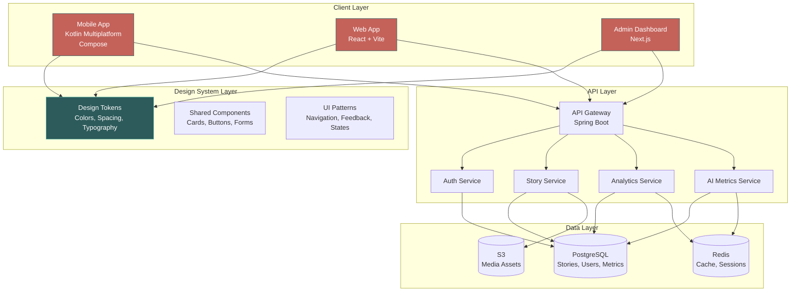

### Design System Architecture

The design system is the foundation of cross-platform consistency. It consists of three layers:

1. **Token Layer**: Atomic design values (colors, spacing, typography, radii, shadows)
2. **Component Layer**: Reusable UI components built with tokens
3. **Pattern Layer**: Composition patterns for common workflows

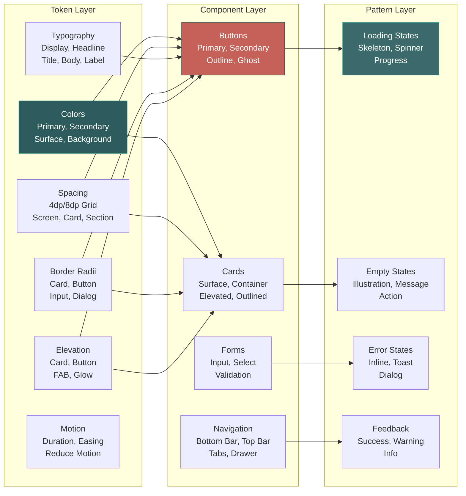


## Components and Interfaces

### Design Token System

#### Mobile (Kotlin Compose)

**Location**: `mobile/composeApp/src/commonMain/kotlin/com/tamixa/ui/theme/Theme.kt`

**Current Implementation**:
```kotlin
object TamixaDesignTokens {
    // Spacing (8dp grid)
    val screenPadding = 24.dp
    val sectionSpacing = 24.dp
    val cardSpacing = 16.dp
    val smallSpacing = 12.dp
    val cardContentPadding = 20.dp
    val minTouchTargetSize = 48.dp
    
    // Border Radii
    val cardRadius = 18.dp
    val cardRadiusMedium = 20.dp
    val cardRadiusLarge = 22.dp
    val buttonRadius = 28.dp
    val inputRadius = 20.dp
    val dialogRadius = 28.dp
    
    // Elevation
    val cardElevation = 6.dp
    val cardElevationHover = 10.dp
    val buttonShadowElevation = 8.dp
    val fabShadowElevation = 12.dp
}

object TamixaColors {
    // Storybook Dusk Palette
    val terracotta = Color(0xFFC4625A)      // Warm accent
    val deepTeal = Color(0xFF2D5A5A)        // Primary
    val eduStoryMint = Color(0xFF5CBCA8)    // Learn accent
    val warmSand = Color(0xFFE8DCC8)        // Cream
    val warmCharcoal = Color(0xFF141210)    // Dark base
    val warmSurface = Color(0xFF2C2822)     // Card surface
}
```

**Enhancement Plan**:
- Add motion tokens (duration, easing, reduce-motion support)
- Add accessibility tokens (focus ring, high contrast)
- Add performance tokens (animation thresholds)

#### Web/Admin (TypeScript)

**Location**: `admin/src/lib/design-tokens.ts`

**Current Implementation**:
```typescript
export const spacing = {
  xs: '0.25rem',    // 4px
  sm: '0.5rem',     // 8px
  md: '0.75rem',    // 12px
  lg: '1rem',       // 16px
  xl: '1.25rem',    // 20px
  '2xl': '1.5rem',  // 24px
  
  // Semantic
  screenPadding: '1.5rem',
  sectionSpacing: '1.5rem',
  cardSpacing: '1rem',
  minTouchTargetSize: '3rem',
};

export const radius = {
  sm: '0.5rem',     // 8px
  md: '0.75rem',    // 12px
  lg: '1rem',       // 16px
  xl: '1.25rem',    // 20px
  '2xl': '1.5rem',  // 24px
  
  // Semantic
  input: '1rem',
  card: '1rem',
  button: '1.5rem',
  dialog: '1.5rem',
};
```

**Enhancement Plan**:
- Align all values with mobile tokens
- Add color palette matching mobile
- Add gradient definitions
- Add motion and accessibility tokens

### Component Specifications

#### 1. TamixaCard (Mobile)

**Purpose**: Consistent card component with proper elevation, radius, and content color

**API**:
```kotlin
@Composable
fun TamixaCard(
    modifier: Modifier = Modifier,
    colors: CardColors = TamixaCardColors.surface(),
    elevation: Dp = TamixaDesignTokens.cardElevation,
    radius: Dp = TamixaDesignTokens.cardRadius,
    onClick: (() -> Unit)? = null,
    content: @Composable ColumnScope.() -> Unit
)
```

**Variants**:
- `TamixaCardColors.surface()` - Default surface card
- `TamixaCardColors.primaryContainer()` - Primary themed card
- `TamixaCardColors.secondaryContainer()` - Secondary themed card
- `TamixaCardColors.surfaceVariant()` - Subtle variant

**Usage**:
```kotlin
TamixaCard(
    colors = TamixaCardColors.surface(),
    onClick = { /* navigate */ }
) {
    Text("Story Title", style = MaterialTheme.typography.titleMedium)
    Text("Description", style = MaterialTheme.typography.bodyMedium)
}
```

#### 2. TamixaButton (Mobile)

**Purpose**: Consistent button styling with proper affordances

**API**:
```kotlin
@Composable
fun TamixaPrimaryButton(
    text: String,
    onClick: () -> Unit,
    modifier: Modifier = Modifier,
    enabled: Boolean = true,
    loading: Boolean = false,
    icon: (@Composable () -> Unit)? = null
)

@Composable
fun TamixaSecondaryButton(
    text: String,
    onClick: () -> Unit,
    modifier: Modifier = Modifier,
    enabled: Boolean = true
)

@Composable
fun TamixaOutlineButton(
    text: String,
    onClick: () -> Unit,
    modifier: Modifier = Modifier,
    enabled: Boolean = true
)
```

**Styling**:
- Primary: Gradient background (terracotta → coral), white text, shadow elevation
- Secondary: Solid deep teal, white text, subtle shadow
- Outline: Transparent background, teal border, teal text

#### 3. TamixaTextField (Mobile)

**Purpose**: Consistent input styling with validation states

**API**:
```kotlin
@Composable
fun TamixaTextField(
    value: String,
    onValueChange: (String) -> Unit,
    modifier: Modifier = Modifier,
    label: String? = null,
    placeholder: String? = null,
    error: String? = null,
    enabled: Boolean = true,
    singleLine: Boolean = true,
    keyboardOptions: KeyboardOptions = KeyboardOptions.Default,
    leadingIcon: (@Composable () -> Unit)? = null,
    trailingIcon: (@Composable () -> Unit)? = null
)
```

**States**:
- Default: White surface, warm charcoal text, teal border
- Focus: Teal border (2dp), focus ring
- Error: Red border, error message below
- Disabled: Reduced opacity, no interaction

#### 4. TamixaBottomBar (Mobile)

**Purpose**: Floating bottom navigation with consistent styling

**API**:
```kotlin
@Composable
fun TamixaBottomBar(
    selectedTab: BottomNavTab,
    onTabSelected: (BottomNavTab) -> Unit,
    modifier: Modifier = Modifier
)

enum class BottomNavTab {
    DASHBOARD, LIBRARY, SHORT_CONTENT, PROFILE
}
```

**Styling**:
- Container: Translucent surface with blur effect
- Selected: Terracotta icon + label
- Unselected: Gray icon + label
- Elevation: 12dp with glow effect
- Shape: Rounded pill (28dp radius)

#### 5. StoryCard (Mobile)

**Purpose**: Display story with cover, title, metadata, and interaction

**API**:
```kotlin
@Composable
fun StoryCard(
    story: LibraryStoryResponse,
    onClick: () -> Unit,
    modifier: Modifier = Modifier,
    showProgress: Boolean = false,
    progress: Float = 0f
)
```

**Layout**:
```
┌─────────────────────────┐
│   Cover Image (16:9)    │
│                         │
├─────────────────────────┤
│ Title                   │
│ Category • Duration     │
│ [Progress Bar]          │
└─────────────────────────┘
```

**Styling**:
- Card radius: 18dp
- Elevation: 6dp
- Cover: Rounded top corners, aspect ratio 16:9
- Title: titleMedium, onSurface color
- Metadata: bodySmall, onSurfaceVariant color
- Progress: Terracotta fill, 4dp height


### Screen Specifications

#### Mobile App Screens

##### 1. Onboarding Flow

**Screens**: Hook → Demo → Interactive Story Preview → Voice Invitation → Avatar Invitation

**Layout Pattern**:
```
┌─────────────────────────────────┐
│ Progress: Step 1 of 5           │ ← Frosted header
├─────────────────────────────────┤
│                                 │
│   [Starfield Background]        │
│                                 │
│   ┌───────────────────────┐    │
│   │  Frosted Card         │    │ ← High opacity (0.68)
│   │                       │    │
│   │  Visual Preview       │    │
│   │  Headline             │    │
│   │  Subline              │    │
│   │                       │    │
│   │  [Action Pills]       │    │
│   └───────────────────────┘    │
│                                 │
│   [Skip] ────────────── [Next] │
└─────────────────────────────────┘
```

**Visual Elements**:
- Background: Deep navy → indigo → violet gradient with particle effects
- Cards: Frosted glass (white 0.68 alpha) with teal border (0.38 alpha)
- Pills: Variety colors (terracotta, teal, mint) with 0.85 alpha
- Typography: onboardingHeadline (cream), onboardingSubline (warm sand)
- Animations: Staggered entrance (120ms delays), swipe gestures

**New Step 3: Interactive Story Preview**:
```
┌─────────────────────────────────┐
│ Progress: Step 3 of 5           │
├─────────────────────────────────┤
│   [Starfield Background]        │
│                                 │
│   ┌───────────────────────┐    │
│   │  Interactive Stories  │    │
│   │                       │    │
│   │  [Story Card Preview] │    │ ← Animated card flip
│   │  "Make choices that   │    │
│   │   shape the story!"   │    │
│   │                       │    │
│   │  ┌─────────────────┐ │    │
│   │  │ Choice A        │ │    │ ← Tappable choices
│   │  └─────────────────┘ │    │
│   │  ┌─────────────────┐ │    │
│   │  │ Choice B        │ │    │
│   │  └─────────────────┘ │    │
│   │                       │    │
│   │  [Try Interactive]    │    │ ← CTA button
│   └───────────────────────┘    │
│                                 │
│   [Skip] ────────────── [Next] │
└─────────────────────────────────┘
```

**Interactive Story Preview Features**:
- Animated branching path visualization
- Sample decision point with 2-3 choices
- Visual feedback when choice is tapped (ripple effect, path highlight)
- Mini-preview of how story branches based on choice
- "Try Interactive" button launches a short demo interactive story
- Emphasizes educational value and engagement

**Data Flow**:
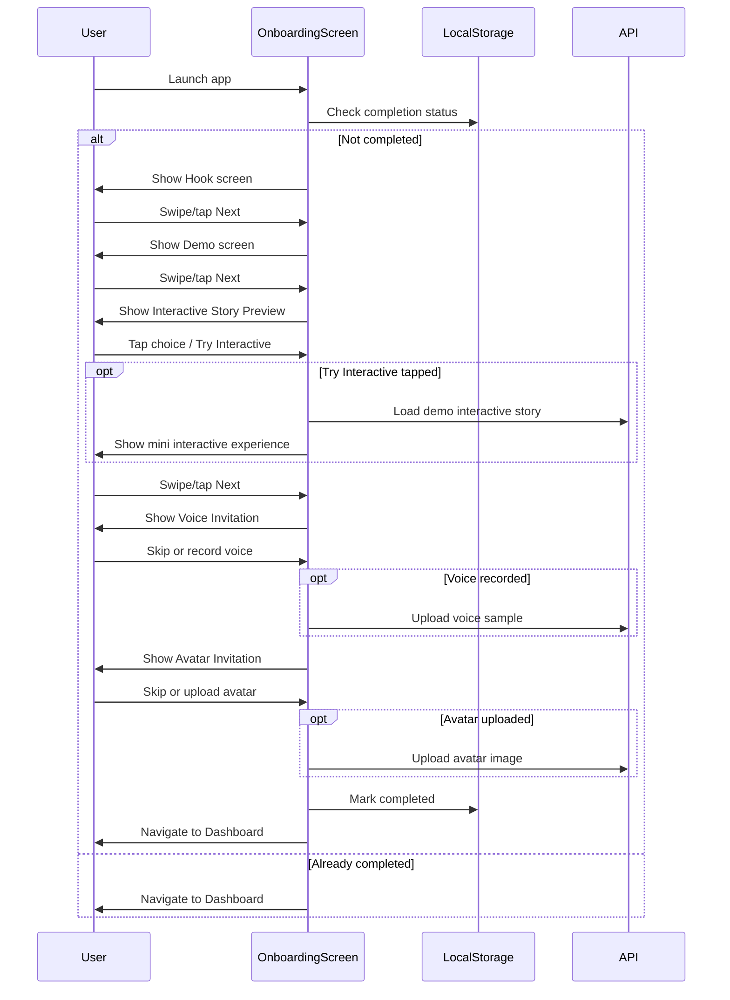

##### 2. Dashboard Screen

**Layout**:
```
┌─────────────────────────────────┐
│ ☰  Dashboard            [👤]    │ ← Top bar (translucent)
├─────────────────────────────────┤
│ [Starfield Background]          │
│                                 │
│ ┌─────────────────────────────┐ │
│ │ Good evening, Maya! 🌙      │ │ ← Greeting card
│ │ 🔥 3 day streak             │ │
│ │ 12/20 stories this month    │ │
│ └─────────────────────────────┘ │
│                                 │
│ Spotlight Stories               │
│ ┌───┐ ┌───┐ ┌───┐ ┌───┐       │ ← Horizontal scroll
│ │ 1 │ │ 2 │ │ 3 │ │ 4 │       │
│ └───┘ └───┘ └───┘ └───┘       │
│                                 │
│ Adventure Stories               │
│ ┌───┐ ┌───┐ ┌───┐ ┌───┐       │
│ │ 1 │ │ 2 │ │ 3 │ │ 4 │       │
│ └───┘ └───┘ └───┘ └───┘       │
│                                 │
│ Learning Stories                │
│ ┌───┐ ┌───┐ ┌───┐ ┌───┐       │
│ │ 1 │ │ 2 │ │ 3 │ │ 4 │       │
│ └───┘ └───┘ └───┘ └───┘       │
│                                 │
└─────────────────────────────────┘
│ [Dashboard] [Library] [+] [Profile] │ ← Bottom nav
└─────────────────────────────────┘
```

**Components**:
- **Greeting Card**: Surface card with user name, streak indicator, usage stats
- **Spotlight Section**: 8 featured stories in horizontal scroll
- **Category Rows**: Grouped by category (Adventure, Learning, Fun, Safety)
- **Story Cards**: Cover image, title, category badge, duration

**Data Flow**:
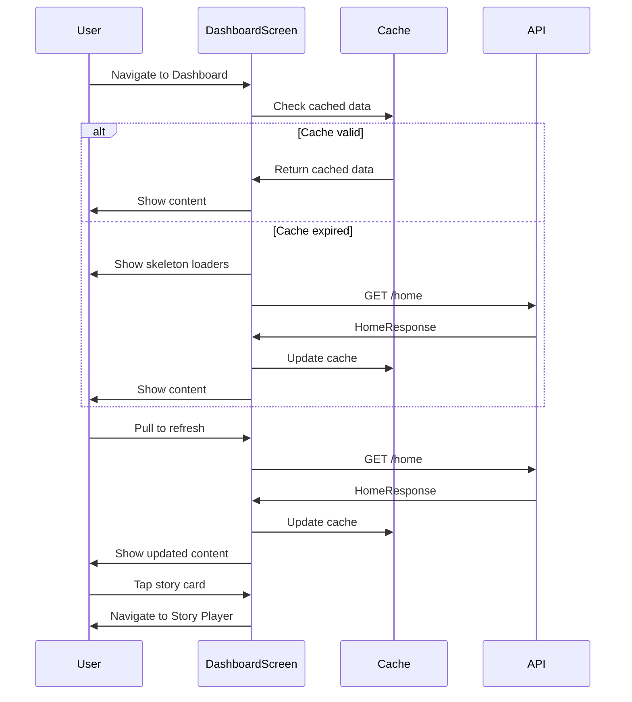

##### 3. Library Screen

**Layout**:
```
┌─────────────────────────────────┐
│ ☰  Library              [🔍]    │ ← Top bar with search
├─────────────────────────────────┤
│ [Browse] [Fun] [Learn] [Sim]    │ ← Hub tabs
├─────────────────────────────────┤
│ [Starfield Background]          │
│                                 │
│ ┌─────────────────────────────┐ │
│ │ [+ Generate Story]          │ │ ← CTA card
│ └─────────────────────────────┘ │
│                                 │
│ Filters: [All] [Tamil] [English]│
│                                 │
│ ┌───────┐ ┌───────┐            │
│ │Story 1│ │Story 2│            │ ← Grid layout
│ └───────┘ └───────┘            │
│ ┌───────┐ ┌───────┐            │
│ │Story 3│ │Story 4│            │
│ └───────┘ └───────┘            │
│                                 │
└─────────────────────────────────┘
│ [Dashboard] [Library] [+] [Profile] │
└─────────────────────────────────┘
```

**Hub Tabs**:
- **Browse**: All library stories
- **Fun Corner**: Entertainment stories (adventure, fantasy, humor)
- **Learn & Safety**: Educational stories (life skills, safety, values)
- **Simulator**: Interactive decision-making stories

**Data Flow**:
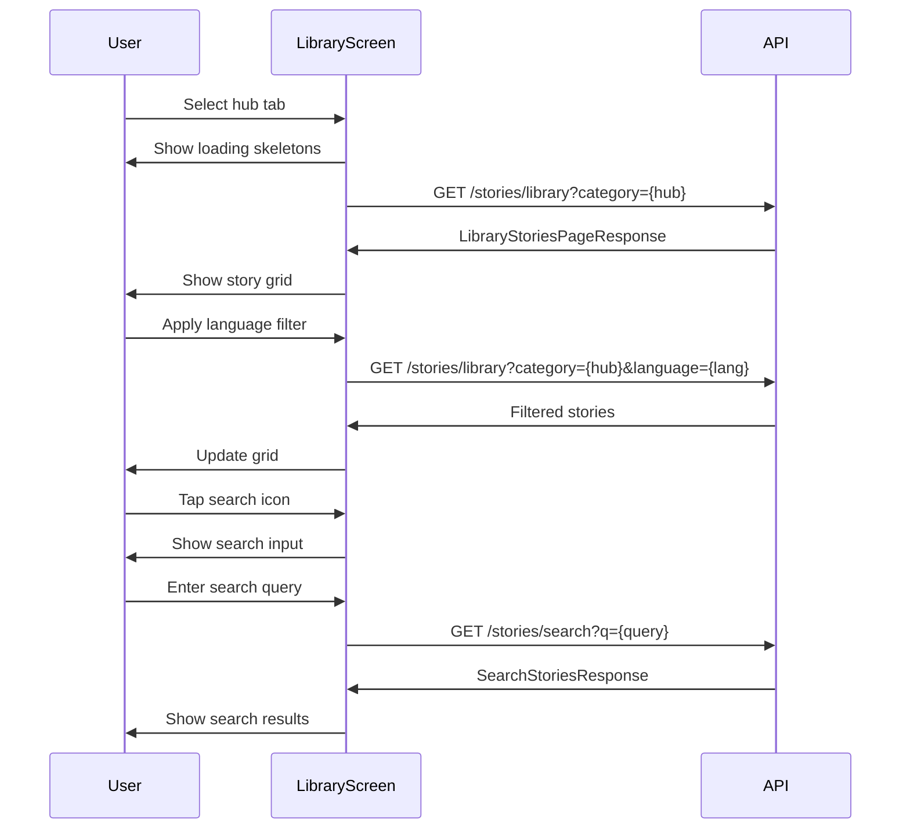

##### 4. Story Player Screen

**Layout**:
```
┌─────────────────────────────────┐
│ [←]                      [⋮]    │ ← Top bar
├─────────────────────────────────┤
│                                 │
│   ┌─────────────────────────┐  │
│   │                         │  │
│   │    Cover Art (16:9)     │  │ ← Hero illustration
│   │                         │  │
│   └─────────────────────────┘  │
│                                 │
│   Story Title                   │
│   Category • Narrator           │
│                                 │
│   ━━━━━━━━━━━━━━━━━━━━━━━━━   │ ← Progress bar
│   2:34 / 8:45                   │
│                                 │
│   [⏮] [⏪] [▶️] [⏩] [⏭]        │ ← Playback controls
│                                 │
│   Speed: [1.0x ▼]               │
│                                 │
│   Related Stories               │
│   ┌───┐ ┌───┐ ┌───┐            │
│   │ 1 │ │ 2 │ │ 3 │            │
│   └───┘ └───┘ └───┘            │
│                                 │
└─────────────────────────────────┘
```

**Features**:
- **Background Audio**: Continues playing when app is backgrounded
- **Lock Screen Controls**: Play/pause, skip, artwork display
- **Speed Control**: 0.75x, 1x, 1.25x, 1.5x
- **Progress Persistence**: Saves position every 5 seconds
- **Related Stories**: Recommendations based on category and theme

**Data Flow**:
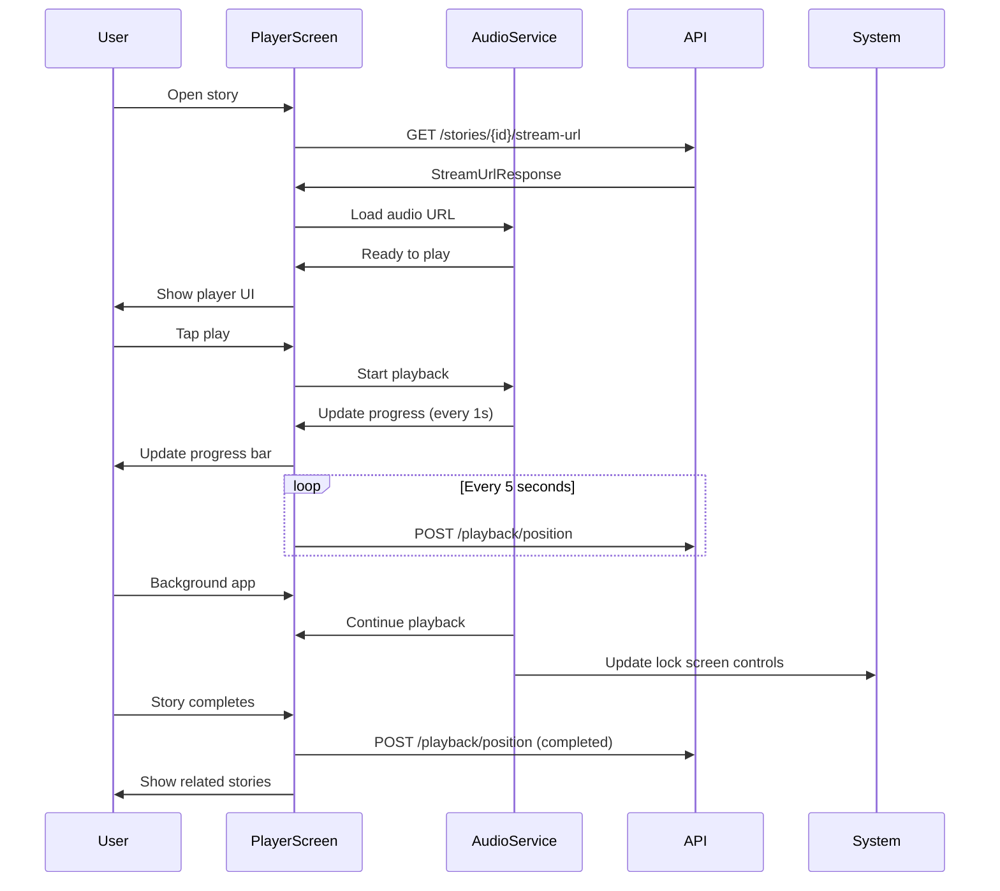

##### 5. Profile Screen

**Layout**:
```
┌─────────────────────────────────┐
│ [←] Profile                     │
├─────────────────────────────────┤
│ [Starfield Background]          │
│                                 │
│ ┌─────────────────────────────┐ │
│ │     [Avatar]                │ │
│ │     Maya Sharma             │ │ ← User info card
│ │     @maya_stories           │ │
│ │     [Edit Profile]          │ │
│ └─────────────────────────────┘ │
│                                 │
│ Learning Progress               │
│ ┌─────────────────────────────┐ │
│ │ Reading Level: 3            │ │
│ │ Reading Streak: 🔥 3 days   │ │
│ │ Vocabulary: 245 words       │ │
│ │ Life Readiness: 67%         │ │
│ └─────────────────────────────┘ │
│                                 │
│ Life Skills Practice            │
│ ┌─────────────────────────────┐ │
│ │ Wisdom      ████░░░░ 12     │ │
│ │ Social      ██████░░ 18     │ │
│ │ Money       ███░░░░░ 9      │ │
│ │ Balance     █████░░░ 15     │ │
│ └─────────────────────────────┘ │
│                                 │
│ Quick Actions                   │
│ • My Voice & Avatar             │
│ • Favorites                     │
│ • Listening History             │
│ • Achievements                  │
│ • Subscription                  │
│ • Settings                      │
│                                 │
└─────────────────────────────────┘
│ [Dashboard] [Library] [+] [Profile] │
└─────────────────────────────────┘
```

**Sections**:
- **User Info**: Avatar, name, nickname, edit button
- **Learning Progress**: Reading level, streak, vocabulary, life readiness
- **Life Skills**: Progress bars for wisdom, social, money, balance
- **Quick Actions**: Navigation to sub-screens

**Data Flow**:
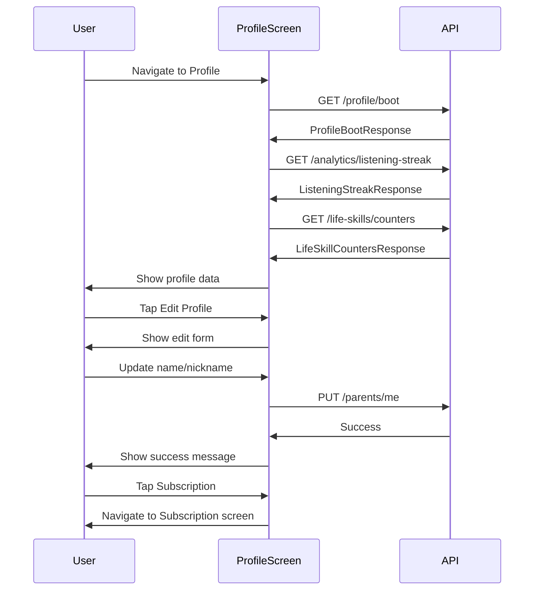


#### Admin Dashboard Screens

##### 1. Story Management (Linear Stories)

**Layout**:
```
┌─────────────────────────────────────────────────────────┐
│ Tamixa Admin                              [User Menu]   │
├─────────────────────────────────────────────────────────┤
│ [Stories] [Narration] [AI Metrics] [Users] [Settings]   │
├─────────────────────────────────────────────────────────┤
│                                                         │
│ Linear Stories                    [+ New Story]         │
│                                                         │
│ Filters: [All] [Draft] [Published] [Processing]        │
│ Search: [________________]                              │
│                                                         │
│ ┌─────────────────────────────────────────────────────┐ │
│ │ Title          │ Status    │ Pipeline │ Actions    │ │
│ ├─────────────────────────────────────────────────────┤ │
│ │ The Brave Fox  │ PUBLISHED │ ✓ All    │ [Edit][⋮] │ │
│ │ Ocean Mystery  │ READY     │ ⏳ 3/5   │ [Edit][⋮] │ │
│ │ Space Journey  │ DRAFT     │ - None   │ [Edit][⋮] │ │
│ └─────────────────────────────────────────────────────┘ │
│                                                         │
│ [1] [2] [3] ... [10]                    20 items/page  │
│                                                         │
└─────────────────────────────────────────────────────────┘
```

**Story Editor**:
```
┌─────────────────────────────────────────────────────────┐
│ [←] Edit Story: The Brave Fox                           │
├─────────────────────────────────────────────────────────┤
│                                                         │
│ ┌─────────────────────────────────────────────────────┐ │
│ │ Story Details                                       │ │
│ │                                                     │ │
│ │ Title *                                             │ │
│ │ [The Brave Fox_________________________]            │ │
│ │                                                     │ │
│ │ Category *                                          │ │
│ │ [Adventure ▼]                                       │ │
│ │                                                     │ │
│ │ Content *                                           │ │
│ │ ┌─────────────────────────────────────────────────┐ │ │
│ │ │ Once upon a time, in a forest far away...      │ │ │
│ │ │                                                 │ │ │
│ │ │                                                 │ │ │
│ │ └─────────────────────────────────────────────────┘ │ │
│ │                                                     │ │
│ │ Moral                                               │ │
│ │ [Courage helps us face our fears_________]          │ │
│ │                                                     │ │
│ │ Cover Image                                         │ │
│ │ [Upload] or [Generate with AI]                     │ │
│ │                                                     │ │
│ │ [Save Draft] [Submit for Review]                   │ │
│ └─────────────────────────────────────────────────────┘ │
│                                                         │
│ ┌─────────────────────────────────────────────────────┐ │
│ │ Pipeline Status                                     │ │
│ │                                                     │ │
│ │ Tamil:    ✓ READY                                   │ │
│ │ English:  ✓ READY                                   │ │
│ │ Hindi:    ⏳ TRANSLATING                            │ │
│ │ Telugu:   ⏳ QUEUED                                 │ │
│ │ Kannada:  ⏳ QUEUED                                 │ │
│ │ Malayalam: ⏳ QUEUED                                │ │
│ │                                                     │ │
│ │ [Regenerate All] [Regenerate Failed]               │ │
│ └─────────────────────────────────────────────────────┘ │
│                                                         │
└─────────────────────────────────────────────────────────┘
```

**Status Flow**:
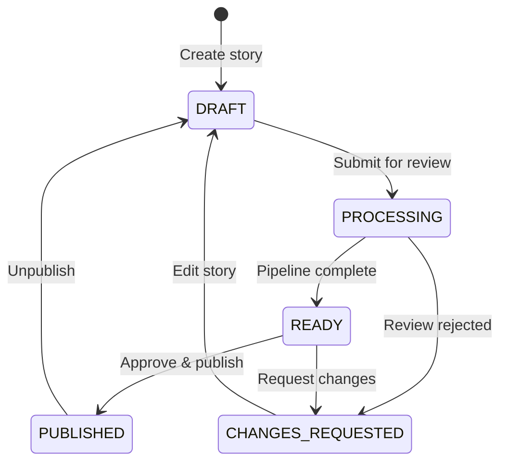

**Data Flow**:
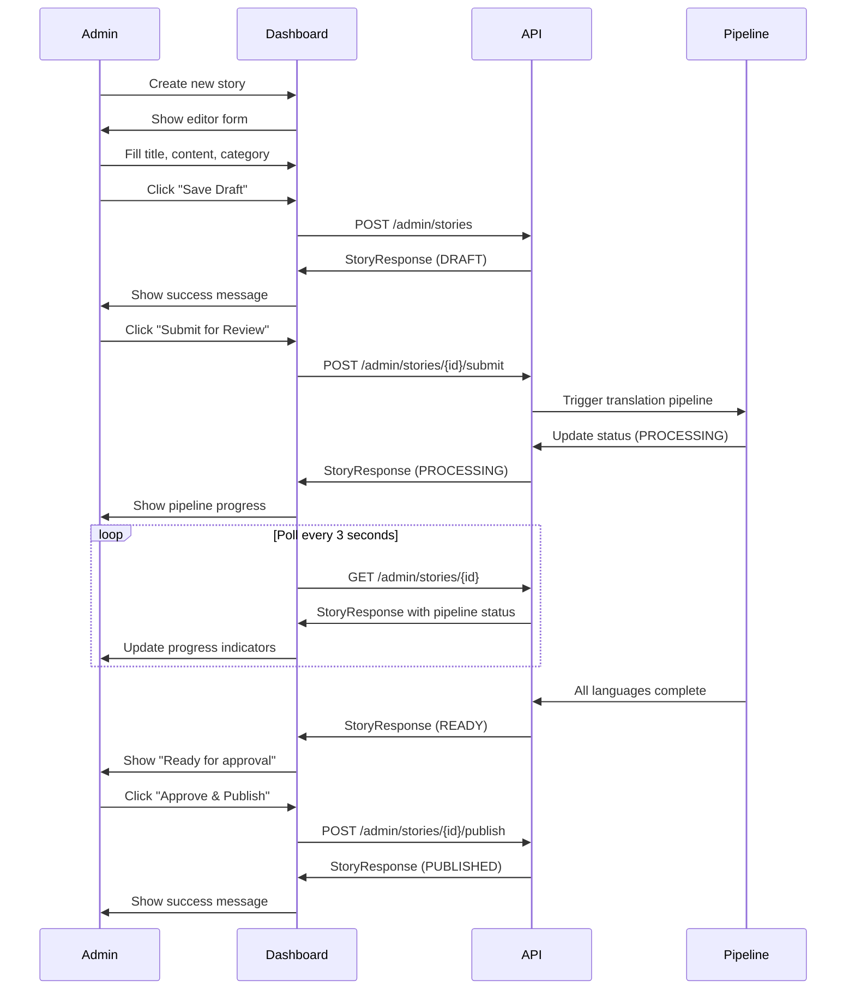

##### 2. Story Management (Interactive Stories)

**Graph Editor**:
```
┌─────────────────────────────────────────────────────────┐
│ [←] Edit Interactive Story: The Mystery Mansion          │
├─────────────────────────────────────────────────────────┤
│ [Graph View] [Outline View]                             │
├─────────────────────────────────────────────────────────┤
│                                                         │
│     ┌─────────┐                                         │
│     │ START   │                                         │
│     │ Segment │                                         │
│     └────┬────┘                                         │
│          │                                              │
│     ┌────┴────┐                                         │
│     │         │                                         │
│ ┌───▼───┐ ┌──▼────┐                                    │
│ │Enter  │ │Run    │                                    │
│ │Mansion│ │Away   │                                    │
│ └───┬───┘ └───────┘                                    │
│     │                                                   │
│ ┌───┴───┐                                               │
│ │       │                                               │
│ ▼       ▼                                               │
│ ...    ...                                              │
│                                                         │
│ [+ Add Segment] [Validate Graph] [Save]                │
│                                                         │
└─────────────────────────────────────────────────────────┘
```

**Segment Editor**:
```
┌─────────────────────────────────────────────────────────┐
│ Edit Segment: Enter Mansion                             │
├─────────────────────────────────────────────────────────┤
│                                                         │
│ Segment ID: enter_mansion                               │
│                                                         │
│ Title                                                   │
│ [The Grand Entrance_____________________]               │
│                                                         │
│ Content                                                 │
│ ┌─────────────────────────────────────────────────────┐ │
│ │ You stand before the mansion's heavy oak door...   │ │
│ │                                                     │ │
│ └─────────────────────────────────────────────────────┘ │
│                                                         │
│ Emotion Mode                                            │
│ [Suspenseful ▼]                                         │
│                                                         │
│ Choices                                                 │
│ ┌─────────────────────────────────────────────────────┐ │
│ │ 1. [Open the door slowly] → explore_hallway         │ │
│ │ 2. [Knock first] → meet_butler                      │ │
│ │ 3. [Look through window] → peek_inside              │ │
│ │ [+ Add Choice]                                      │ │
│ └─────────────────────────────────────────────────────┘ │
│                                                         │
│ [Save] [Delete Segment]                                 │
│                                                         │
└─────────────────────────────────────────────────────────┘
```

**Validation Rules**:
- No orphaned nodes (all segments reachable from START)
- All choices point to valid segments
- At least one ending segment
- No circular references without escape paths
- Maximum depth: 20 segments

**Data Flow**:
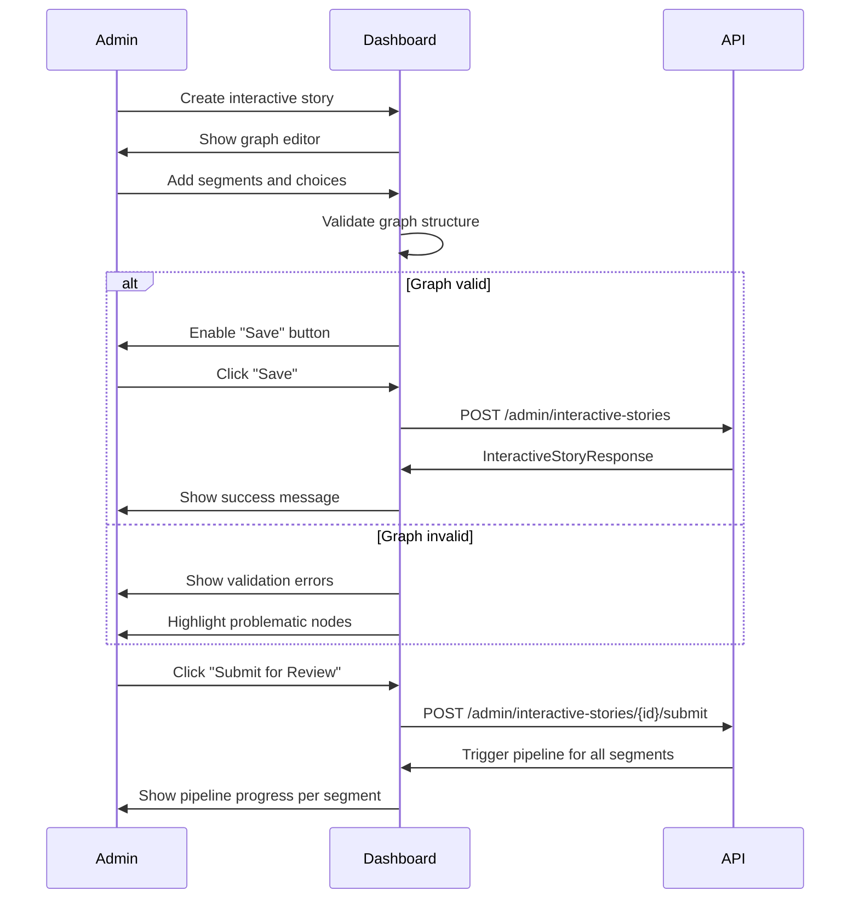

##### 3. AI Metrics Dashboard

**Layout**:
```
┌─────────────────────────────────────────────────────────┐
│ AI Metrics & Analytics                                  │
├─────────────────────────────────────────────────────────┤
│                                                         │
│ Time Period: [Last 24 Hours ▼]  [Refresh]              │
│                                                         │
│ ┌─────────────────────────────────────────────────────┐ │
│ │ Key Metrics                                         │ │
│ │                                                     │ │
│ │ ┌──────────┐ ┌──────────┐ ┌──────────┐ ┌─────────┐│ │
│ │ │Stories   │ │Tokens    │ │Avg       │ │Error   ││ │
│ │ │Generated │ │Used      │ │Latency   │ │Rate    ││ │
│ │ │          │ │          │ │          │ │        ││ │
│ │ │  1,247   │ │  2.4M    │ │  1.8s    │ │  2.3%  ││ │
│ │ └──────────┘ └──────────┘ └──────────┘ └─────────┘│ │
│ └─────────────────────────────────────────────────────┘ │
│                                                         │
│ ┌─────────────────────────────────────────────────────┐ │
│ │ Story Generation Trend                              │ │
│ │                                                     │ │
│ │     │                                               │ │
│ │ 200 │     ╱╲                                        │ │
│ │     │    ╱  ╲    ╱╲                                 │ │
│ │ 100 │   ╱    ╲  ╱  ╲                                │ │
│ │     │  ╱      ╲╱    ╲                               │ │
│ │   0 └────────────────────────                       │ │
│ │     0h  6h  12h  18h  24h                           │ │
│ └─────────────────────────────────────────────────────┘ │
│                                                         │
│ ┌─────────────────────────────────────────────────────┐ │
│ │ Token Consumption by Model                          │ │
│ │                                                     │ │
│ │ GPT-4:     ████████████░░░░░░░░  60% (1.44M)       │ │
│ │ GPT-3.5:   ██████░░░░░░░░░░░░░░  30% (720K)        │ │
│ │ Gemini:    ██░░░░░░░░░░░░░░░░░░  10% (240K)        │ │
│ └─────────────────────────────────────────────────────┘ │
│                                                         │
│ ┌─────────────────────────────────────────────────────┐ │
│ │ Model Performance                                   │ │
│ │                                                     │ │
│ │ Model    │ Avg Latency │ Error Rate │ Success Rate││ │
│ │──────────┼─────────────┼────────────┼─────────────││ │
│ │ GPT-4    │ 2.1s        │ 1.8%       │ 98.2%       ││ │
│ │ GPT-3.5  │ 1.2s        │ 3.5%       │ 96.5%       ││ │
│ │ Gemini   │ 1.5s        │ 2.1%       │ 97.9%       ││ │
│ └─────────────────────────────────────────────────────┘ │
│                                                         │
└─────────────────────────────────────────────────────────┘
```

**Data Sources**:
- `ApplicationMetrics` service (in-memory counters)
- Database queries (story generation logs, token usage)
- Redis cache (recent metrics, 30-second TTL)

**API Endpoints**:
```typescript
// GET /admin/ai-metrics/summary
interface AIMetricsSummaryResponse {
  period: string;
  storiesGenerated: number;
  tokensUsed: number;
  avgLatency: number;
  errorRate: number;
}

// GET /admin/ai-metrics/trend
interface AIMetricsTrendResponse {
  dataPoints: Array<{
    timestamp: string;
    storiesGenerated: number;
    tokensUsed: number;
  }>;
}

// GET /admin/ai-metrics/models
interface AIMetricsModelsResponse {
  models: Array<{
    name: string;
    tokensUsed: number;
    percentage: number;
    avgLatency: number;
    errorRate: number;
    successRate: number;
  }>;
}
```

**Data Flow**:
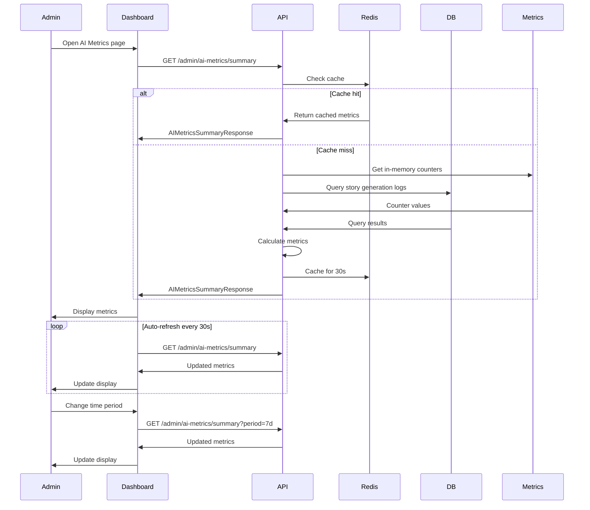


## Data Models

### Mobile App Models

#### LibraryStoryResponse
```kotlin
@Serializable
data class LibraryStoryResponse(
    val id: Long,
    val title: String?,
    val content: String = "",
    val moral: String?,
    val category: String?,
    val coverImageUrl: String?,
    val audioFileUrl: String?,
    val duration: Int?,
    val language: String?,
    val isInteractive: Boolean = false,
    val readingLevel: Int?,
    val tags: List<String> = emptyList()
)
```

#### HomeResponse
```kotlin
@Serializable
data class HomeResponse(
    val continueAdventure: List<HomeContinueAdventureItem>,
    val recommended: List<HomeStoryItem>,
    val spotlight: List<HomeStoryItem>,
    val categories: Map<String, List<HomeStoryItem>>
)

@Serializable
data class HomeStoryItem(
    val id: Long,
    val title: String,
    val coverImageUrl: String?,
    val category: String,
    val duration: Int?,
    val isInteractive: Boolean = false
)

@Serializable
data class HomeContinueAdventureItem(
    val storyId: Long,
    val title: String,
    val coverImageUrl: String?,
    val progress: Float,
    val lastPlayedAt: String
)
```

#### ProfileBootResponse
```kotlin
@Serializable
data class ProfileBootResponse(
    val parent: ProfileParentJson,
    val children: List<ProfileChildJson> = emptyList(),
    val subscription: SubscriptionJson?
)

@Serializable
data class ProfileParentJson(
    val id: Long,
    val email: String,
    val name: String?,
    val nickname: String?,
    val avatarUrl: String?,
    val createdAt: String
)

@Serializable
data class ProfileChildJson(
    val id: Long,
    val name: String,
    val nickname: String?,
    val avatarUrl: String?,
    val readingLevel: Int,
    val vocabularyCount: Int,
    val lifeReadinessScore: Int
)
```

### Backend API Models

#### Story Management DTOs

```kotlin
// backend/src/main/kotlin/com/tamixa/api/admin/dto/AdminStoryRequest.kt
data class AdminStoryRequest(
    @field:NotBlank(message = "Title is required")
    @field:Size(max = 200, message = "Title must be 200 characters or less")
    val title: String,
    
    @field:NotBlank(message = "Content is required")
    @field:Size(max = 10000, message = "Content must be 10000 characters or less")
    val content: String,
    
    @field:NotBlank(message = "Category is required")
    val category: String,
    
    val moral: String? = null,
    val coverImageUrl: String? = null,
    val readingLevel: Int? = null,
    val tags: List<String> = emptyList()
)

// backend/src/main/kotlin/com/tamixa/api/admin/dto/AdminStoryResponse.kt
data class AdminStoryResponse(
    val id: Long,
    val title: String,
    val content: String,
    val moral: String?,
    val category: String,
    val coverImageUrl: String?,
    val status: StoryStatus,
    val pipelineStatus: Map<String, LanguagePipelineStatus>,
    val createdAt: Instant,
    val updatedAt: Instant,
    val createdBy: String
)

enum class StoryStatus {
    DRAFT,
    PROCESSING,
    READY,
    PUBLISHED,
    CHANGES_REQUESTED,
    REJECTED
}

data class LanguagePipelineStatus(
    val language: String,
    val status: PipelineStepStatus,
    val translationStatus: PipelineStepStatus,
    val rewriteStatus: PipelineStepStatus,
    val ttsStatus: PipelineStepStatus,
    val error: String? = null
)

enum class PipelineStepStatus {
    NOT_STARTED,
    QUEUED,
    PROCESSING,
    COMPLETED,
    FAILED
}
```

#### Interactive Story DTOs

```kotlin
// backend/src/main/kotlin/com/tamixa/api/admin/dto/InteractiveStoryRequest.kt
data class InteractiveStoryRequest(
    @field:NotBlank(message = "Title is required")
    val title: String,
    
    @field:NotBlank(message = "Category is required")
    val category: String,
    
    @field:Valid
    val graph: InteractiveGraphRequest
)

data class InteractiveGraphRequest(
    @field:NotEmpty(message = "Graph must have at least one segment")
    val segments: List<InteractiveSegmentRequest>
)

data class InteractiveSegmentRequest(
    @field:NotBlank(message = "Segment ID is required")
    val segmentId: String,
    
    @field:NotBlank(message = "Title is required")
    val title: String,
    
    @field:NotBlank(message = "Content is required")
    val content: String,
    
    val emotionMode: String = "neutral",
    val choices: List<ChoiceRequest> = emptyList(),
    val isEnding: Boolean = false
)

data class ChoiceRequest(
    @field:NotBlank(message = "Choice text is required")
    val text: String,
    
    @field:NotBlank(message = "Target segment is required")
    val targetSegmentId: String
)
```

#### AI Metrics DTOs

```kotlin
// backend/src/main/kotlin/com/tamixa/api/admin/dto/AIMetricsResponse.kt
data class AIMetricsSummaryResponse(
    val period: String,
    val storiesGenerated: Long,
    val tokensUsed: Long,
    val avgLatency: Double,
    val errorRate: Double,
    val successRate: Double
)

data class AIMetricsTrendResponse(
    val dataPoints: List<AIMetricsTrendPoint>
)

data class AIMetricsTrendPoint(
    val timestamp: Instant,
    val storiesGenerated: Long,
    val tokensUsed: Long,
    val avgLatency: Double
)

data class AIMetricsModelsResponse(
    val models: List<AIMetricsModelSummary>
)

data class AIMetricsModelSummary(
    val name: String,
    val tokensUsed: Long,
    val percentage: Double,
    val avgLatency: Double,
    val errorRate: Double,
    val successRate: Double,
    val requestCount: Long
)
```

### Database Schema Changes

#### Story Status Tracking

```sql
-- Add status column to library_stories table
ALTER TABLE library_stories 
ADD COLUMN IF NOT EXISTS status VARCHAR(50) DEFAULT 'DRAFT',
ADD COLUMN IF NOT EXISTS created_by VARCHAR(255),
ADD COLUMN IF NOT EXISTS reviewed_by VARCHAR(255),
ADD COLUMN IF NOT EXISTS reviewed_at TIMESTAMP;

-- Add index for status filtering
CREATE INDEX IF NOT EXISTS idx_library_stories_status 
ON library_stories(status);

-- Add index for created_by filtering
CREATE INDEX IF NOT EXISTS idx_library_stories_created_by 
ON library_stories(created_by);
```

#### Pipeline Status Tracking

```sql
-- Create pipeline_status table for tracking translation/TTS progress
CREATE TABLE IF NOT EXISTS pipeline_status (
    id BIGSERIAL PRIMARY KEY,
    story_id BIGINT NOT NULL REFERENCES library_stories(id) ON DELETE CASCADE,
    language VARCHAR(10) NOT NULL,
    translation_status VARCHAR(50) DEFAULT 'NOT_STARTED',
    rewrite_status VARCHAR(50) DEFAULT 'NOT_STARTED',
    tts_status VARCHAR(50) DEFAULT 'NOT_STARTED',
    overall_status VARCHAR(50) DEFAULT 'NOT_STARTED',
    error_message TEXT,
    started_at TIMESTAMP,
    completed_at TIMESTAMP,
    updated_at TIMESTAMP DEFAULT CURRENT_TIMESTAMP,
    UNIQUE(story_id, language)
);

CREATE INDEX IF NOT EXISTS idx_pipeline_status_story_id 
ON pipeline_status(story_id);

CREATE INDEX IF NOT EXISTS idx_pipeline_status_overall_status 
ON pipeline_status(overall_status);
```

#### AI Metrics Tracking

```sql
-- Create ai_generation_logs table for detailed metrics
CREATE TABLE IF NOT EXISTS ai_generation_logs (
    id BIGSERIAL PRIMARY KEY,
    parent_id BIGINT REFERENCES parents(id) ON DELETE SET NULL,
    model_name VARCHAR(100) NOT NULL,
    operation_type VARCHAR(50) NOT NULL, -- 'story_generation', 'translation', 'tts', etc.
    input_tokens INT,
    output_tokens INT,
    total_tokens INT,
    latency_ms INT,
    success BOOLEAN DEFAULT true,
    error_message TEXT,
    created_at TIMESTAMP DEFAULT CURRENT_TIMESTAMP
);

CREATE INDEX IF NOT EXISTS idx_ai_generation_logs_created_at 
ON ai_generation_logs(created_at);

CREATE INDEX IF NOT EXISTS idx_ai_generation_logs_model_name 
ON ai_generation_logs(model_name);

CREATE INDEX IF NOT EXISTS idx_ai_generation_logs_operation_type 
ON ai_generation_logs(operation_type);
```


## Error Handling

### Error Handling Strategy

#### Mobile App Error Handling

**Error Categories**:
1. **Network Errors**: Connection timeout, no internet, server unreachable
2. **API Errors**: 4xx client errors, 5xx server errors
3. **Validation Errors**: Invalid input, missing required fields
4. **Authentication Errors**: Token expired, unauthorized access
5. **Resource Errors**: Story not found, audio unavailable

**Error Display Patterns**:

```kotlin
// Inline errors (forms, inputs)
TamixaTextField(
    value = email,
    onValueChange = { email = it },
    error = if (emailError != null) emailError else null,
    label = "Email"
)

// Toast notifications (transient feedback)
LaunchedEffect(saveResult) {
    if (saveResult is Result.Success) {
        snackbarHostState.showSnackbar("Story saved successfully")
    } else if (saveResult is Result.Error) {
        snackbarHostState.showSnackbar("Failed to save story")
    }
}

// Full-screen error states (critical failures)
if (loadState is LoadState.Error) {
    ErrorState(
        title = "Unable to load stories",
        message = "Please check your connection and try again",
        onRetry = { viewModel.retry() }
    )
}

// Empty states (no content available)
if (stories.isEmpty() && loadState is LoadState.Success) {
    EmptyState(
        illustration = painterResource(Res.drawable.empty_library),
        title = "No stories yet",
        message = "Start by generating your first story",
        action = { Button(onClick = { /* navigate */ }) { Text("Generate Story") } }
    )
}
```

**Error Response Handling**:
```kotlin
sealed class ApiResult<out T> {
    data class Success<T>(val data: T) : ApiResult<T>()
    data class Error(val code: Int, val message: String) : ApiResult<Nothing>()
    object Loading : ApiResult<Nothing>()
}

suspend fun <T> safeApiCall(
    apiCall: suspend () -> T
): ApiResult<T> {
    return try {
        ApiResult.Success(apiCall())
    } catch (e: HttpException) {
        val errorBody = e.response()?.errorBody()?.string()
        val errorMessage = parseErrorMessage(errorBody) ?: "An error occurred"
        ApiResult.Error(e.code(), errorMessage)
    } catch (e: IOException) {
        ApiResult.Error(0, "Network error. Please check your connection.")
    } catch (e: Exception) {
        ApiResult.Error(-1, "An unexpected error occurred")
        logger.error("Unexpected error in API call", e)
    }
}
```

#### Admin Dashboard Error Handling

**Error Display Patterns**:

```typescript
// Inline validation errors
<Input
  value={title}
  onChange={(e) => setTitle(e.target.value)}
  error={errors.title}
  helperText={errors.title}
/>

// Toast notifications
import { toast } from 'sonner';

const handleSave = async () => {
  try {
    await api.saveStory(story);
    toast.success('Story saved successfully');
  } catch (error) {
    toast.error('Failed to save story');
  }
};

// Error boundaries (catch React errors)
class ErrorBoundary extends React.Component {
  componentDidCatch(error, errorInfo) {
    logErrorToService(error, errorInfo);
  }
  
  render() {
    if (this.state.hasError) {
      return <ErrorFallback />;
    }
    return this.props.children;
  }
}

// Loading skeletons
{loading ? (
  <Skeleton count={5} height={80} />
) : (
  <StoryList stories={stories} />
)}
```

#### Backend Error Handling

**Error Response Format**:
```kotlin
data class ErrorResponse(
    val message: String,
    val status: Int,
    val timestamp: Instant = Instant.now(),
    val path: String? = null,
    val errors: List<FieldError> = emptyList()
)

data class FieldError(
    val field: String,
    val message: String
)
```

**Exception Handling**:
```kotlin
@RestControllerAdvice
class GlobalExceptionHandler {
    
    @ExceptionHandler(MethodArgumentNotValidException::class)
    fun handleValidationErrors(
        ex: MethodArgumentNotValidException,
        request: HttpServletRequest
    ): ResponseEntity<ErrorResponse> {
        val errors = ex.bindingResult.fieldErrors.map {
            FieldError(it.field, it.defaultMessage ?: "Invalid value")
        }
        val response = ErrorResponse(
            message = "Validation failed",
            status = 400,
            path = request.requestURI,
            errors = errors
        )
        return ResponseEntity.badRequest().body(response)
    }
    
    @ExceptionHandler(ResourceNotFoundException::class)
    fun handleNotFound(
        ex: ResourceNotFoundException,
        request: HttpServletRequest
    ): ResponseEntity<ErrorResponse> {
        val response = ErrorResponse(
            message = ex.message ?: "Resource not found",
            status = 404,
            path = request.requestURI
        )
        return ResponseEntity.status(404).body(response)
    }
    
    @ExceptionHandler(Exception::class)
    fun handleGenericError(
        ex: Exception,
        request: HttpServletRequest
    ): ResponseEntity<ErrorResponse> {
        logger.error("Unexpected error", ex)
        val response = ErrorResponse(
            message = "An unexpected error occurred",
            status = 500,
            path = request.requestURI
        )
        return ResponseEntity.status(500).body(response)
    }
}
```

**Structured Logging**:
```kotlin
class StoryService(
    private val storyRepository: StoryRepositoryPort,
    private val logger: Logger
) {
    fun createStory(request: AdminStoryRequest, userId: String): AdminStoryResponse {
        logger.info("Creating story", mapOf(
            "userId" to userId,
            "category" to request.category
        ))
        
        try {
            val story = storyRepository.save(request.toEntity(userId))
            logger.info("Story created successfully", mapOf(
                "storyId" to story.id,
                "userId" to userId
            ))
            return story.toResponse()
        } catch (e: Exception) {
            logger.error("Failed to create story", mapOf(
                "userId" to userId,
                "error" to e.message
            ), e)
            throw ServiceException("Unable to create story", e)
        }
    }
}
```

### Offline Handling

#### Mobile App Offline Strategy

**Offline Detection**:
```kotlin
@Composable
fun OfflineIndicator() {
    val isOnline by connectivityObserver.isOnline.collectAsState()
    
    AnimatedVisibility(visible = !isOnline) {
        Surface(
            color = MaterialTheme.colorScheme.errorContainer,
            modifier = Modifier.fillMaxWidth()
        ) {
            Row(
                modifier = Modifier.padding(12.dp),
                horizontalArrangement = Arrangement.Center
            ) {
                Icon(Icons.Default.CloudOff, contentDescription = null)
                Spacer(Modifier.width(8.dp))
                Text("No internet connection")
            }
        }
    }
}
```

**Offline Caching**:
```kotlin
class StoryRepository(
    private val api: StoryApi,
    private val cache: StoryCache,
    private val db: StoryDatabase
) {
    suspend fun getLibraryStories(category: String): List<LibraryStoryResponse> {
        return try {
            // Try network first
            val stories = api.getLibraryStories(category)
            cache.saveStories(category, stories)
            db.saveStories(stories)
            stories
        } catch (e: IOException) {
            // Fall back to cache
            cache.getStories(category) ?: db.getStories(category)
        }
    }
}
```

**Offline Queue**:
```kotlin
class OfflineActionQueue(
    private val db: Database
) {
    suspend fun queueAction(action: OfflineAction) {
        db.insertAction(action)
    }
    
    suspend fun processQueue() {
        val actions = db.getPendingActions()
        actions.forEach { action ->
            try {
                when (action.type) {
                    ActionType.SAVE_POSITION -> {
                        api.savePosition(action.data)
                        db.markActionComplete(action.id)
                    }
                    ActionType.FAVORITE_STORY -> {
                        api.favoriteStory(action.data)
                        db.markActionComplete(action.id)
                    }
                }
            } catch (e: Exception) {
                logger.warn("Failed to process offline action", e)
            }
        }
    }
}
```


## Testing Strategy

### Testing Approach

The testing strategy follows a dual approach:
- **Unit Tests**: Specific examples, edge cases, error conditions
- **Integration Tests**: API endpoints, database operations, external services

### Mobile App Testing

#### Unit Tests

**ViewModel Tests**:
```kotlin
class DashboardViewModelTest {
    private lateinit var viewModel: DashboardViewModel
    private lateinit var mockStoryRepository: StoryRepository
    private lateinit var mockAnalyticsRepository: AnalyticsRepository
    
    @Before
    fun setup() {
        mockStoryRepository = mockk()
        mockAnalyticsRepository = mockk()
        viewModel = DashboardViewModel(mockStoryRepository, mockAnalyticsRepository)
    }
    
    @Test
    fun `loadDashboard success updates state`() = runTest {
        // Given
        val expectedHome = HomeResponse(/* ... */)
        coEvery { mockStoryRepository.getHome() } returns expectedHome
        
        // When
        viewModel.loadDashboard()
        
        // Then
        assertEquals(LoadState.Success, viewModel.loadState.value)
        assertEquals(expectedHome, viewModel.homeData.value)
    }
    
    @Test
    fun `loadDashboard network error shows error state`() = runTest {
        // Given
        coEvery { mockStoryRepository.getHome() } throws IOException("Network error")
        
        // When
        viewModel.loadDashboard()
        
        // Then
        assertTrue(viewModel.loadState.value is LoadState.Error)
    }
}
```

**Repository Tests**:
```kotlin
class StoryRepositoryTest {
    private lateinit var repository: StoryRepository
    private lateinit var mockApi: StoryApi
    private lateinit var mockCache: StoryCache
    
    @Before
    fun setup() {
        mockApi = mockk()
        mockCache = mockk()
        repository = StoryRepository(mockApi, mockCache)
    }
    
    @Test
    fun `getLibraryStories returns cached data when network fails`() = runTest {
        // Given
        val cachedStories = listOf(LibraryStoryResponse(/* ... */))
        coEvery { mockApi.getLibraryStories(any()) } throws IOException()
        coEvery { mockCache.getStories(any()) } returns cachedStories
        
        // When
        val result = repository.getLibraryStories("adventure")
        
        // Then
        assertEquals(cachedStories, result)
    }
}
```

#### UI Tests

**Compose UI Tests**:
```kotlin
class DashboardScreenTest {
    @get:Rule
    val composeTestRule = createComposeRule()
    
    @Test
    fun `dashboard displays greeting with user name`() {
        // Given
        val userName = "Maya"
        composeTestRule.setContent {
            DashboardScreen(userName = userName)
        }
        
        // Then
        composeTestRule.onNodeWithText("Good evening, $userName!")
            .assertIsDisplayed()
    }
    
    @Test
    fun `tapping story card navigates to player`() {
        // Given
        var navigatedToStory: Long? = null
        composeTestRule.setContent {
            StoryCard(
                story = testStory,
                onClick = { navigatedToStory = testStory.id }
            )
        }
        
        // When
        composeTestRule.onNodeWithText(testStory.title).performClick()
        
        // Then
        assertEquals(testStory.id, navigatedToStory)
    }
}
```

### Backend Testing

#### Unit Tests

**Service Tests**:
```kotlin
class StoryServiceTest {
    private lateinit var service: StoryService
    private lateinit var mockRepository: StoryRepositoryPort
    private lateinit var mockPipeline: PipelineService
    
    @BeforeEach
    fun setup() {
        mockRepository = mockk()
        mockPipeline = mockk()
        service = StoryService(mockRepository, mockPipeline)
    }
    
    @Test
    fun `createStory saves story with DRAFT status`() {
        // Given
        val request = AdminStoryRequest(
            title = "Test Story",
            content = "Content",
            category = "adventure"
        )
        val userId = "admin@example.com"
        val expectedEntity = StoryEntity(/* ... */)
        every { mockRepository.save(any()) } returns expectedEntity
        
        // When
        val result = service.createStory(request, userId)
        
        // Then
        assertEquals(StoryStatus.DRAFT, result.status)
        verify { mockRepository.save(any()) }
    }
    
    @Test
    fun `submitForReview triggers pipeline for all languages`() {
        // Given
        val storyId = 1L
        val story = StoryEntity(/* ... */)
        every { mockRepository.findById(storyId) } returns story
        every { mockRepository.save(any()) } returns story
        every { mockPipeline.startPipeline(any(), any()) } just Runs
        
        // When
        service.submitForReview(storyId)
        
        // Then
        verify(exactly = 6) { mockPipeline.startPipeline(storyId, any()) }
    }
}
```

#### Integration Tests

**Controller Tests**:
```kotlin
@SpringBootTest(webEnvironment = SpringBootTest.WebEnvironment.RANDOM_PORT)
@AutoConfigureTestDatabase
class StoryControllerIntegrationTest {
    @Autowired
    private lateinit var restTemplate: TestRestTemplate
    
    @Autowired
    private lateinit var storyRepository: StoryJpaRepository
    
    @Test
    fun `POST admin stories creates story`() {
        // Given
        val request = AdminStoryRequest(
            title = "Integration Test Story",
            content = "Test content",
            category = "adventure"
        )
        
        // When
        val response = restTemplate
            .withBasicAuth("admin", "password")
            .postForEntity("/admin/stories", request, AdminStoryResponse::class.java)
        
        // Then
        assertEquals(HttpStatus.CREATED, response.statusCode)
        assertNotNull(response.body?.id)
        assertEquals("Integration Test Story", response.body?.title)
        
        // Verify database
        val saved = storyRepository.findById(response.body!!.id)
        assertTrue(saved.isPresent)
        assertEquals(StoryStatus.DRAFT, saved.get().status)
    }
    
    @Test
    fun `GET admin stories returns paginated list`() {
        // Given
        storyRepository.saveAll(listOf(
            StoryEntity(/* ... */),
            StoryEntity(/* ... */),
            StoryEntity(/* ... */)
        ))
        
        // When
        val response = restTemplate
            .withBasicAuth("admin", "password")
            .getForEntity("/admin/stories?page=0&size=2", PagedResponse::class.java)
        
        // Then
        assertEquals(HttpStatus.OK, response.statusCode)
        assertEquals(2, response.body?.content?.size)
        assertEquals(3, response.body?.totalElements)
    }
}
```

### Admin Dashboard Testing

#### Unit Tests

**Component Tests**:
```typescript
import { render, screen, fireEvent } from '@testing-library/react';
import { StoryCard } from './StoryCard';

describe('StoryCard', () => {
  it('displays story title and status', () => {
    const story = {
      id: 1,
      title: 'Test Story',
      status: 'DRAFT',
      pipelineStatus: {}
    };
    
    render(<StoryCard story={story} />);
    
    expect(screen.getByText('Test Story')).toBeInTheDocument();
    expect(screen.getByText('DRAFT')).toBeInTheDocument();
  });
  
  it('calls onEdit when edit button clicked', () => {
    const onEdit = jest.fn();
    const story = { id: 1, title: 'Test', status: 'DRAFT' };
    
    render(<StoryCard story={story} onEdit={onEdit} />);
    
    fireEvent.click(screen.getByText('Edit'));
    
    expect(onEdit).toHaveBeenCalledWith(1);
  });
});
```

**Hook Tests**:
```typescript
import { renderHook, waitFor } from '@testing-library/react';
import { useDashboard } from './use-dashboard';

describe('useDashboard', () => {
  it('loads AI metrics on mount', async () => {
    const { result } = renderHook(() => useDashboard());
    
    await waitFor(() => {
      expect(result.current.metrics).toBeDefined();
      expect(result.current.loading).toBe(false);
    });
  });
  
  it('refreshes metrics when refresh called', async () => {
    const { result } = renderHook(() => useDashboard());
    
    await waitFor(() => expect(result.current.loading).toBe(false));
    
    result.current.refresh();
    
    expect(result.current.loading).toBe(true);
    await waitFor(() => expect(result.current.loading).toBe(false));
  });
});
```

#### Integration Tests

**API Tests**:
```typescript
import { test, expect } from '@playwright/test';

test.describe('Story Management', () => {
  test.beforeEach(async ({ page }) => {
    await page.goto('/login');
    await page.fill('[name="email"]', 'admin@example.com');
    await page.fill('[name="password"]', 'password');
    await page.click('button[type="submit"]');
    await page.waitForURL('/dashboard');
  });
  
  test('creates new story', async ({ page }) => {
    await page.goto('/dashboard/stories');
    await page.click('text=New Story');
    
    await page.fill('[name="title"]', 'E2E Test Story');
    await page.fill('[name="content"]', 'Test content');
    await page.selectOption('[name="category"]', 'adventure');
    
    await page.click('text=Save Draft');
    
    await expect(page.locator('text=Story saved successfully')).toBeVisible();
    await expect(page.locator('text=E2E Test Story')).toBeVisible();
  });
  
  test('submits story for review', async ({ page }) => {
    await page.goto('/dashboard/stories/1');
    await page.click('text=Submit for Review');
    
    await expect(page.locator('text=Pipeline started')).toBeVisible();
    await expect(page.locator('text=PROCESSING')).toBeVisible();
  });
});
```

### Performance Testing

#### Mobile Performance Tests

```kotlin
@Test
fun `dashboard loads within 1 second`() = runTest {
    val startTime = System.currentTimeMillis()
    
    viewModel.loadDashboard()
    
    val endTime = System.currentTimeMillis()
    val duration = endTime - startTime
    
    assertTrue(duration < 1000, "Dashboard took ${duration}ms to load")
}

@Test
fun `story list scrolls smoothly with 100 items`() {
    composeTestRule.setContent {
        LazyColumn {
            items(100) { index ->
                StoryCard(story = generateTestStory(index))
            }
        }
    }
    
    // Measure frame drops during scroll
    val frameMetrics = composeTestRule.onRoot().performScrollToIndex(50)
    assertTrue(frameMetrics.droppedFrames < 5)
}
```

#### Backend Performance Tests

```kotlin
@Test
fun `story list endpoint responds within 200ms`() {
    val startTime = System.currentTimeMillis()
    
    val response = restTemplate
        .withBasicAuth("admin", "password")
        .getForEntity("/admin/stories?page=0&size=20", PagedResponse::class.java)
    
    val duration = System.currentTimeMillis() - startTime
    
    assertEquals(HttpStatus.OK, response.statusCode)
    assertTrue(duration < 200, "Endpoint took ${duration}ms")
}

@Test
fun `AI metrics endpoint uses cache`() {
    // First call - cache miss
    val firstCall = measureTimeMillis {
        restTemplate.getForEntity("/admin/ai-metrics/summary", AIMetricsSummaryResponse::class.java)
    }
    
    // Second call - cache hit
    val secondCall = measureTimeMillis {
        restTemplate.getForEntity("/admin/ai-metrics/summary", AIMetricsSummaryResponse::class.java)
    }
    
    assertTrue(secondCall < firstCall / 2, "Cache not working effectively")
}
```


## Implementation Approach

### Phase 1: Design System Foundation (Week 1-2)

**Goal**: Establish unified design tokens and core components across all platforms

#### Mobile (Kotlin Compose)

**Tasks**:
1. Enhance `TamixaDesignTokens` with motion and accessibility tokens
2. Create `TamixaCard` component with consistent styling
3. Create `TamixaButton` variants (Primary, Secondary, Outline)
4. Create `TamixaTextField` with validation states
5. Update `TamixaBottomBar` with floating pill design
6. Create loading skeleton components
7. Create empty state components
8. Create error state components

**Files to Create/Modify**:
- `mobile/composeApp/src/commonMain/kotlin/com/tamixa/ui/theme/Theme.kt` (enhance)
- `mobile/composeApp/src/commonMain/kotlin/com/tamixa/ui/components/TamixaCard.kt` (new)
- `mobile/composeApp/src/commonMain/kotlin/com/tamixa/ui/components/TamixaButton.kt` (new)
- `mobile/composeApp/src/commonMain/kotlin/com/tamixa/ui/components/TamixaTextField.kt` (new)
- `mobile/composeApp/src/commonMain/kotlin/com/tamixa/ui/components/TamixaBottomBar.kt` (enhance)
- `mobile/composeApp/src/commonMain/kotlin/com/tamixa/ui/components/LoadingState.kt` (new)
- `mobile/composeApp/src/commonMain/kotlin/com/tamixa/ui/components/EmptyState.kt` (new)
- `mobile/composeApp/src/commonMain/kotlin/com/tamixa/ui/components/ErrorState.kt` (new)

#### Admin Dashboard (Next.js)

**Tasks**:
1. Align `design-tokens.ts` with mobile tokens
2. Create color palette matching mobile
3. Add gradient definitions
4. Create Card component with variants
5. Create Button component with variants
6. Create Input component with validation
7. Create loading skeleton components
8. Create empty state components

**Files to Create/Modify**:
- `admin/src/lib/design-tokens.ts` (enhance)
- `admin/src/lib/colors.ts` (new)
- `admin/src/components/ui/card.tsx` (enhance)
- `admin/src/components/ui/button.tsx` (enhance)
- `admin/src/components/ui/input.tsx` (enhance)
- `admin/src/components/ui/skeleton.tsx` (enhance)
- `admin/src/components/empty-state.tsx` (enhance)

#### Web App (React/Vite)

**Tasks**:
1. Create design tokens file matching mobile/admin
2. Create shared component library
3. Implement responsive layouts

**Files to Create/Modify**:
- `web/src/lib/design-tokens.ts` (new)
- `web/src/components/ui/` (new directory with components)

### Phase 2: Mobile App Screens (Week 3-5)

**Goal**: Implement premium mobile UI for all screens

#### Week 3: Onboarding & Dashboard

**Onboarding Flow**:
1. Create starfield background component
2. Create frosted card component
3. Implement Hook screen with visual preview
4. Implement Demo screen with story cards
5. Implement Voice Invitation screen
6. Implement Avatar Invitation screen
7. Add swipe gesture navigation
8. Add progress indicator
9. Persist completion state

**Files**:
- `mobile/composeApp/src/commonMain/kotlin/com/tamixa/ui/screens/onboarding/OnboardingScreen.kt`
- `mobile/composeApp/src/commonMain/kotlin/com/tamixa/ui/screens/onboarding/HookScreen.kt`
- `mobile/composeApp/src/commonMain/kotlin/com/tamixa/ui/screens/onboarding/DemoScreen.kt`
- `mobile/composeApp/src/commonMain/kotlin/com/tamixa/ui/screens/onboarding/VoiceInvitationScreen.kt`
- `mobile/composeApp/src/commonMain/kotlin/com/tamixa/ui/screens/onboarding/AvatarInvitationScreen.kt`
- `mobile/composeApp/src/commonMain/kotlin/com/tamixa/ui/components/StarfieldBackground.kt`
- `mobile/composeApp/src/commonMain/kotlin/com/tamixa/ui/components/FrostedCard.kt`

**Dashboard Screen**:
1. Create greeting card component
2. Create spotlight section with horizontal scroll
3. Create category rows with story cards
4. Implement pull-to-refresh
5. Add loading skeletons
6. Add error states
7. Implement caching strategy

**Files**:
- `mobile/composeApp/src/commonMain/kotlin/com/tamixa/ui/screens/dashboard/DashboardScreen.kt`
- `mobile/composeApp/src/commonMain/kotlin/com/tamixa/ui/screens/dashboard/DashboardViewModel.kt`
- `mobile/composeApp/src/commonMain/kotlin/com/tamixa/ui/components/GreetingCard.kt`
- `mobile/composeApp/src/commonMain/kotlin/com/tamixa/ui/components/SpotlightSection.kt`
- `mobile/composeApp/src/commonMain/kotlin/com/tamixa/ui/components/CategoryRow.kt`

#### Week 4: Library & Story Player

**Library Screen**:
1. Create hub tab navigation
2. Create story grid layout
3. Implement search functionality
4. Add language filters
5. Create generate story CTA card
6. Add loading states
7. Add empty states

**Files**:
- `mobile/composeApp/src/commonMain/kotlin/com/tamixa/ui/screens/library/LibraryScreen.kt`
- `mobile/composeApp/src/commonMain/kotlin/com/tamixa/ui/screens/library/LibraryViewModel.kt`
- `mobile/composeApp/src/commonMain/kotlin/com/tamixa/ui/components/HubTabs.kt`
- `mobile/composeApp/src/commonMain/kotlin/com/tamixa/ui/components/StoryGrid.kt`

**Story Player Screen**:
1. Create hero illustration component
2. Create playback controls
3. Implement progress bar with seek
4. Add speed control
5. Implement background audio
6. Add lock screen controls
7. Create related stories section
8. Implement progress persistence

**Files**:
- `mobile/composeApp/src/commonMain/kotlin/com/tamixa/ui/screens/player/StoryPlayerScreen.kt`
- `mobile/composeApp/src/commonMain/kotlin/com/tamixa/ui/screens/player/StoryPlayerViewModel.kt`
- `mobile/composeApp/src/commonMain/kotlin/com/tamixa/ui/components/HeroIllustration.kt`
- `mobile/composeApp/src/commonMain/kotlin/com/tamixa/ui/components/PlaybackControls.kt`
- `mobile/androidApp/src/main/java/com/tamixa/android/player/AudioPlaybackService.kt` (enhance)

#### Week 5: Profile & Story Generation

**Profile Screen**:
1. Create user info card
2. Create learning progress section
3. Create life skills progress bars
4. Create quick actions list
5. Implement edit profile flow
6. Add loading states

**Files**:
- `mobile/composeApp/src/commonMain/kotlin/com/tamixa/ui/screens/profile/ProfileScreen.kt`
- `mobile/composeApp/src/commonMain/kotlin/com/tamixa/ui/screens/profile/ProfileViewModel.kt`
- `mobile/composeApp/src/commonMain/kotlin/com/tamixa/ui/components/UserInfoCard.kt`
- `mobile/composeApp/src/commonMain/kotlin/com/tamixa/ui/components/LearningProgressCard.kt`
- `mobile/composeApp/src/commonMain/kotlin/com/tamixa/ui/components/LifeSkillsCard.kt`

**Story Generation Flow**:
1. Create child selection screen
2. Create theme selection screen
3. Create customization screen
4. Create generation progress screen
5. Add error handling
6. Add cancel functionality
7. Add subscription limit checks

**Files**:
- `mobile/composeApp/src/commonMain/kotlin/com/tamixa/ui/screens/generation/StoryGenerationFlow.kt`
- `mobile/composeApp/src/commonMain/kotlin/com/tamixa/ui/screens/generation/ChildSelectionScreen.kt`
- `mobile/composeApp/src/commonMain/kotlin/com/tamixa/ui/screens/generation/ThemeSelectionScreen.kt`
- `mobile/composeApp/src/commonMain/kotlin/com/tamixa/ui/screens/generation/GenerationProgressScreen.kt`

### Phase 3: Admin Dashboard (Week 6-7)

**Goal**: Implement story management and AI metrics

#### Week 6: Story Management

**Linear Story Editor**:
1. Create story list page with filters
2. Create story editor form
3. Implement validation
4. Create pipeline status display
5. Add bulk actions
6. Implement pagination
7. Add search functionality

**Files**:
- `admin/src/app/(dashboard)/dashboard/stories/page.tsx`
- `admin/src/app/(dashboard)/dashboard/stories/[id]/page.tsx`
- `admin/src/components/stories/story-list.tsx`
- `admin/src/components/stories/story-editor.tsx`
- `admin/src/components/stories/pipeline-status.tsx`
- `admin/src/hooks/use-stories.ts`

**Interactive Story Editor**:
1. Create graph editor component
2. Create outline view component
3. Create segment editor
4. Implement graph validation
5. Add visual feedback for errors
6. Implement save/load functionality

**Files**:
- `admin/src/app/(dashboard)/dashboard/interactive-stories/page.tsx`
- `admin/src/app/(dashboard)/dashboard/interactive-stories/[id]/page.tsx`
- `admin/src/components/interactive/graph-editor.tsx`
- `admin/src/components/interactive/outline-view.tsx`
- `admin/src/components/interactive/segment-editor.tsx`
- `admin/src/lib/interactive-graph-validation.ts`

#### Week 7: AI Metrics & Narration

**AI Metrics Dashboard**:
1. Create metrics summary cards
2. Create trend charts
3. Create model comparison table
4. Implement auto-refresh
5. Add time period selector
6. Add error handling

**Files**:
- `admin/src/app/(dashboard)/dashboard/ai-metrics/page.tsx`
- `admin/src/components/charts/story-generation-bar-chart.tsx` (enhance)
- `admin/src/components/charts/token-usage-chart.tsx` (new)
- `admin/src/components/charts/model-performance-table.tsx` (new)
- `admin/src/hooks/use-ai-metrics.ts` (new)

**Narration Workflow**:
1. Create narration page
2. Create audio player component
3. Create approval controls
4. Add language-specific status
5. Implement regeneration

**Files**:
- `admin/src/app/(dashboard)/dashboard/stories/[id]/narration/page.tsx`
- `admin/src/components/narration/audio-player.tsx`
- `admin/src/components/narration/approval-controls.tsx`
- `admin/src/components/narration/language-status.tsx`

### Phase 4: Backend API (Week 8-9)

**Goal**: Implement backend support for new features

#### Week 8: Story Management APIs

**Tasks**:
1. Create admin story DTOs
2. Implement story CRUD endpoints
3. Add status management
4. Implement pipeline status tracking
5. Add validation
6. Create database migrations

**Files**:
- `backend/src/main/kotlin/com/tamixa/api/admin/AdminStoryController.kt` (new)
- `backend/src/main/kotlin/com/tamixa/api/admin/dto/AdminStoryRequest.kt` (new)
- `backend/src/main/kotlin/com/tamixa/api/admin/dto/AdminStoryResponse.kt` (new)
- `backend/src/main/kotlin/com/tamixa/application/admin/AdminStoryService.kt` (new)
- `backend/src/main/kotlin/com/tamixa/domain/StoryStatus.kt` (new)
- `backend/src/main/resources/db/migration/V100__add_story_status.sql` (new)
- `backend/src/main/resources/db/migration/V101__create_pipeline_status.sql` (new)

**Interactive Story APIs**:
1. Create interactive story DTOs
2. Implement graph validation
3. Create CRUD endpoints
4. Add segment management
5. Implement pipeline integration

**Files**:
- `backend/src/main/kotlin/com/tamixa/api/admin/AdminInteractiveStoryController.kt` (new)
- `backend/src/main/kotlin/com/tamixa/api/admin/dto/InteractiveStoryRequest.kt` (new)
- `backend/src/main/kotlin/com/tamixa/api/admin/dto/InteractiveStoryResponse.kt` (new)
- `backend/src/main/kotlin/com/tamixa/application/admin/InteractiveStoryService.kt` (new)
- `backend/src/main/kotlin/com/tamixa/domain/InteractiveGraphValidator.kt` (new)

#### Week 9: AI Metrics & Analytics

**Tasks**:
1. Create AI metrics DTOs
2. Implement metrics collection
3. Create aggregation queries
4. Implement caching
5. Add database migrations
6. Create metrics endpoints

**Files**:
- `backend/src/main/kotlin/com/tamixa/api/admin/AIMetricsController.kt` (new)
- `backend/src/main/kotlin/com/tamixa/api/admin/dto/AIMetricsResponse.kt` (new)
- `backend/src/main/kotlin/com/tamixa/application/admin/AIMetricsService.kt` (new)
- `backend/src/main/kotlin/com/tamixa/infrastructure/metrics/AIMetricsCollector.kt` (new)
- `backend/src/main/resources/db/migration/V102__create_ai_generation_logs.sql` (new)

**Home API Enhancement**:
1. Add spotlight stories
2. Enhance category grouping
3. Add continue adventure section
4. Implement caching

**Files**:
- `backend/src/main/kotlin/com/tamixa/application/home/HomeService.kt` (enhance)
- `backend/src/main/kotlin/com/tamixa/application/home/HomeResponse.kt` (enhance)

### Phase 5: Performance & Polish (Week 10)

**Goal**: Optimize performance and polish UI

#### Performance Optimizations

**Mobile**:
1. Implement image caching with Coil
2. Add pagination for story lists
3. Optimize Compose recomposition
4. Reduce memory usage
5. Add performance monitoring

**Admin**:
1. Implement server-side pagination
2. Add debouncing for search
3. Optimize chart rendering
4. Add virtual scrolling
5. Implement optimistic UI updates

**Backend**:
1. Add database indexes
2. Implement query optimization
3. Add Redis caching
4. Optimize N+1 queries
5. Add connection pooling

#### Accessibility

**Mobile**:
1. Add content descriptions
2. Implement focus order
3. Test with TalkBack/VoiceOver
4. Verify color contrast
5. Test touch target sizes
6. Add reduce-motion support

**Admin**:
1. Add ARIA labels
2. Implement keyboard navigation
3. Test with screen readers
4. Verify color contrast
5. Add focus indicators

#### Testing

**Mobile**:
1. Write unit tests for ViewModels
2. Write UI tests for screens
3. Write integration tests for repositories
4. Add performance tests

**Admin**:
1. Write component tests
2. Write integration tests
3. Add E2E tests with Playwright

**Backend**:
1. Write unit tests for services
2. Write integration tests for controllers
3. Add performance tests

### Phase 6: Deployment & Monitoring (Week 11)

**Goal**: Deploy to production and set up monitoring

#### Deployment

**Mobile**:
1. Build release APK/IPA
2. Test on physical devices
3. Submit to app stores
4. Monitor crash reports

**Admin**:
1. Build production bundle
2. Deploy to hosting
3. Configure CDN
4. Set up monitoring

**Backend**:
1. Run database migrations
2. Deploy to production
3. Configure load balancer
4. Set up monitoring

#### Monitoring

**Setup**:
1. Configure application metrics
2. Set up error tracking (Sentry)
3. Add performance monitoring
4. Create dashboards
5. Set up alerts

**Metrics to Track**:
- Mobile: Crash rate, ANR rate, screen load time, API latency
- Admin: Page load time, API latency, error rate
- Backend: Request rate, response time, error rate, database query time


## Design Decisions and Rationale

### 1. Design System Centralization

**Decision**: Use a single source of truth for design tokens across all platforms

**Rationale**:
- Ensures visual consistency across mobile, web, and admin
- Reduces maintenance burden (update once, apply everywhere)
- Prevents design drift over time
- Enables rapid iteration on design changes

**Implementation**:
- Mobile: `TamixaDesignTokens` object in Kotlin
- Web/Admin: `design-tokens.ts` in TypeScript
- Values are manually synchronized (no code generation needed)
- Semantic naming (e.g., `cardRadius`, `screenPadding`) over raw values

### 2. Storybook Dusk Theme

**Decision**: Use warm, earthy palette (terracotta, deep teal, warm cream) instead of cold or bright colors

**Rationale**:
- Differentiates from competitors (Duolingo's bright green, Spotify's blue)
- Warm tones are more suitable for bedtime storytelling
- Earthy colors feel trustworthy and educational
- Avoids overstimulation for children
- Professional appearance for parents

**Research**:
- Audiobook apps use warmer palettes for relaxation
- Kids apps with cold colors (blue/purple) feel less inviting
- Warm undertones support bedtime use case

### 3. Component-Based Architecture

**Decision**: Build reusable components with consistent APIs across platforms

**Rationale**:
- Reduces code duplication
- Ensures consistency in behavior and appearance
- Simplifies maintenance and updates
- Enables rapid feature development
- Facilitates testing (test once, use everywhere)

**Examples**:
- `TamixaCard` with variants (surface, primaryContainer, secondaryContainer)
- `TamixaButton` with variants (Primary, Secondary, Outline)
- `TamixaTextField` with validation states

### 4. Status-Driven Story Workflow

**Decision**: Use explicit status enum (DRAFT, PROCESSING, READY, PUBLISHED, CHANGES_REQUESTED, REJECTED) instead of boolean flags

**Rationale**:
- Clear state machine with defined transitions
- Prevents invalid states (e.g., published draft)
- Enables workflow automation
- Simplifies UI logic (show/hide based on status)
- Supports audit trail and reporting

**State Machine**:
```
DRAFT → PROCESSING → READY → PUBLISHED
  ↓         ↓
CHANGES_REQUESTED
  ↓
REJECTED
```

### 5. Pipeline Status Separation

**Decision**: Separate pipeline status from story status

**Rationale**:
- Story status represents editorial workflow
- Pipeline status represents technical processing
- Allows independent tracking of translation/TTS for each language
- Enables partial completion (3/5 languages ready)
- Supports retry and regeneration per language

**Implementation**:
- `story.status`: Editorial status (DRAFT, PUBLISHED, etc.)
- `pipelineStatus[language]`: Technical status per language
- UI shows both: "Story: READY, Pipeline: 3/5 languages complete"

### 6. Graph-Based Interactive Stories

**Decision**: Use graph structure (nodes + edges) for interactive stories instead of nested JSON

**Rationale**:
- Natural representation of branching narratives
- Enables visual editing (graph editor)
- Simplifies validation (check for orphaned nodes, cycles)
- Supports complex branching patterns
- Allows multiple paths to same ending

**Validation Rules**:
- All segments reachable from START
- All choices point to valid segments
- At least one ending segment
- No circular references without escape paths
- Maximum depth limit (prevents infinite loops)

### 7. AI Metrics Caching Strategy

**Decision**: Cache AI metrics in Redis with 30-second TTL

**Rationale**:
- Metrics queries are expensive (aggregate across large datasets)
- Metrics don't need real-time accuracy (30s delay acceptable)
- Reduces database load significantly
- Enables auto-refresh without performance impact
- Supports multiple concurrent admin users

**Implementation**:
- First request: Query DB, calculate metrics, cache in Redis
- Subsequent requests (within 30s): Return cached value
- Auto-refresh in UI every 30s (matches cache TTL)
- Manual refresh bypasses cache

### 8. Offline-First Mobile Strategy

**Decision**: Cache data locally and queue actions for offline support

**Rationale**:
- Children may use app in areas with poor connectivity
- Improves perceived performance (instant load from cache)
- Enables uninterrupted listening experience
- Reduces data usage (cache frequently accessed content)
- Supports background audio playback

**Implementation**:
- Cache story lists, user profile, listening history
- Queue actions (save position, favorite story) when offline
- Process queue when connectivity restored
- Show offline indicator when network unavailable

### 9. Accessibility-First Design

**Decision**: Build accessibility into components from the start, not as an afterthought

**Rationale**:
- Easier to build accessible than to retrofit
- Ensures compliance with WCAG 2.1 AA
- Expands user base (users with disabilities)
- Improves usability for all users
- Reduces legal risk

**Implementation**:
- Content descriptions on all interactive elements
- Minimum 48dp touch targets
- 4.5:1 color contrast for text
- Focus indicators on all focusable elements
- Reduce-motion support for animations
- Screen reader testing in development

### 10. Performance Budgets

**Decision**: Set explicit performance targets and measure against them

**Rationale**:
- Prevents performance regression over time
- Ensures smooth experience on mid-range devices
- Reduces user frustration and abandonment
- Improves app store ratings
- Supports users with slower devices/connections

**Targets**:
- Mobile: Initial screen render < 1s, interaction response < 100ms
- Admin: Page load < 2s, API response < 500ms
- Backend: API response < 200ms (p95), database query < 100ms

### 11. Dual Testing Strategy

**Decision**: Use both unit tests and integration tests, not just one or the other

**Rationale**:
- Unit tests: Fast, isolated, test business logic
- Integration tests: Realistic, test full stack, catch integration bugs
- Both needed for comprehensive coverage
- Unit tests catch logic errors early
- Integration tests catch configuration and wiring errors

**Balance**:
- 70% unit tests (ViewModels, services, utilities)
- 30% integration tests (API endpoints, database operations)
- E2E tests for critical user flows only (expensive to maintain)

### 12. Incremental Migration Strategy

**Decision**: Migrate screens incrementally, not all at once

**Rationale**:
- Reduces risk (smaller changes, easier to test)
- Enables continuous delivery (ship improvements incrementally)
- Allows learning and adjustment (apply lessons to next screen)
- Maintains app stability (old screens still work)
- Reduces merge conflicts (smaller PRs)

**Approach**:
- Phase 1: Design system foundation (all platforms)
- Phase 2: Mobile screens (one per week)
- Phase 3: Admin dashboard (one section per week)
- Phase 4: Backend APIs (as needed for frontend)
- Phase 5: Performance and polish
- Phase 6: Deployment and monitoring

### 13. API Versioning Strategy

**Decision**: Use URL versioning (e.g., `/v1/stories`, `/v2/stories`) for breaking changes

**Rationale**:
- Clear indication of API version
- Supports multiple versions simultaneously
- Enables gradual migration (mobile app updates slowly)
- Prevents breaking existing clients
- Simplifies deprecation (remove old version after migration)

**Implementation**:
- Current APIs: No version prefix (implicit v1)
- New APIs: `/v2/` prefix for breaking changes
- Maintain v1 for 6 months after v2 release
- Deprecation warnings in v1 responses

### 14. Error Handling Philosophy

**Decision**: Never fail silently; always provide user feedback

**Rationale**:
- Silent failures confuse users ("Why didn't it work?")
- Explicit errors enable user action (retry, contact support)
- Improves debugging (errors logged with context)
- Builds trust (transparent about problems)
- Reduces support burden (users can self-diagnose)

**Implementation**:
- Network errors: Show retry button
- Validation errors: Inline with field
- Critical errors: Modal dialog with explanation
- Transient feedback: Toast notification
- All errors logged with context (user ID, action, timestamp)

### 15. Mobile-First Priority

**Decision**: Prioritize mobile app over web and admin

**Rationale**:
- Mobile is primary product (children use mobile, not web)
- Mobile generates revenue (subscriptions, engagement)
- Mobile has highest user count
- Mobile experience drives retention
- Web and admin are supporting tools

**Resource Allocation**:
- 60% effort on mobile
- 25% effort on admin
- 15% effort on web


## Risk Analysis and Mitigation

### Technical Risks

#### Risk 1: Design Token Synchronization

**Risk**: Design tokens drift between mobile, web, and admin platforms

**Impact**: High - Breaks visual consistency, defeats purpose of design system

**Likelihood**: Medium - Manual synchronization is error-prone

**Mitigation**:
1. Document token values in single source (this design doc)
2. Create validation tests that compare token values across platforms
3. Use code review checklist to verify token updates
4. Consider automated token generation in future (JSON → Kotlin/TypeScript)

**Contingency**:
- If drift occurs, run audit script to identify mismatches
- Create PR to synchronize all platforms
- Add regression tests to prevent future drift

#### Risk 2: Performance Regression

**Risk**: New UI components cause performance degradation on low-end devices

**Impact**: High - Poor user experience, negative reviews, user churn

**Likelihood**: Medium - Complex UI with animations and images

**Mitigation**:
1. Set performance budgets and measure against them
2. Test on low-end devices (not just flagship phones)
3. Use profiling tools (Android Profiler, Chrome DevTools)
4. Implement lazy loading and pagination
5. Optimize images (WebP, appropriate resolutions)
6. Add reduce-motion support

**Contingency**:
- If performance issues found, profile to identify bottleneck
- Optimize hot paths (reduce recomposition, cache calculations)
- Add feature flags to disable expensive features on low-end devices

#### Risk 3: Database Migration Failures

**Risk**: Schema migrations fail in production, causing downtime

**Impact**: Critical - App unusable, data loss risk

**Likelihood**: Low - Migrations tested in staging

**Mitigation**:
1. Test migrations in staging environment first
2. Use backward-compatible migrations (add columns, don't drop)
3. Run migrations during low-traffic window
4. Create rollback scripts for each migration
5. Take database backup before migration
6. Monitor migration progress and errors

**Contingency**:
- If migration fails, immediately rollback using prepared script
- Restore from backup if data corrupted
- Fix migration script and retry in next deployment window

#### Risk 4: API Breaking Changes

**Risk**: Backend API changes break mobile app for users who haven't updated

**Impact**: High - App crashes or features broken for some users

**Likelihood**: Medium - Multiple API changes across 20 requirements

**Mitigation**:
1. Use API versioning for breaking changes
2. Maintain backward compatibility for 6 months
3. Add deprecation warnings in old API responses
4. Test with old mobile app versions
5. Use feature flags to enable new features gradually

**Contingency**:
- If breaking change deployed, immediately rollback backend
- Deploy hotfix with backward compatibility
- Force app update for affected users (last resort)

### Product Risks

#### Risk 5: User Confusion with New UI

**Risk**: Users confused by redesigned interface, can't find features

**Impact**: Medium - Temporary user frustration, support burden

**Likelihood**: Medium - Significant UI changes

**Mitigation**:
1. Use self-explanatory UI patterns (minimize instructional text)
2. Maintain familiar navigation patterns (bottom nav, back button)
3. Add tooltips for new features
4. Create in-app tutorial for major changes
5. Gradual rollout with A/B testing
6. Monitor support tickets for confusion patterns

**Contingency**:
- If confusion widespread, add contextual help
- Create video tutorials and help articles
- Offer in-app chat support during transition
- Consider reverting to old UI for subset of users

#### Risk 6: Story Management Workflow Complexity

**Risk**: Content team finds new story management workflow too complex

**Impact**: Medium - Slower content creation, team frustration

**Likelihood**: Low - Workflow simplified from current state

**Mitigation**:
1. Involve content team in design review
2. Create training materials and documentation
3. Provide hands-on training sessions
4. Add contextual help in admin dashboard
5. Collect feedback during beta testing
6. Iterate based on feedback

**Contingency**:
- If workflow too complex, simplify based on feedback
- Add wizard mode for common tasks
- Provide dedicated support during transition

#### Risk 7: AI Metrics Inaccuracy

**Risk**: AI metrics dashboard shows incorrect or misleading data

**Impact**: Medium - Poor business decisions based on bad data

**Likelihood**: Low - Metrics calculated from database

**Mitigation**:
1. Validate metrics calculations with sample data
2. Cross-check with existing analytics tools
3. Add data quality checks (detect anomalies)
4. Document metric definitions clearly
5. Add "last updated" timestamp to dashboard
6. Provide drill-down to raw data

**Contingency**:
- If inaccuracy found, add warning banner
- Fix calculation logic and backfill historical data
- Document known issues and workarounds

### Operational Risks

#### Risk 8: Deployment Coordination

**Risk**: Mobile, web, admin, and backend deployments out of sync

**Impact**: Medium - Features broken, inconsistent experience

**Likelihood**: Medium - Multiple platforms, multiple teams

**Mitigation**:
1. Create deployment checklist with dependencies
2. Deploy backend first (backward compatible)
3. Deploy admin and web (can update quickly)
4. Deploy mobile last (slow rollout via app stores)
5. Use feature flags to enable features after all platforms deployed
6. Document deployment order and dependencies

**Contingency**:
- If deployment out of sync, disable new features via feature flags
- Expedite deployment of missing platform
- Communicate status to users via in-app banner

#### Risk 9: Third-Party Service Failures

**Risk**: External services (S3, Redis, OpenAI) fail or degrade

**Impact**: High - Features unavailable, poor user experience

**Likelihood**: Low - Services have high uptime SLAs

**Mitigation**:
1. Implement circuit breakers for external calls
2. Add fallback behavior (serve from cache, degrade gracefully)
3. Monitor external service health
4. Set up alerts for service failures
5. Have backup providers ready (e.g., alternative AI models)
6. Document incident response procedures

**Contingency**:
- If service fails, activate circuit breaker
- Serve cached/stale data with warning
- Switch to backup provider if available
- Communicate status to users

#### Risk 10: Resource Constraints

**Risk**: Development takes longer than estimated, resources exhausted

**Impact**: Medium - Delayed launch, incomplete features

**Likelihood**: Medium - Ambitious scope, 11-week timeline

**Mitigation**:
1. Prioritize requirements (P0, P1, P2)
2. Implement in phases (MVP first, enhancements later)
3. Use feature flags to ship incomplete features (disabled)
4. Regular progress reviews (weekly)
5. Adjust scope based on progress
6. Have contingency plan for scope reduction

**Contingency**:
- If behind schedule, cut P2 features
- Extend timeline for non-critical features
- Add resources (contractors, overtime)
- Ship MVP and iterate post-launch

### Security Risks

#### Risk 11: Unauthorized Access to Admin Dashboard

**Risk**: Unauthorized users gain access to admin dashboard

**Impact**: Critical - Data breach, content manipulation

**Likelihood**: Low - Authentication and authorization in place

**Mitigation**:
1. Require authentication for all admin endpoints
2. Use role-based access control (RBAC)
3. Implement session timeout (30 minutes)
4. Add audit logging for all admin actions
5. Use HTTPS for all connections
6. Regular security audits

**Contingency**:
- If breach detected, immediately revoke all sessions
- Reset passwords for all admin users
- Audit logs to identify compromised accounts
- Notify affected users and authorities if required

#### Risk 12: Data Exposure in Logs

**Risk**: Sensitive data (PII, tokens) logged and exposed

**Impact**: High - Privacy violation, compliance issues

**Likelihood**: Low - Logging guidelines in place

**Mitigation**:
1. Never log passwords, tokens, or PII
2. Mask sensitive data in logs (show last 4 digits only)
3. Use structured logging with field-level control
4. Regular log audits to detect violations
5. Encrypt logs at rest and in transit
6. Restrict log access to authorized personnel

**Contingency**:
- If sensitive data logged, immediately purge logs
- Rotate compromised credentials
- Notify affected users if required
- Update logging code to prevent recurrence

### Mitigation Priority Matrix

| Risk | Impact | Likelihood | Priority | Mitigation Effort |
|------|--------|------------|----------|-------------------|
| Database Migration Failures | Critical | Low | High | Medium |
| Unauthorized Admin Access | Critical | Low | High | Low |
| Performance Regression | High | Medium | High | High |
| API Breaking Changes | High | Medium | High | Medium |
| Design Token Drift | High | Medium | Medium | Low |
| Third-Party Service Failures | High | Low | Medium | Medium |
| User Confusion | Medium | Medium | Medium | Medium |
| Deployment Coordination | Medium | Medium | Medium | Low |
| AI Metrics Inaccuracy | Medium | Low | Low | Low |
| Story Workflow Complexity | Medium | Low | Low | Low |
| Data Exposure in Logs | High | Low | Medium | Low |
| Resource Constraints | Medium | Medium | Medium | High |

**Priority Levels**:
- **High**: Address immediately, before implementation
- **Medium**: Monitor during implementation, address if occurs
- **Low**: Accept risk, address only if occurs


## Appendix

### A. API Endpoint Reference

#### Mobile App Endpoints

**Authentication**:
- `POST /auth/passwordless/send` - Send magic link
- `POST /auth/passwordless/verify` - Verify magic link
- `POST /auth/otp/send` - Send OTP
- `POST /auth/otp/verify` - Verify OTP
- `GET /profile/boot` - Get user profile and children

**Home & Dashboard**:
- `GET /home` - Get dashboard data (greeting, spotlight, categories)
- `GET /analytics/listening-streak` - Get listening streak
- `GET /analytics/listening-progress` - Get listening progress

**Library & Stories**:
- `GET /stories/library` - Get library stories (paginated)
- `GET /stories/library?category={category}` - Filter by category
- `GET /stories/library?language={language}` - Filter by language
- `GET /stories/search?q={query}` - Search stories
- `GET /stories/{id}` - Get story details
- `GET /stories/{id}/stream-url` - Get audio stream URL

**Story Generation**:
- `GET /stories/generation-topics` - Get available themes
- `POST /stories/generate` - Generate new story
- `GET /stories/generate/{id}/status` - Check generation status

**Playback**:
- `POST /playback/position` - Save playback position
- `GET /playback/position?storyId={id}` - Get saved position

**Profile & Settings**:
- `GET /parents/me` - Get parent profile
- `PUT /parents/me` - Update parent profile
- `GET /parents/me/children` - Get children
- `POST /parents/me/children` - Add child
- `PUT /parents/me/children/{id}` - Update child
- `GET /life-skills/counters` - Get life skill counters

**Subscription**:
- `GET /subscription` - Get subscription status
- `GET /subscription/usage` - Get usage statistics
- `POST /subscription/upgrade` - Initiate upgrade

#### Admin Dashboard Endpoints

**Authentication**:
- `POST /admin/auth/login` - Admin login
- `POST /admin/auth/logout` - Admin logout
- `GET /admin/auth/me` - Get current admin user

**Story Management (Linear)**:
- `GET /admin/stories` - List stories (paginated, filtered)
- `GET /admin/stories/{id}` - Get story details
- `POST /admin/stories` - Create new story
- `PUT /admin/stories/{id}` - Update story
- `DELETE /admin/stories/{id}` - Delete story
- `POST /admin/stories/{id}/submit` - Submit for review
- `POST /admin/stories/{id}/approve` - Approve story
- `POST /admin/stories/{id}/reject` - Reject story
- `POST /admin/stories/{id}/publish` - Publish story
- `POST /admin/stories/{id}/unpublish` - Unpublish story
- `GET /admin/stories/{id}/pipeline-status` - Get pipeline status
- `POST /admin/stories/{id}/regenerate` - Regenerate translations/TTS

**Story Management (Interactive)**:
- `GET /admin/interactive-stories` - List interactive stories
- `GET /admin/interactive-stories/{id}` - Get interactive story
- `POST /admin/interactive-stories` - Create interactive story
- `PUT /admin/interactive-stories/{id}` - Update interactive story
- `DELETE /admin/interactive-stories/{id}` - Delete interactive story
- `POST /admin/interactive-stories/{id}/validate` - Validate graph
- `POST /admin/interactive-stories/{id}/submit` - Submit for review

**Narration Management**:
- `GET /admin/stories/{id}/narration` - Get narration status
- `POST /admin/stories/{id}/narration/generate` - Generate narration
- `POST /admin/stories/{id}/narration/approve` - Approve narration
- `POST /admin/stories/{id}/narration/reject` - Reject narration

**AI Metrics**:
- `GET /admin/ai-metrics/summary` - Get metrics summary
- `GET /admin/ai-metrics/summary?period={period}` - Filter by period
- `GET /admin/ai-metrics/trend` - Get trend data
- `GET /admin/ai-metrics/models` - Get model comparison

**User Management**:
- `GET /admin/users` - List users (paginated)
- `GET /admin/users/{id}` - Get user details
- `PUT /admin/users/{id}` - Update user
- `DELETE /admin/users/{id}` - Delete user

### B. Database Schema Reference

#### Core Tables

**parents**:
```sql
CREATE TABLE parents (
    id BIGSERIAL PRIMARY KEY,
    email VARCHAR(255) UNIQUE NOT NULL,
    name VARCHAR(255),
    nickname VARCHAR(100),
    avatar_url TEXT,
    created_at TIMESTAMP DEFAULT CURRENT_TIMESTAMP,
    updated_at TIMESTAMP DEFAULT CURRENT_TIMESTAMP
);
```

**children**:
```sql
CREATE TABLE children (
    id BIGSERIAL PRIMARY KEY,
    parent_id BIGINT REFERENCES parents(id) ON DELETE CASCADE,
    name VARCHAR(255) NOT NULL,
    nickname VARCHAR(100),
    avatar_url TEXT,
    reading_level INT DEFAULT 1,
    vocabulary_count INT DEFAULT 0,
    life_readiness_score INT DEFAULT 0,
    created_at TIMESTAMP DEFAULT CURRENT_TIMESTAMP,
    updated_at TIMESTAMP DEFAULT CURRENT_TIMESTAMP
);
```

**library_stories**:
```sql
CREATE TABLE library_stories (
    id BIGSERIAL PRIMARY KEY,
    title VARCHAR(200) NOT NULL,
    content TEXT NOT NULL,
    moral TEXT,
    category VARCHAR(50) NOT NULL,
    cover_image_url TEXT,
    audio_file_url TEXT,
    duration INT,
    language VARCHAR(10) DEFAULT 'en',
    is_interactive BOOLEAN DEFAULT false,
    reading_level INT,
    status VARCHAR(50) DEFAULT 'DRAFT',
    created_by VARCHAR(255),
    reviewed_by VARCHAR(255),
    reviewed_at TIMESTAMP,
    created_at TIMESTAMP DEFAULT CURRENT_TIMESTAMP,
    updated_at TIMESTAMP DEFAULT CURRENT_TIMESTAMP
);

CREATE INDEX idx_library_stories_category ON library_stories(category);
CREATE INDEX idx_library_stories_language ON library_stories(language);
CREATE INDEX idx_library_stories_status ON library_stories(status);
CREATE INDEX idx_library_stories_created_by ON library_stories(created_by);
```

**pipeline_status**:
```sql
CREATE TABLE pipeline_status (
    id BIGSERIAL PRIMARY KEY,
    story_id BIGINT NOT NULL REFERENCES library_stories(id) ON DELETE CASCADE,
    language VARCHAR(10) NOT NULL,
    translation_status VARCHAR(50) DEFAULT 'NOT_STARTED',
    rewrite_status VARCHAR(50) DEFAULT 'NOT_STARTED',
    tts_status VARCHAR(50) DEFAULT 'NOT_STARTED',
    overall_status VARCHAR(50) DEFAULT 'NOT_STARTED',
    error_message TEXT,
    started_at TIMESTAMP,
    completed_at TIMESTAMP,
    updated_at TIMESTAMP DEFAULT CURRENT_TIMESTAMP,
    UNIQUE(story_id, language)
);

CREATE INDEX idx_pipeline_status_story_id ON pipeline_status(story_id);
CREATE INDEX idx_pipeline_status_overall_status ON pipeline_status(overall_status);
```

**ai_generation_logs**:
```sql
CREATE TABLE ai_generation_logs (
    id BIGSERIAL PRIMARY KEY,
    parent_id BIGINT REFERENCES parents(id) ON DELETE SET NULL,
    model_name VARCHAR(100) NOT NULL,
    operation_type VARCHAR(50) NOT NULL,
    input_tokens INT,
    output_tokens INT,
    total_tokens INT,
    latency_ms INT,
    success BOOLEAN DEFAULT true,
    error_message TEXT,
    created_at TIMESTAMP DEFAULT CURRENT_TIMESTAMP
);

CREATE INDEX idx_ai_generation_logs_created_at ON ai_generation_logs(created_at);
CREATE INDEX idx_ai_generation_logs_model_name ON ai_generation_logs(model_name);
CREATE INDEX idx_ai_generation_logs_operation_type ON ai_generation_logs(operation_type);
```

**playback_positions**:
```sql
CREATE TABLE playback_positions (
    id BIGSERIAL PRIMARY KEY,
    parent_id BIGINT REFERENCES parents(id) ON DELETE CASCADE,
    story_id BIGINT REFERENCES library_stories(id) ON DELETE CASCADE,
    position_seconds INT NOT NULL,
    updated_at TIMESTAMP DEFAULT CURRENT_TIMESTAMP,
    UNIQUE(parent_id, story_id)
);

CREATE INDEX idx_playback_positions_parent_id ON playback_positions(parent_id);
```

### C. Environment Variables

#### Backend

```bash
# Database
DATABASE_URL=jdbc:postgresql://localhost:5432/tamixa
DATABASE_USERNAME=tamixa
DATABASE_PASSWORD=***

# Redis
REDIS_HOST=localhost
REDIS_PORT=6379
REDIS_PASSWORD=***

# S3
AWS_ACCESS_KEY_ID=***
AWS_SECRET_ACCESS_KEY=***
AWS_S3_BUCKET=tamixa-media
AWS_REGION=us-east-1

# OpenAI
OPENAI_API_KEY=***
OPENAI_MODEL=gpt-4

# Authentication
JWT_SECRET=***
JWT_EXPIRATION_MS=86400000

# Feature Flags
SEED_ADMIN_ENABLED=false
AI_METRICS_ENABLED=true
INTERACTIVE_STORIES_ENABLED=true

# Performance
HIKARI_MAX_POOL_SIZE=10
HIKARI_MIN_IDLE=5
REDIS_CACHE_TTL_SECONDS=30
```

#### Admin Dashboard

```bash
# API
NEXT_PUBLIC_API_BASE_URL=https://api.tamixa.com
NEXT_PUBLIC_API_TIMEOUT_MS=10000

# Authentication
NEXTAUTH_URL=https://admin.tamixa.com
NEXTAUTH_SECRET=***

# Feature Flags
NEXT_PUBLIC_AI_METRICS_ENABLED=true
NEXT_PUBLIC_INTERACTIVE_STORIES_ENABLED=true

# Analytics
NEXT_PUBLIC_ANALYTICS_ID=***
```

#### Mobile App

```kotlin
// buildConfig in build.gradle.kts
buildConfigField("String", "API_BASE_URL", "\"https://api.tamixa.com\"")
buildConfigField("String", "API_TIMEOUT_MS", "\"10000\"")
buildConfigField("Boolean", "DEBUG_MODE", "false")
```

### D. Glossary

**Terms**:
- **Acceptance Criteria**: Specific conditions that must be met for a requirement to be considered complete
- **Admin Dashboard**: Next.js application for content operations and management
- **API Gateway**: Entry point for all API requests, handles routing and authentication
- **Backend API**: Kotlin Spring Boot REST API with PostgreSQL, Redis, and S3
- **Bottom Navigation**: Primary navigation bar at bottom of mobile screen
- **Card**: Elevated surface containing related content and actions
- **Category**: Story classification (Adventure, Learning, Fun, Safety, etc.)
- **Child**: User profile for a child, linked to parent account
- **Component**: Reusable UI element with consistent styling and behavior
- **Design Tokens**: Atomic design values (colors, spacing, typography, etc.)
- **DRAFT**: Story status indicating work in progress, not yet submitted
- **Elevation**: Visual depth created by shadows
- **Empty State**: UI shown when no content is available
- **Error State**: UI shown when an error occurs
- **Feature Flag**: Configuration toggle to enable/disable features
- **Frosted Card**: Semi-transparent card with blur effect
- **Generated Story**: AI-generated story created by parent for child
- **Hero Illustration**: Large prominent image at top of screen
- **Hub**: Category grouping in library (Browse, Fun, Learn, Simulator)
- **Interactive Story**: Story with branching paths and decision points
- **Library Story**: Curated story content managed through admin dashboard
- **Linear Story**: Traditional sequential story without branching
- **Loading State**: UI shown while content is loading
- **Mobile App**: Kotlin Multiplatform Compose application for Android and iOS
- **Onboarding Flow**: Multi-step introduction sequence for new users
- **Parent**: User account that manages children and subscription
- **Pipeline**: Automated process for translation and TTS generation
- **PROCESSING**: Story status indicating pipeline is running
- **PUBLISHED**: Story status indicating story is live and visible to users
- **READY**: Story status indicating pipeline complete, ready for approval
- **Skeleton**: Placeholder UI shown while content loads
- **Spotlight**: Featured stories section on dashboard
- **Starfield Background**: Animated background with stars and particles
- **Status**: Current state of a story in the editorial workflow
- **Storybook Dusk**: Design theme with warm earthy colors
- **Toast**: Brief notification message
- **Token**: Atomic design value (color, spacing, etc.)
- **Top Bar**: Navigation bar at top of screen with title and actions
- **Visual Hierarchy**: Organization of UI elements by importance
- **Web App**: React/Vite parent-facing web application

### E. References

**Design Resources**:
- Figma Design Files: [Link to Figma]
- Design System Documentation: [Link to docs]
- Brand Guidelines: [Link to brand guide]

**Technical Documentation**:
- API Documentation: [Link to OpenAPI/Swagger]
- Database Schema: [Link to schema docs]
- Architecture Decision Records: [Link to ADRs]

**External Resources**:
- Material Design 3: https://m3.material.io/
- Compose Multiplatform: https://www.jetbrains.com/lp/compose-multiplatform/
- Next.js Documentation: https://nextjs.org/docs
- Spring Boot Documentation: https://spring.io/projects/spring-boot

**Accessibility Guidelines**:
- WCAG 2.1: https://www.w3.org/WAI/WCAG21/quickref/
- Android Accessibility: https://developer.android.com/guide/topics/ui/accessibility
- iOS Accessibility: https://developer.apple.com/accessibility/

**Performance Resources**:
- Android Performance: https://developer.android.com/topic/performance
- Web Performance: https://web.dev/performance/
- Database Performance: https://www.postgresql.org/docs/current/performance-tips.html

---

## Document History

| Version | Date | Author | Changes |
|---------|------|--------|---------|
| 1.0 | 2025-01-XX | AI Agent | Initial design document |

---

**End of Design Document**

