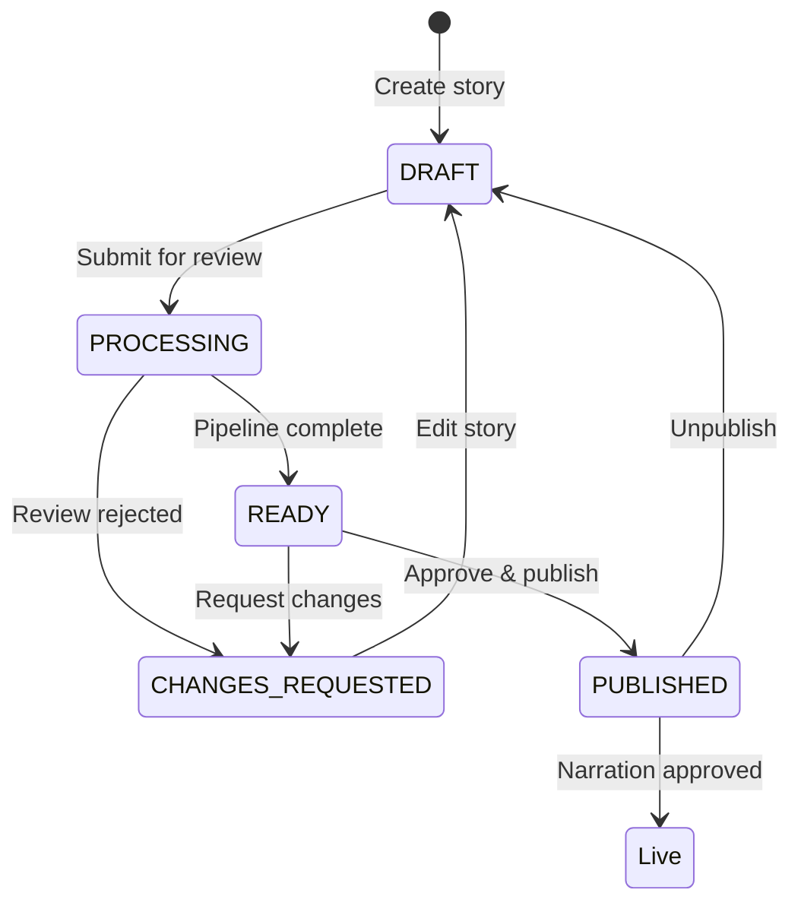
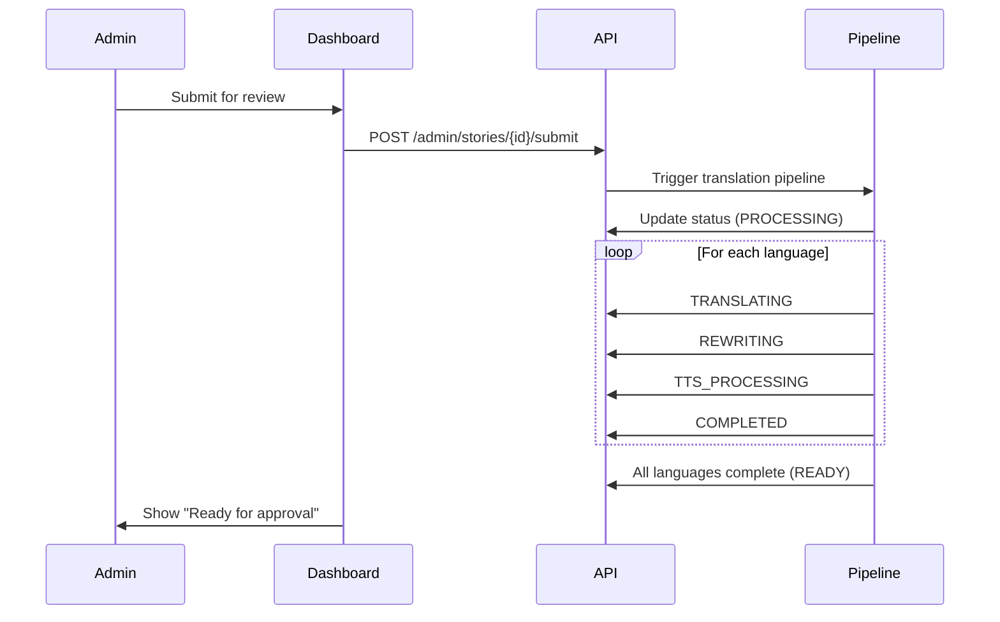

# Story Status System Documentation

## Overview

The unified story status system provides clear visual indicators for story lifecycle management across the admin dashboard. This system aligns with the Tamixa Premium UX Overhaul requirements (Requirement 11: Admin Story Management Workflow Clarity).

## Story Status Types

### LibraryStoryStatus Enum

The backend uses a unified `LibraryStoryStatus` enum with the following values:

| Status | Description | Color | Icon | Use Case |
|--------|-------------|-------|------|----------|
| `DRAFT` | Story is being edited, not submitted for review | Gray | FileText | Initial creation, editing before submission |
| `PUBLISHED` | Story is in review queue (may be processing or awaiting approval) | Amber | ClipboardCheck | Submitted for review, awaiting human approval |
| `PROCESSING` | Pipeline is actively running (translation, rewriting, TTS) | Blue (animated) | Clock | Background processing in progress |
| `READY` | Pipeline complete, ready for human review | Green | CheckCircle | Ready for content ops team to approve |
| `CHANGES_REQUESTED` | Reviewer requested changes | Orange | AlertCircle | Needs revision before re-submission |
| `REJECTED` | Story rejected by reviewer | Red | XCircle | Not approved for publication |

### Special Status: Live on App

When a story has `status === "PUBLISHED"` AND `narrationApprovedAt` is set, it displays as **"Live"** with green color, indicating it's approved and available in the mobile app.

## Pipeline Status System

### Per-Language Pipeline Stages

Each language (Tamil, English, Hindi, Telugu, Kannada, Malayalam) goes through these stages:

1. **PENDING** - Not started (gray)
2. **TRANSLATING** - Translating content (orange, animated)
3. **REWRITING** - Converting to conversational narration script (orange, animated)
4. **TTS_PROCESSING** - Generating audio (orange, animated)
5. **COMPLETED** - All stages complete (green)
6. **FAILED** - Error occurred (red, with error message)

### Pipeline Progress Indicators

The system provides multiple ways to display pipeline progress:

#### 1. Full Pipeline Status Badges

Shows all languages with their current status:

```tsx
import { PipelineStatusBadges } from "@/components/design-system";

<PipelineStatusBadges
  status={pipelineStatus}
  showProgress={true}
  compact={false}
/>
```

Features:
- Per-language status badges with color coding
- Progress label (e.g., "Translating Ta…", "Complete")
- Error summary section for failed stages
- Animated pulse effect for active processing

#### 2. Compact Progress Indicator

Shows just the completion count:

```tsx
import { PipelineProgressIndicator } from "@/components/design-system";

<PipelineProgressIndicator status={pipelineStatus} />
```

Displays: "3 / 6" or "Complete"

## Component Usage

### Story Status Badge

```tsx
import { StoryStatusBadge } from "@/components/design-system";

// Basic usage
<StoryStatusBadge status="DRAFT" />

// With narration approval (shows "Live")
<StoryStatusBadge 
  status="PUBLISHED" 
  narrationApproved={true} 
/>

// Different sizes
<StoryStatusBadge status="READY" size="sm" />
<StoryStatusBadge status="READY" size="md" />
<StoryStatusBadge status="READY" size="lg" />

// Without icon
<StoryStatusBadge status="PROCESSING" showIcon={false} />
```

### Story Status Icon (Compact)

For dense table views where space is limited:

```tsx
import { StoryStatusIcon } from "@/components/design-system";

<StoryStatusIcon status="READY" />
```

### Pipeline Status Badges

```tsx
import { PipelineStatusBadges } from "@/components/design-system";

// Full display with progress
<PipelineStatusBadges
  status={pipelineStatusResponse}
  showProgress={true}
  compact={false}
/>

// Compact display (short language codes)
<PipelineStatusBadges
  status={pipelineStatusResponse}
  compact={true}
/>

// Without progress label
<PipelineStatusBadges
  status={pipelineStatusResponse}
  showProgress={false}
/>
```

## Status Workflow

### Draft → Review → Approval → Live



### Pipeline Processing Flow



## Real-Time Updates

The story list page polls for pipeline status updates every 3 seconds when stories are in active processing states:

- **PROCESSING** - Pipeline actively running
- **PUBLISHED** - May have background processing
- **READY** - May have ongoing audio generation

The polling mechanism:
1. Identifies stories in pollable states
2. Fetches pipeline status for those stories
3. Updates UI with new status badges
4. Continues until all stories reach stable states

## Preventing Conflicting Operations

The system prevents conflicting operations during pipeline processing:

### Disabled Actions During Pipeline Processing

When `isLibraryStoryPipelineActivelyRunning(status)` returns `true`:

- ❌ Edit story
- ❌ Delete story
- ❌ Bulk select
- ❌ Submit for review
- ❌ Approve/reject

### Allowed Actions During Pipeline Processing

- ✅ View story details
- ✅ View pipeline progress
- ✅ Navigate to other pages
- ✅ Refresh status

## Error Handling

### Pipeline Errors

When a language fails during pipeline processing:

1. Status badge turns red
2. Error message displayed in tooltip
3. Error summary section shows all failed languages
4. Admin can retry from Edit page

### Display Format

```
Ta — FAILED
  Translation service timeout
```

## Accessibility

All status components include:

- **Tooltips**: Descriptive text on hover
- **Color + Icon**: Not relying on color alone
- **ARIA labels**: Screen reader support
- **Keyboard navigation**: Focus states

## Design Tokens

Status colors align with the Tamixa design system:

```typescript
// Status colors
DRAFT: "border-muted-foreground/40 bg-muted/30"
PUBLISHED: "border-amber-500/60 bg-amber-500/15"
PROCESSING: "border-blue-500/60 bg-blue-500/15"
READY: "border-emerald-500/60 bg-emerald-500/15"
CHANGES_REQUESTED: "border-orange-500/60 bg-orange-500/15"
REJECTED: "border-red-500/60 bg-red-500/15"
LIVE: "border-green-500/60 bg-green-500/15"
```

## Best Practices

### 1. Always Show Pipeline Status for Review Queue Stories

```tsx
{isReviewQueueStatus(story.status) && (
  <PipelineStatusBadges status={pipelineStatus} />
)}
```

### 2. Disable Actions During Processing

```tsx
const isPipelineActive = isLibraryStoryPipelineActivelyRunning(pipelineStatus);

<Button disabled={isPipelineActive}>
  Edit Story
</Button>
```

### 3. Poll for Updates

```tsx
useEffect(() => {
  if (!hasActiveStories) return;
  
  const interval = setInterval(() => {
    loadPipelineStatuses(activeStoryIds);
  }, 3000);
  
  return () => clearInterval(interval);
}, [hasActiveStories, activeStoryIds]);
```

### 4. Show Clear Status Transitions

```tsx
// Before submission
<StoryStatusBadge status="DRAFT" />

// After submission (processing)
<StoryStatusBadge status="PROCESSING" />
<PipelineStatusBadges status={pipelineStatus} showProgress />

// After pipeline complete
<StoryStatusBadge status="READY" />

// After approval
<StoryStatusBadge status="PUBLISHED" narrationApproved />
```

## Testing

### Unit Tests

Test status badge rendering:

```typescript
describe("StoryStatusBadge", () => {
  it("renders DRAFT status correctly", () => {
    render(<StoryStatusBadge status="DRAFT" />);
    expect(screen.getByText("Draft")).toBeInTheDocument();
  });

  it("shows Live when published and approved", () => {
    render(<StoryStatusBadge status="PUBLISHED" narrationApproved />);
    expect(screen.getByText("Live")).toBeInTheDocument();
  });
});
```

### Integration Tests

Test pipeline status updates:

```typescript
describe("Pipeline Status Updates", () => {
  it("polls for status updates every 3 seconds", async () => {
    // Mock API
    // Render story list
    // Verify polling interval
    // Verify status updates
  });
});
```

## Migration Guide

### Updating Existing Code

Replace inline status rendering with components:

**Before:**
```tsx
<Badge variant={story.status === "DRAFT" ? "secondary" : "default"}>
  {story.status}
</Badge>
```

**After:**
```tsx
<StoryStatusBadge 
  status={story.status} 
  narrationApproved={story.narrationApprovedAt != null}
/>
```

### Pipeline Status Migration

**Before:**
```tsx
{pipelineStatus && (
  <div>
    {Object.entries(pipelineStatus).map(([lang, status]) => (
      <span key={lang}>{lang}: {status}</span>
    ))}
  </div>
)}
```

**After:**
```tsx
<PipelineStatusBadges status={pipelineStatus} />
```

## Related Documentation

- [Design System Tokens](../src/lib/design-tokens.ts)
- [Library Story Workflow](../src/lib/library-story-workflow.ts)
- [API Types](../src/types/api.ts)
- [Requirements: Admin Story Management](../../.kiro/specs/tamixa-premium-ux-overhaul/requirements.md#requirement-11-admin-story-management-workflow-clarity)
