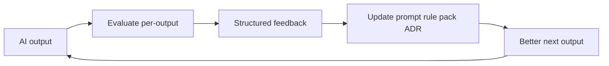

# AI evaluation system (per-output + learning loop)

The quarterly maturity scorecard in [AGENTIC_SDLC_GOVERNANCE.md](AGENTIC_SDLC_GOVERNANCE.md) is **too slow** as the only feedback mechanism. This document adds **per-output evaluation** and ties it to a **learning loop**.

## Per-output evaluation (default habit)

Run evaluation **on each meaningful AI artifact** before merge or publish:

| Output type | When | How |
|-------------|------|-----|
| Story / localized text | Before admin publish or A/B | Evaluation agent + human for nuance |
| Prompt / JSON instruction change | Before merge | Evaluation + Prompt/Story agent |
| Code / tests | Before merge | Review agent + CI + optional Evaluation on diff quality |
| PR as a whole | Before merge | Review checklist + PR acceptance note |

Use [.cursor/rules/evaluation-agent.mdc](../.cursor/rules/evaluation-agent.mdc) and [.github/prompts/evaluate-output.prompt.md](../.github/prompts/evaluate-output.prompt.md).

### Dimensions tracked (examples)

- **Story quality** — safety, coherence, voice (see Evaluation agent rubric)  
- **Tamil / multilingual fluency** — script, idiom, TTS speakability; compare to [context-packs/](context-packs/README.md)  
- **Test / code quality** — architecture fit, determinism, coverage appropriateness  
- **PR acceptance** — merged vs changes requested; link to AI-assisted flag  

## Learning loop (closed)

| Step | Owner | Artifact |
|------|-------|----------|
| Output | Dev / agent | PR, story draft, prompt diff |
| Evaluate | Human or Evaluation agent | Scores + blockers in PR comment |
| Feedback | Tech lead / locale owner | Thread or `docs/engineering-brain/LESSONS_LEARNED.md` |
| Update | Owner per [CONTEXT_LIFECYCLE.md](CONTEXT_LIFECYCLE.md) | `.github/prompts/`, `.cursor/rules/`, `docs/context-packs/` |
| Measure | Team | PR metrics table below |

## Automation in this repo

- **End-to-end map:** [AI_GOVERNANCE_E2E.md](AI_GOVERNANCE_E2E.md) — CI, DB tables, logs, and security in one view.
- **Spec-first CI:** [.github/workflows/spec-first-guard.yml](../.github/workflows/spec-first-guard.yml) — blocks sensitive diffs without a `docs/specs/` link (see [specs/README.md](specs/README.md)).
- **PR metrics artifact:** [.github/workflows/pr-governance-metrics.yml](../.github/workflows/pr-governance-metrics.yml) — parses optional `ai-assisted` / `eval-pass` / `re-prompts` from the PR body into `pr-governance.json` and the job summary.
- **Merged PR export + webhook:** [.github/workflows/pr-metrics-export.yml](../.github/workflows/pr-metrics-export.yml) and [METRICS_EXPORT.md](METRICS_EXPORT.md) — optional `PR_METRICS_WEBHOOK_URL` (Sheets/BigQuery via your endpoint).
- **Label bootstrap:** [.github/workflows/bootstrap-repo-labels.yml](../.github/workflows/bootstrap-repo-labels.yml) — creates **`skip-spec-first`** (run once from Actions).
- **Runtime story signal:** backend logs `event=ai_governance_output` when a generated story is persisted (`StoryService`) — use for dashboards or offline eval correlation.

## PR acceptance rate tracking (lightweight)

Until a dashboard exists, add to **each AI-heavy PR** (or weekly rollup):

- `ai-assisted: yes|no`  
- `eval-pass: yes|no|n/a`  
- `outcome: merged|changes|closed`  
- `re-prompts: N` (optional)  

Roll into governance **monthly**; scorecard **quarterly** still applies for strategic dimensions.

## Relation to “AI Control Plane”

When [TAMIXA_AI_CONTROL_PLANE.md](TAMIXA_AI_CONTROL_PLANE.md) is implemented as software, **Evaluation Engine** persists scores, ties to **Prompt Registry** versions, and automates alerts. Until then, **repo process + PR discipline** implements the same logic.

## Related

- [COST_GOVERNANCE.md](COST_GOVERNANCE.md) — use cheaper models for routine evaluation  
- [AGENT_EXECUTION_BOUNDARIES.md](AGENT_EXECUTION_BOUNDARIES.md) — VERIFY stage  
