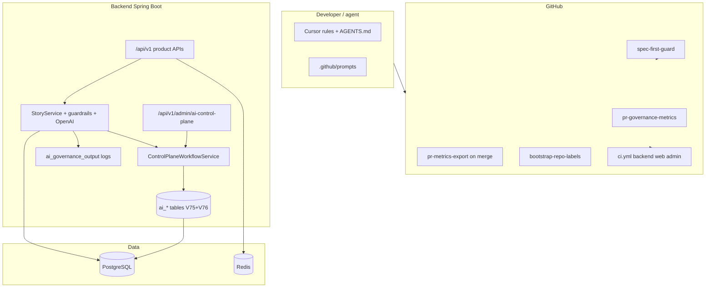

# AI governance & control plane — end-to-end map

This document ties together **documentation**, **CI**, **backend schema**, and **runtime behavior** so nothing is “documented but invisible” in the repo.

## Current architecture (what runs today)

## Component status

| Layer | Artifact | Status | Notes |
|-------|-----------|--------|--------|
| **Workflow** | [AGENTS.md](../AGENTS.md), [.cursor/rules/](../.cursor/rules/) | Active | Think→Verify; Evaluation agent |
| **Spec-first CI** | [.github/workflows/spec-first-guard.yml](../.github/workflows/spec-first-guard.yml) | Active | PRs need `docs/specs/` or break-glass / label |
| **PR metrics** | [pr-governance-metrics.yml](../.github/workflows/pr-governance-metrics.yml) | Active | Artifact + summary |
| **Merged export** | [pr-metrics-export.yml](../.github/workflows/pr-metrics-export.yml) | Active | Optional `PR_METRICS_WEBHOOK_URL` (+ secret header) |
| **Label bootstrap** | [bootstrap-repo-labels.yml](../.github/workflows/bootstrap-repo-labels.yml) | Manual | Run once for `skip-spec-first` |
| **Control plane DB** | [V75__ai_control_plane.sql](../backend/src/main/resources/db/migration/V75__ai_control_plane.sql), [V76__ai_control_plane_seed_tamixa.sql](../backend/src/main/resources/db/migration/V76__ai_control_plane_seed_tamixa.sql) | Active | Flyway on deploy; seed project `tamixa` + default workflow |
| **Control plane API** | `/api/v1/admin/ai-control-plane/**` | Active | RBAC: `VIEW_AI_CONTROL_PLANE` / `MANAGE_AI_CONTROL_PLANE`; public `/api/control-plane/**` still `denyAll` |
| **Ports (contracts)** | `com.tamixa.controlplane.application.port` | Active | `ControlPlaneWorkflowService` (`execute`, `markRunCompleted`, `markRunFailed`, …) + JPA adapters |
| **Story pipeline spine** | `StoryService` + control plane | Default on in `application.yml` | After story row exists: `execute` → success `markRunCompleted` / failure `markRunFailed` (`requestSource=STORY_SERVICE`). Disable with `TAMIXA_CONTROL_PLANE_STORY_WORKFLOW=false` or test profile. |
| **Observability hook** | `event=ai_governance_output` | Active | Includes optional `workflowRunId` when spine enabled |

## Target architecture (documented)

Full design: [CONTROL_PLANE_ARCHITECTURE.md](CONTROL_PLANE_ARCHITECTURE.md).  
Index: [TAMIXA_AI_CONTROL_PLANE.md](TAMIXA_AI_CONTROL_PLANE.md).

**Agentic SDLC alignment:** spec-first CI and PR governance stay the process spine; **runtime** story generation now registers the same workflow registry the admin console uses, so governance is one system—not a parallel “sidecar”.

## Next gaps (recommended order)

1. Step-level orchestration: persist `ai_workflow_step_runs` from the story pipeline and drive prompts/router from registry.  
2. `ControlPlanePromptComposer` / routing used on the hot path (behind flags).  
3. Admin UI: deeper workflow + prompt editing tied to live runs.  
4. Mobile/web: unchanged API surface; continue using `/api/v1` story endpoints.

## Client surfaces (mobile / admin / web)

| Client | Governance touchpoint today | Future |
|--------|----------------------------|--------|
| **Mobile** | Same story APIs; logs only server-side | Optional: headers for experiment id |
| **Admin** | Internal ops | Prompt/workflow consoles → control APIs |
| **Web** | Parent flows unchanged | Same as mobile |

## Related

- [METRICS_EXPORT.md](METRICS_EXPORT.md) · [AI_EVALUATION_SYSTEM.md](AI_EVALUATION_SYSTEM.md) · [specs/README.md](specs/README.md)
