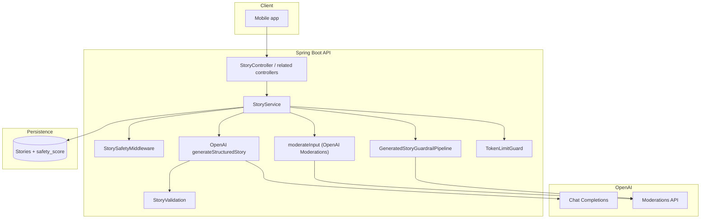

# AI guardrails implementation

This document describes how Tamixa enforces **child-safe AI usage** across the backend and mobile app: input hardening, model output checks, moderation APIs, configuration, and client behavior.

## Goals

- Block unsafe or manipulative **user input** before it reaches the model.
- Validate **structured model output** (length, consistency, vocabulary rules).
- Run **multi-layer moderation** before persisting generated text.
- **Fail closed** when moderation cannot run in production.
- Return **clear HTTP and mobile errors** when content is rejected (without leaking internals).

Guardrails are enforced **primarily on the server**. The mobile app does not duplicate moderation logic; it handles status codes and user-facing messages.

---

## High-level architecture

---

## Story generation pipeline (parent-facing)

Order matters. Approximate sequence in `StoryService.generate`:

| Phase | Component | What it does |
|--------|-----------|----------------|
| Cost / abuse | `TokenLimitGuard` | Blocks generation when token limits would be exceeded. |
| Conversation | `StorySafetyMiddleware` | Sanitizes conversation lines and parent custom prompt (length, control chars, injection patterns, child blocklist). |
| Summarizer | `ConversationSummarizer` | Optional LLM summary → hints. **Raw LLM JSON** passes `getModerationResult`; **parsed `customPrompt` and parse-fallback text** pass full `StoryModerationService.moderateBeforeSave`. Hints are then **re-sanitized** with `sanitizeParentCustomPrompt` in `StoryService`. |
| Input | `StorySafetyMiddleware.sanitizeAndValidateInput` | Theme + child name: allowlist, injection regexes, blocklist. |
| Input moderation | `StoryService.moderateInput` | OpenAI Moderations on `theme + childName`. |
| Generation | `OpenAIPort.generateStructuredStory` | Structured JSON story payload. |
| Pre-cache validation | `StoryValidation` | Validates payload before writing to Redis cache (title, moral, word count vs age, duration vs words, middleware blocklist, `StorySafetyValidationRules`). |
| Cache hit | `StoryValidation` | If the payload comes from cache, **validation runs again** so policy changes and bad cache entries cannot bypass checks. |
| Post-generation | `GeneratedStoryGuardrailPipeline` | Runs **in order**: full `StoryModerationService` on story body → static blocklist → `StorySafetyScoreService` (see [Unified post-generation pipeline](#unified-post-generation-pipeline)). |

On validation or moderation failure, the story may be marked `FAILED` and an exception is thrown (see [API behavior](#api-behavior)).

---

## Unified post-generation pipeline

`GeneratedStoryGuardrailPipeline` (`com.tamixa.application.guardrail`) is the **single orchestrator** for parent-generated structured stories after the model returns and cache/validation have succeeded. It guarantees every saved story passes the same three stages:

| Stage (`GuardrailStage`) | Enforcement |
|--------------------------|-------------|
| `STORY_POST_FULL_MODERATION` | `StoryModerationService.moderateBeforeSave` (OpenAI + keyword + regex + age vocabulary). |
| `STORY_POST_STATIC_BLOCKLIST` | `StorySafetyMiddleware.isGeneratedContentChildSafe` on `storyText`. |
| `STORY_POST_SAFETY_SCORE` | `StorySafetyScoreService.computeAndValidate` → persisted `safety_score`. |

Each stage emits a structured debug log `guardrail_stage` with `guardrailStage`, `promptId`, `language`, `age`. Any `ContentModerationException` from the pipeline causes `StoryService` to set the story to **FAILED** before rethrowing.

---

## `StoryModerationService` layers

Used for **generated story text** (via `GeneratedStoryGuardrailPipeline`), **conversation-summary snippets**, **library rephrase suggestions**, **short content** batches, **short content generation**, and **bulk library** story creation (service is **required** for `StoryLibraryService` bulk flow).

| Layer | Mechanism |
|-------|-----------|
| 1 | **OpenAI Moderations API** — categories mapped to child-unsafe (violence, sexual, hate, self-harm, harassment). Empty API response or transport error → **fail closed** when the API key is present. |
| 2 | **Configurable keyword blocklist** — `app.story.keyword-blocklist` (comma-separated). |
| 3 | **Regex red-flag patterns** — e.g. political/violence/weapon hints (see `StoryModerationService`). |
| 4 | **`StorySafetyValidationRules`** — harmful/adult terms, psychological themes, age &lt; 6 fear-word rules. |

Rejections increment metrics via `ApplicationMetrics.recordModerationFailure` and structured logs (`story_moderation`, `moderation_rejection`) with `promptId`, `layer`, `age`, etc. **Story text is not logged** on rejection.

---

## Input hardening: `StorySafetyMiddleware`

- Strips dangerous **control / format characters** (null bytes, zero-width, etc.).
- Enforces **max lengths** (theme, child name, parent custom prompt, conversation messages).
- Optional **theme allowlist** via `app.story.theme-allowlist` (empty = no restriction).
- **Prompt-injection style patterns** (e.g. “ignore previous instructions”, “system:”, jailbreak phrasing).
- **Static child-unsafe vocabulary** on user-facing fields and generated text spot-checks.

`StoryPromptBuilder` keeps **system** and **user** content separated; user-controlled strings should only enter through sanitized paths.

---

## Structured output: `StoryValidation`

Ensures the model output is **usable and internally consistent**:

- Title length, non-blank moral, word count vs **age-based** caps (`StoryPromptBuilder.maxWordsForAge` vs `app.story.max-words`).
- **Estimated duration** vs word count (tolerance against 150 WPM assumption).
- Generated story text passes middleware blocklist and `StorySafetyValidationRules`.

---

## Heuristic safety score: `StorySafetyScoreService`

- Adjusts a score from patterns in title, moral, and body (penalties for risky words, bonuses for moral/positive tone).
- Default threshold: **`app.story.safety-score-threshold`** (default 60).
- Below threshold → `ContentModerationException`.
- Score recorded on the story row for **audit and admin review**.

---

## OpenAI client: moderation and API key

Implementation: `OpenAIClient` (`backend/.../infrastructure/openai/OpenAIClient.kt`).

- **`app.openai.moderation-required`** (env: `OPENAI_MODERATION_REQUIRED`):
  - **Default `false`** in base `application.yml` (local dev without a key).
  - **Default `true`** under **`application-prod.yml`** so a **missing API key fails moderation closed** (no silent “allow all”).
- When the key is set: Moderations API errors or empty results → **fail closed** (`safe = false`).

---

## Narration pipeline

`SafetyValidatorServiceImpl` (`app.narration.blocklist-keywords`, word-count tolerance vs original) validates **AI-formatted narration** scripts: blocklist, moral preservation heuristics, length ratio. Failures use `SafetyValidationException` (separate from story `ContentModerationException`).

---

## Other AI entry points

| Flow | Moderation / safety notes |
|------|-------------------------|
| **Short content (admin generate)** | `ShortContentGenerationService` filters each item through `StoryModerationService`. |
| **Short content (save)** | `ShortContentService` runs `moderateBeforeSave` before persist. |
| **Bulk library stories** | `StoryLibraryService` requires `StoryModerationService`; each generated story text is moderated before `create`. |
| **Library rephrase (admin)** | After `completeChat`, full **`StoryModerationService.moderateBeforeSave`** on title + body; unsafe suggestions return `null` (not shown/saved). |
| **Conversation summary** | **`getModerationResult`** on raw model output; then **`moderateBeforeSave`** on parsed `customPrompt` and on parse-fallback concatenation. |
| **Translation (OpenAI)** | Pipeline translation uses `TranslationService` / provider config; not the same creative guard stack—curated content is admin-controlled upstream. |

---

## API behavior

| Exception | HTTP | Typical client handling |
|-----------|------|-------------------------|
| `ContentModerationException` | **422** Unprocessable Entity | JSON `message` from `ErrorResponse` shape. |
| `FreeStoryLimitReachedException` | **402** Payment Required | Mobile: `LimitReachedException` → upgrade UI. |

`GlobalExceptionHandler` maps `ContentModerationException` to 422 with a safe `message` string (no stack traces in body).

---

## Mobile app

- **`StoryApi.generate`**: treats **422** as `ContentModerationFailureException` with server `message` when parseable.
- **`errorMessageForUser`**: shows that message to the parent; fallback string `Strings.storyContentNotAllowed()` if the body is missing.

Clients should **not** rely on parsing English error codes; use HTTP status + `message`.

---

## Configuration reference

| Setting | Env / property | Purpose |
|---------|----------------|---------|
| OpenAI key | `OPENAI_API_KEY` / `app.openai.api-key` | Required when `AI_LLM_PROVIDER=openai` for story/moderation paths using OpenAI. |
| Gemini key | `GEMINI_API_KEY` / `app.llm.gemini.api-key` | Required when `AI_LLM_PROVIDER=gemini` (and for Gemini translation, Gemini covers, Veo when enabled). |
| Moderation required (OpenAI) | `OPENAI_MODERATION_REQUIRED` / `app.openai.moderation-required` | If true and OpenAI key blank → OpenAI moderation rejects. Prod profile defaults true. |
| Moderation required (Gemini) | `GEMINI_MODERATION_REQUIRED` / `app.llm.gemini.moderation-required` | If true and Gemini key blank → Gemini moderation rejects. Prod profile defaults true. |
| Theme allowlist | `STORY_THEME_ALLOWLIST` / `app.story.theme-allowlist` | Optional comma-separated themes. |
| Safety score threshold | `STORY_SAFETY_SCORE_THRESHOLD` / `app.story.safety-score-threshold` | Min acceptable heuristic score (default 60). |
| Keyword blocklist | `STORY_KEYWORD_BLOCKLIST` / `app.story.keyword-blocklist` | Layer 2 in `StoryModerationService`. |
| Max story words | `STORY_MAX_WORDS` / `app.story.max-words` | Cap with age-based stricter limits inside validation. |
| Narration blocklist | `app.narration.blocklist-keywords` | Narration script safety. |
| Guardrails service | `GUARDRAILS_SERVICE_ENABLED`, `GUARDRAILS_SERVICE_URL`, `GUARDRAILS_SERVICE_API_KEY`, `GUARDRAILS_SERVICE_FAIL_OPEN` | Optional Python sidecar; see [Reusable guardrails HTTP service](#reusable-guardrails-http-service-separate-project). |

See also `.env.example` and [docs/ENV_REFERENCE.md](ENV_REFERENCE.md) for broader env documentation.

---

## Operations and auditing

- **Logs**: `moderation_rejection` includes `layer`, `promptId`, `age`; avoid logging full story bodies in production.
- **Metrics**: Moderation failures by layer; safety score recording where implemented.
- **Database**: `safety_score` on stories for dashboards and manual review.
- **Admin**: Moderation UI consumes story status and scores; ensure flag/approve flows match your deployed admin build.

---

## Reusable guardrails HTTP service (separate project)

The **`guardrails-service/`** directory is a **Git submodule** to a **product-agnostic** Python service (canonical repo **`guardrails-service`**; sibling path `../guardrails-service` or your published Git URL). In this monorepo, clone with **`git clone --recurse-submodules`** or run **`git submodule update --init`**. See **[GUARDRAILS_SUBMODULE.md](GUARDRAILS_SUBMODULE.md)**. The service does **not** replace Kotlin moderation; it adds an optional **first step** in `GeneratedStoryGuardrailPipeline` when enabled.

| Item | Detail |
|------|--------|
| **API** | `POST /v1/validate/structured-story`, `GET /health` |
| **Python app** | Package `guardrails_service`; run with `uvicorn guardrails_service.main:app` |
| **Contract** | Story JSON fields (`title`, `moral`, `story_text`, `estimated_duration_seconds`) + `context.max_story_words` from the caller (Tamixa maps from `StructuredStoryPayload` and age + `app.story.max-words`) |
| **Auth** | Optional shared secret: env `GUARDRAILS_API_KEY` on Python side → header `X-Guardrails-Api-Key` from the HTTP client |
| **Tamixa config** | `app.guardrails-service.*` via `GUARDRAILS_SERVICE_*` (see `application.yml`, `.env.example`) |
| **When down** | `fail-open-on-error: true` skips remote validation only; Kotlin pipeline still runs. If `false`, API returns **503** (`ExternalGuardrailUnavailableException`). |
| **Docker** | Compose builds `guardrails-service`, backend **`depends_on`** its healthcheck, and **`GUARDRAILS_SERVICE_ENABLED` defaults to `true`**. Set `GUARDRAILS_SERVICE_ENABLED=false` if you run backend without that container. |
| **Mobile** | Story generate maps **503** → `StoryValidationServiceUnavailableException` and localized `Strings.storyValidationTemporarilyUnavailable()`. |

Backend wiring: `StructuredStoryRemoteGuardrailPort`, `HttpStructuredStoryGuardrailAdapter` (`@ConditionalOnProperty` `app.guardrails-service.enabled=true`). `StoryService` marks the story **FAILED** on `ExternalGuardrailUnavailableException` so rows do not stay stuck in `MODERATION_CHECK`.

---

## Related source files (backend)

| Area | Primary types |
|------|----------------|
| Input + injection | `StorySafetyMiddleware`, `StoryPromptBuilder` |
| Story orchestration | `StoryService` |
| Post-gen orchestration | `GeneratedStoryGuardrailPipeline`, `GuardrailStage` |
| Remote structural (optional) | `StructuredStoryRemoteGuardrailPort`, `HttpStructuredStoryGuardrailAdapter` |
| Output validation | `StoryValidation`, `StorySafetyValidationRules` |
| Multi-layer moderation | `StoryModerationService`, `ModerationResult` |
| Heuristic score | `StorySafetyScoreService` |
| Conversation hints | `ConversationSummarizer` |
| Admin rephrase | `LibraryStoryRephraseService` |
| OpenAI | `OpenAIClient`, `OpenAIPort` |
| HTTP errors | `GlobalExceptionHandler` |
| Short content | `ShortContentService`, `ShortContentGenerationService` |
| Library bulk | `StoryLibraryService` |
| Narration | `SafetyValidatorServiceImpl` |

Mobile: `StoryApi.kt`, `ContentModerationFailureException.kt`, `ErrorMessages.kt`, `Strings.storyContentNotAllowed()`.

---

## Maintenance notes

- **Policy drift**: Blocklists and regexes exist in multiple classes; consider consolidating into one data-driven policy module if rules grow.
- **Multilingual**: Many substring rules are English-centric; OpenAI Moderation helps but may vary by language—monitor false negatives/positives per locale.
- **Tests**: Keep integration tests mocking `OpenAIPort.getModerationResult` aligned with real moderation behavior; story payloads must satisfy `StoryValidation` (e.g. duration vs word count).

---

*Last updated: `guardrails-service/` reusable HTTP project + Kotlin integration; `GeneratedStoryGuardrailPipeline`; conversation-summary and library-rephrase moderation; conversation sanitization; cache re-validation; required bulk moderation; production moderation-required defaults; mobile 422 handling.*
