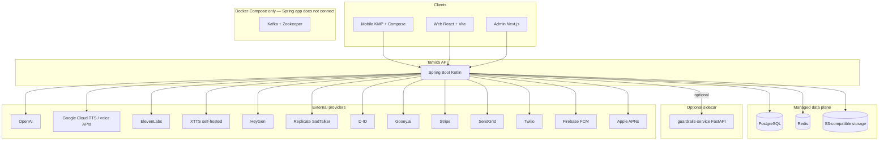

# Tamixa application architecture

This document is the **high-level map** of the monorepo: clients, backend layers, data plane, and **external integrations**. For deep dives, see the linked docs at the end.

---

## Why `guardrails-service` is called “optional”

The Python **guardrails-service** is **not** required for Tamixa to generate or serve stories.

| Reason | Detail |
|--------|--------|
| **Feature flag** | Backend enables it only when `app.guardrails-service.enabled` / `GUARDRAILS_SERVICE_ENABLED` is true. When false, the bean `HttpStructuredStoryGuardrailAdapter` is not created and the pipeline skips the HTTP call. |
| **Additive check** | It runs as an **extra** structural validation step **before** the main Kotlin guardrail stack (moderation, blocklist, safety score). Disabling it does not remove core child-safety logic in the JVM. |
| **Fail-open** | With `GUARDRAILS_SERVICE_FAIL_OPEN=true`, transport errors to the sidecar are ignored and generation continues. |
| **Separate deployable** | It lives in its **own repo (submodule)** and container so teams can omit it in minimal environments or swap implementations. |

So “optional” means **operationally optional**, not “unimportant”: in full Docker Compose we default it **on** so local stacks match a hardened path; production may still choose fail-open for availability.

---

## System context (containers)

---

## Monorepo modules

| Path | Stack | Role |
|------|--------|------|
| `mobile/` | Kotlin Multiplatform, Compose, Ktor | Primary product: parent + child UX, playback, subscriptions. |
| `backend/` | Spring Boot 3, Kotlin | REST API `/api/v1`, auth, story pipeline, webhooks, integrations (ports/adapters). |
| `web/` | React, Vite | Parent web client. |
| `admin/` | Next.js | Operations: moderation, users, curated content, health, revenue tooling. |
| `guardrails-service/` | Python, FastAPI (submodule) | Optional structured JSON validation HTTP API. |

---

## Backend internal shape

- **API layer** — `com.tamixa.api.*` — controllers, DTOs, security, exception mapping.
- **Application layer** — `com.tamixa.application.*` — use cases, domain services, **ports** (interfaces).
- **Infrastructure** — `com.tamixa.infrastructure.*` — **adapters**: JPA, Redis, S3, HTTP clients to vendors, email/SMS/push.

Configuration is grouped in **`AppProperties`** (`application.yml` + env). Features are toggled with `@ConditionalOnProperty`, non-empty keys, or dedicated `@Conditional` beans (e.g. Replicate SadTalker).

---

## External integrations (what talks to what)

Only **major** integrations are listed; see **`docs/ENV_REFERENCE.md`** and **`.env.example`** for every variable.

### AI, moderation, and translation

| Capability | Typical providers / adapters | Notes |
|------------|------------------------------|--------|
| Story LLM, moderation API, some narration rewrite | **OpenAI** (`OpenAIClient`, `NarrationOpenAIAdapter`, `OpenAITtsClientAdapter`, `OpenAITranslationClient`) | Core generation and moderation; translation for curated pipeline. |
| Optional structured JSON guardrails | **`guardrails-service`** (`HttpStructuredStoryGuardrailAdapter`) | HTTP sidecar; see **[AI_GUARDRAILS.md](AI_GUARDRAILS.md)**. |

### Narration (TTS) and audio

| Capability | Providers | Notes |
|------------|-----------|--------|
| Production TTS | **Google Cloud TTS** (`GoogleCloudTtsClientAdapter`) | Common path for real narration; Chirp / WaveNet. |
| OpenAI TTS | **OpenAI** (`OpenAITtsClientAdapter`) | Alternative voice option. |
| Branded / placeholder audio | **Tamixa sample** (`TamixaTtsClientAdapter`) | Pre-recorded / sample paths. |
| Dev / tests | **Simulated** (`SimulatedTtsClientAdapter`) | Tiny placeholder MP3. |
| Narration storage | **S3** (`S3NarrationAudioStorageAdapter`) | When `app.storage.type=s3`. |

See **[backend/NARRATION_ARCHITECTURE.md](backend/NARRATION_ARCHITECTURE.md)**.

### Voice cloning (parent voice)

| Provider | Adapter / config | Notes |
|----------|------------------|--------|
| **ElevenLabs** | `ElevenLabsVoiceCloningAdapter`, `app.voice-cloning.eleven-labs-*` | Default provider in many setups; see **[ELEVENLABS_INTEGRATION.md](ELEVENLABS_INTEGRATION.md)**. |
| **Google** (Chirp Instant Custom Voice) | `GoogleCloudVoiceCloningAdapter` | Uses Google Cloud API key path shared with TTS in places. |
| **XTTS** (self-hosted) | `XttsVoiceCloningAdapter`, `app.voice-cloning.xtts-base-url` | Optional co-located service (`xtts-service/` in repo). |

**HeyGen** also appears on **voice profiles** (e.g. `heygenVoiceId`) for avatar / voice flows where HeyGen is the video or voice vendor—see avatar section and voice docs.

See **[VOICE_CLONING_ARCHITECTURE.md](VOICE_CLONING_ARCHITECTURE.md)**.

### Avatar / talking-head video

| Provider | Client / notes |
|----------|----------------|
| **HeyGen** | Primary path per **[AVATAR_VIDEO.md](AVATAR_VIDEO.md)**; `HEYGEN_API_KEY`, `HeyGenVoiceTtsAdapter` where applicable. |
| **Replicate (SadTalker)** | `ReplicateSadTalkerClient` — lip-sync video from image + audio URL. |
| **D-ID** | `DidAvatarVideoClient` — photo avatar talks API. |
| **Gooey.ai** | Gooey recipe / API; can use **Eleven Labs** as inner TTS per `app.avatar-video.gooey-tts-provider`. |

Rendered assets and uploads use **S3** adapters (e.g. `S3StoryAvatarVideoStorageAdapter`, cover/video storage).

### Commerce and billing

| Service | Role |
|---------|------|
| **Stripe** | Checkout, subscriptions, webhooks (`StripeCheckoutAdapter`, subscription domain). |

### Notifications

| Channel | Implementation |
|---------|----------------|
| **Email (magic link, etc.)** | **SendGrid** when API key set (`SendGridEmailSender`); otherwise logging stub. |
| **SMS (OTP)** | **Twilio** (`TwilioSmsSender`) when configured; otherwise `LoggingSmsSender` + dev OTP bypass. |
| **Push (Android)** | **FCM** (`FCMPushNotificationAdapter`). |
| **Push (iOS)** | **APNs** (`APNsPushNotificationAdapter`). |

### Media / tooling (not SaaS APIs)

| Tool | Use |
|------|-----|
| **FFmpeg** | Share clips, GIF conversion (`FFmpegShareClipRenderAdapter`, `FfmpegVideoToGifAdapter`) when enabled and installed on the host. |

### Infrastructure

| Component | Use |
|-----------|-----|
| **PostgreSQL** | System of record (JPA/Flyway). |
| **Redis** | Cache, rate limits, optional bulk job store, TTS metadata cache, etc. |
| **Kafka** | **Not used by the Spring Boot app today** (no `spring-kafka` dependency, no producers/consumers). **Docker Compose** still starts a broker and sets `KAFKA_BOOTSTRAP_SERVERS` / topic env vars for **parity with older deployment docs and optional future async pipelines**. Story audio after generation runs **in-process** via `InlineStoryEventPublisher` (`backend/src/main/kotlin/com/tamixa/infrastructure/pipeline/InlineStoryEventPublisher.kt`), whose doc comment says it **replaced** `KafkaStoryEventPublisher` for Beta. Packages under `infrastructure/kafka/` hold mostly **no-op publishers** and event record types; admin `GET /api/v1/admin/kafka-events` is a **stub** (no in-app event store). |
| **S3** | Audio, covers, avatars, exports, clips—behind storage type and feature flags. |

---

## Representative request flows

**Story generation (simplified):** Client → **Spring API** → OpenAI (structured story) → optional **guardrails-service** → **moderation + rules** in Kotlin → persist → **async in-JVM narration** (`InlineStoryEventPublisher` executor), not Kafka.

**Playback with avatar:** Client → stream URL API → signed audio (and optional **avatar video** from HeyGen / Replicate / D-ID / Gooey) → **S3** / CDN URLs.

---

## AI governance & control plane (platform layer)

Tamixa is adding an **AI Control Plane** as a governed layer **above** ad-hoc provider calls: prompt registry, workflows, routing, policy, evaluation, audit, and cost. It is **not** a replacement for the story API surface parents use today.

| Aspect | Today | Target |
|--------|--------|--------|
| **Story generation** | `StoryService` + `StoryPromptBuilder` + OpenAI in-process | Optional facade via control-plane **workflow execute** (feature-flagged) |
| **Persistence** | Stories, usage, tokens in existing tables | **`ai_*` tables** (Flyway V75) for prompts, runs, policies, cost events |
| **HTTP** | `/api/v1/...` only | **`/api/control-plane/**` reserved** — currently **403 deny-all** in `SecurityConfig` until controllers + RBAC exist |
| **CI / process** | Spec-first guard, PR metrics, webhook export | See [AI_GOVERNANCE_E2E.md](AI_GOVERNANCE_E2E.md) |

**Docs:** [CONTROL_PLANE_ARCHITECTURE.md](CONTROL_PLANE_ARCHITECTURE.md) (full design), [TAMIXA_AI_CONTROL_PLANE.md](TAMIXA_AI_CONTROL_PLANE.md) (index), [AI_GOVERNANCE_E2E.md](AI_GOVERNANCE_E2E.md) (integration map).

---

## Related documentation

| Topic | Doc |
|-------|-----|
| Enterprise quality + future B2B | [ENTERPRISE_ROADMAP.md](ENTERPRISE_ROADMAP.md) |
| Guardrails (optional sidecar + Kotlin pipeline) | [AI_GUARDRAILS.md](AI_GUARDRAILS.md), [GUARDRAILS_SUBMODULE.md](GUARDRAILS_SUBMODULE.md) |
| Narration / TTS | [backend/NARRATION_ARCHITECTURE.md](backend/NARRATION_ARCHITECTURE.md) |
| Voice cloning (ElevenLabs, Google, XTTS) | [VOICE_CLONING_ARCHITECTURE.md](VOICE_CLONING_ARCHITECTURE.md), [ELEVENLABS_INTEGRATION.md](ELEVENLABS_INTEGRATION.md) |
| Avatar video (HeyGen primary, fallbacks) | [AVATAR_VIDEO.md](AVATAR_VIDEO.md) |
| Environment variables | [ENV_REFERENCE.md](ENV_REFERENCE.md), root `.env.example` |
| Security | [SECURITY.md](SECURITY.md), [backend/SECURITY_CHECKLIST.md](backend/SECURITY_CHECKLIST.md) |
| AI governance & control plane | [AI_GOVERNANCE_E2E.md](AI_GOVERNANCE_E2E.md), [CONTROL_PLANE_ARCHITECTURE.md](CONTROL_PLANE_ARCHITECTURE.md), [AGENTS.md](../AGENTS.md) |

---

*This file is the umbrella “map”; feature docs remain the source of truth for provider-specific setup and behavior.*
