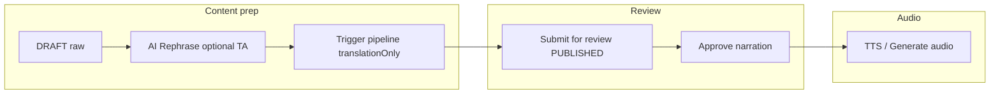

# Tamixa Application — Architecture, Flows & Integration

**Role:** Senior technical architect reference  
**Scope:** End-to-end flows, screen responsibilities, mobile ↔ backend integration, and identified gaps.

---

## 1. Application entry and routing

- **Start destination** (TamixaNavHost): Depends on `settingsState.settingsLoaded` and `authViewModel.isLoggedIn()`.
  - Settings not loaded → **Splash**.
  - Logged in + settings loaded:
    - No language selected yet → **LanguageSelection**.
    - Else → **Dashboard**.
  - Else → **Splash** (user then goes to Onboarding Hook or Login).

- **Splash** decides:
  - If onboarding not completed → **OnboardingHook**.
  - Else → **Login**.

- **Post-login:** After successful login/register, navigate to `postLoginDestination`: LanguageSelection (first time) or Dashboard, with back stack cleared.

- **Session expired:** When token refresh fails, `SessionExpiredNotifier` is triggered; NavHost navigates to **Login**, clears tokens, and resets back stack (implemented).

---

## 2. Route and screen map

| Route | Screen | Main data source | Backend integration |
|-------|--------|------------------|---------------------|
| `splash` | SplashScreen | AuthViewModel, SettingsViewModel | None (local flags) |
| `onboarding/hook` … `onboarding/bedtime-reminder` | Onboarding* | SettingsViewModel (completeOnboarding, reminder) | Optional reminder port (platform) |
| `login` | LoginScreen | AuthViewModel (loginState, OTP, passwordless) | AuthApi: passwordless, OTP send/verify, refresh |
| `register` | RegisterScreen | AuthViewModel (registerState) | AuthApi: register |
| `language` | LanguageSelectionScreen | SettingsViewModel | Persisted locally |
| `dashboard` | DashboardScreen | StoryViewModel, SubscriptionViewModel, SettingsViewModel | Library, my stories, recent playback, favorites, recommended, usage |
| `library` | LibraryScreen → StorySelectionScreen | StoryViewModel (cachedStories, allStories) | Loaded via Dashboard/Library loadLibraryStories |
| `profile` | ProfileScreen | AuthViewModel (currentUser) | AuthApi: me(); loading/error/retry (implemented) |
| `stories`, `stories/generate` | StorySelectionScreen, StoryGenerationScreen | StoryViewModel (generateState, usage) | Generate, usage limits |
| `audio/{id}` | AudioPlayerScreen | StoryViewModel (fetchStoryById), stream URL, playback | StreamUrlController, playback position, analytics |
| `search` | SearchScreen | StoryViewModel (searchResults, favorites) | StoryApi: search |
| `listening-history` | ListeningHistoryScreen | StoryViewModel (recentPlaybackWithStories) | PlaybackPositionController: recent |
| `favorites` | FavoritesScreen | StoryViewModel (favorites) | FavoriteStoryController |
| `my-voice-avatar` | MyVoiceAndAvatarScreen | Nav only | — |
| `voice` | VoiceUploadScreen | VoiceViewModel, SubscriptionViewModel | VoiceApi: upload, list |
| `avatar` | AvatarUploadScreen | AvatarViewModel, StoryViewModel | AvatarApi: upload, get |
| `subscription` | SubscriptionScreen | SubscriptionViewModel | SubscriptionApi: get, usage, cancel, referral, upgrade |
| `settings` | SettingsScreen | SettingsViewModel (state) | SettingsApi: consent, export, listening-progress; AuthApi: deleteAccount |

---

## 3. Mobile ↔ backend API alignment

- **Auth:** AuthApi ↔ AuthController (`/api/v1/auth/*`). Login, register, passwordless, OTP, refresh, me, deleteAccount.
- **Stories:** StoryApi ↔ StoryController, LibraryStoryController, StreamUrlController, FavoriteStoryController, StoryRecommendationController, PlaybackPositionController, StreamAnalyticsController.
- **Voice / Avatar:** VoiceApi, AvatarApi ↔ VoiceController, FamilyAvatarController.
- **Subscription:** SubscriptionApi ↔ SubscriptionController (get, usage, cancel, referral validate, upgrade).
- **Settings:** SettingsApi ↔ ConsentController, DataExportController, ListeningProgressController.

**DTOs:** Mobile defines DTOs in `network` package; backend uses `api/<domain>/dto/`. Contract is by convention (camelCase JSON). No shared module.

---

## 4. Implemented improvements (this pass)

1. **Session expired (401 / refresh failure)**  
   - `SessionExpiredNotifier` notifies when token refresh fails.  
   - `HttpClientFactory` clears tokens and invokes notifier on refresh exception.  
   - NavHost observes `sessionExpired`, logs out, clears notifier, and navigates to Login with back stack cleared.

2. **Profile screen**  
   - ProfileScreen now receives `userState: UiState<CurrentUser>` and `onRetryLoadUser`.  
   - Shows loading indicator, error message + Retry when load fails, and profile content on success.

3. **Dashboard pull-to-refresh**  
   - `StoryViewModel.refreshDashboard(language)` runs library, my stories, recent playback, favorites, and recommended in parallel.  
   - `dashboardRefreshing` state is wired to DashboardScreen `isRefreshing` so the UI shows refresh progress.

---

## 5. Gaps addressed (non-Auth, this pass)

- **Library / StorySelectionScreen:** Loading and error state; `StoryViewModel.loadLibraryScreen`, `libraryLoading`, `libraryError`; screens accept `loading`, `loadError`, `onRetry`.
- **ListeningHistoryScreen:** `recentPlaybackLoading`, `recentPlaybackError`; loading indicator, error + Retry.
- **FavoritesScreen:** `favoritesLoading`, `favoritesError`; loading, error + Retry.
- **Dashboard childName:** From `currentUser` (email prefix) when available.
- **Onboarding:** Interests and HomePreview added to composeApp NavHost; flow Avatar → Interests → HomePreview → Login.
- **Backend:** Parent-facing `POST /api/v1/stories/{id}/regenerate-cover` and `POST /api/v1/stories/{id}/remix` in StoryController (remix returns 501 until implemented).
- **Ktor:** Authorization/Bearer redacted in logging.
- **Tests:** `AuthValidationTest` for `isEmailValid` / `isOtpCodeValid`.

## 6. Remaining gaps and recommendations

### 6.1 Backend integration

| Gap | Recommendation |
|-----|----------------|
| **StreamUrlResponse.wordTimings** | Backend builds stream URL response but often does not set `wordTimings`. If transcript sync is required, backend should populate word-level timings where available. |
| **Remix** | Confirm parent-facing `POST /api/v1/stories/{id}/remix` exists and is not admin-only; mobile calls this for remix. |
| **Regenerate cover** | Mobile may call regenerate-cover; backend expose is under AdminController (admin) and StoryController (parent). |
| **Logout** | Logout is local-only (TokenStorage.clear()). If backend supports token invalidation, add optional logout API call. |

### 6.2 Navigation and flows

| Gap | Recommendation |
|-----|----------------|
| **OnboardingInterests / OnboardingHomePreview** | Defined in Screen but not in composeApp NavHost; androidApp NavHost includes them. Unify onboarding routes across targets or document platform difference. |
| **Deep links** | No NavDeepLink or deep-link handling. Add if marketing or notifications should open specific screens (e.g. story, subscription). |
| **childName on Dashboard** | Passed as `null`; wire from backend/settings when child context exists. |

### 6.3 UX and robustness

| Gap | Recommendation |
|-----|----------------|
| **Library / StorySelectionScreen** | No explicit loading or error state; relies on empty list. Consider loading indicator and error + retry when load fails. |
| **ListeningHistoryScreen** | Same: no dedicated loading/error UI; uses list only. |
| **FavoritesScreen** | Loading/error handled inside screen/ViewModel; ensure snackbar or inline message on failure. |
| **401 on API calls** | After refresh failure, the failing request throws; caller sees error. Session-expired redirect is now global. Optionally show “Session expired, please sign in again” snackbar when redirecting. |

### 6.3 Security and quality (from audit; Auth excluded)

| Gap | Recommendation |
|-----|----------------|
| **iOS token storage** | Move from NSUserDefaults to Keychain (Security framework or KMP-friendly wrapper). |
| **Automated tests** | Add unit tests for auth, subscription, and critical API/URL resolution; add integration tests for key flows. |
| **Ktor logging** | Ensure Authorization header is never logged; use custom logger or DEBUG-only for bodies/headers. |

---

## 7. Design and consistency

- **Design tokens:** `TamixaDesignTokens` (screen padding, card radius, section spacing, card content padding, min touch target, bottom padding with nav) and `AppScreenLayout` support consistent, HD-friendly layout.
- **Typography:** bodyLarge/bodyMedium line heights and sizes tuned for readability (kids to elders).
- **Cards:** Use `cardRadiusLarge`, `cardContentPadding`, and `cardElevation` on Profile, Settings, MyVoiceAndAvatar, ListeningHistory for consistency.

---

## 8. Suggested next steps (priority)

1. **High:** iOS Keychain for tokens; add tests for auth and subscription flows.  
2. **Medium:** Deep links; backend wordTimings when TTS provides them.  
3. **Low:** Backend wordTimings for stream URL; optional logout API; deep links; session-expired snackbar.

---

## 9. Curated library story pipeline (target admin process)

This is the **intended operational sequence** for **library / curated** stories (not parent instant generation). The backend already implements most of it when translation pipeline flags are set as below.

### 9.1 Target phases (your model → product today)

| Phase | What you want | How it maps in Tamixa today |
|--------|----------------|-----------------------------|
| **1. Raw story** | Authoring draft | **`DRAFT`** on `library_stories`. Create/edit in Admin → Story library. |
| **2. Regenerate with prompt (polish + translate all languages)** | One conceptual “make it good, then go multilingual” | **Polish:** Admin story edit → **AI Rephrase** (`LibraryStoryRephraseService` — Tamil editorial pass; apply title/content). **Translate to all configured languages:** run the narration **pipeline in translation-only mode** (`StoryProcessingService.processSync(..., translationOnly=true)`), which runs **translate + conversational rewrite** per language and persists **TTS-oriented scripts** (`story_translations`, `TranslationPipelineStatus.AWAITING_AUDIO`). Trigger via **Trigger pipeline** when `audio-after-approval` is on and narration is not yet approved (see `AdminController.triggerLibraryStoryPipeline`). There is **no single API** that runs “custom polish prompt + all languages” in one click; bulk/theme flows are separate (`bulk-generate`). |
| **3. “Translate” → TTS-ready scripts** | All languages have narration-ready text | Covered by the same **translation-only** pipeline pass: per language, **translate** (`TranslationService`) then **rewrite for speech** (`RewriteService`). Status ends at **`AWAITING_AUDIO`** until TTS runs. |
| **4. Submit for review** | Lock content for human QA | Admin saves with **Submit for review** → status **`PUBLISHED`** (and `narration_approved_at` cleared so it appears in **Story for review**). `pipeline-on-submit-only` (default **true**) avoids surprise full pipeline on save when configured that way. |
| **5. Approve** | Human sign-off on **content** (not necessarily audio yet) | **Approve narration / approve for delivery** (`StoryLibraryService.approveNarration`) sets **`narration_approved_at`**. |
| **6. Generate audio (TTS)** | Synthesis only after approval | With **`audio-after-approval: true`** (default), TTS is **not** part of the translation-only pass. After approval, ops use **Narration (Story to Speech)** → **Generate audio** / **Trigger pipeline** (full pass or TTS-only path for rows in **`AWAITING_AUDIO`**). If **`auto-tts-on-approve: true`**, approval can also kick off background TTS when still needed. |

### 9.2 Configuration (backend)

In `application.yml` under `app.translation-pipeline`:

- **`pipeline-on-submit-only`** (default **true**): pipeline runs when you intend (e.g. **Trigger pipeline** / submit flows), not hidden on every save.
- **`audio-after-approval`** (default **true**): translation + rewrite can complete **without** TTS; TTS happens **after** human approval.
- **`auto-tts-on-approve`** (default **false**): if **true**, approval may start TTS automatically when audio is still missing.

### 9.3 Flow diagram (curated)

### 9.4 Product gap (if you need stricter SLDC)

- **Single “regenerate with prompt”** that both **polishes master with an arbitrary prompt** and **fans out to all languages** in one job is **not** a first-class endpoint today; today you combine **Rephrase** (fixed Tamil editor prompt) + **Trigger pipeline** (translate + rewrite per language).
- **Hard enforcement** (e.g. cannot submit for review until every language is `AWAITING_AUDIO`) would require extra validation in `StoryLibraryService` and clearer status surfaced in admin; not implemented as a strict gate in this pass.

**Parent-generated stories** use a different path (`StoryService`, optional `PENDING_REVIEW` human gate, then `InlineStoryEventPublisher` for narration). Library curated content uses **`library_stories` + `story_translations`** and the pipeline above.
