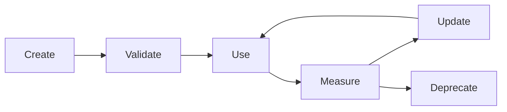

# Context lifecycle (instructions, prompts, packs)

This defines **how context evolves over time** so teams avoid **context drift**, **outdated instructions**, **conflicting rules**, and **prompt bloat**.

## Lifecycle stages

Every durable context artifact (repo instruction, Cursor rule, SDLC prompt, context pack, ADR) moves through:

| Stage | Purpose | Exit criteria |
|-------|---------|---------------|
| **Create** | New need identified (feature, incident, new locale) | Draft in branch; owner assigned |
| **Validate** | Accuracy, security, no conflict with narrower rules | Tech lead or domain owner sign-off |
| **Use** | Referenced from `AGENTS.md`, prompts, or code | In active use on real tasks |
| **Measure** | Eval scores, PR outcomes, incidents, re-prompt rate | Data captured per [AI_EVALUATION_SYSTEM.md](AI_EVALUATION_SYSTEM.md) |
| **Update** | Revise based on evidence | Version bumped; changelog note in file footer or PR |
| **Deprecate** | Superseded or harmful | Mark DEPRECATED; link replacement; removal date |

## Enforcement mechanisms (repo)

| Mechanism | Rule |
|-----------|------|
| **Versioning** | Product prompts in code: tie to commit + optional `PromptRegistry` table when control plane exists. Repo docs: date + version line at top of pack/prompt when materially changed. |
| **Expiry** | Context packs and high-churn prompts: add `Review-by: YYYY-MM-DD`; owners must review or extend. |
| **Ownership** | Each top-level artifact has an **owner** (role or name) in its header or in [AGENTIC_SDLC_GOVERNANCE.md](AGENTIC_SDLC_GOVERNANCE.md) RACI. |
| **Metrics** | Per-output evaluation + PR tracking; quarterly scorecard rolls up trends. |
| **Precedence** | On conflict, **narrowest path scope wins**; then **newest validated** over stale (see [AGENTS.md](../AGENTS.md)). |

## Where artifacts live

| Artifact | Location |
|----------|----------|
| Global / repo | [AGENTS.md](../AGENTS.md), [.github/copilot-instructions.md](../.github/copilot-instructions.md) |
| Path / stack | [.github/instructions/](../.github/instructions/), [.cursor/rules/](../.cursor/rules/) |
| SDLC prompts | [.github/prompts/](../.github/prompts/) |
| Language / culture | [docs/context-packs/](context-packs/README.md) |
| Decisions | [docs/adr/](adr/README.md) |
| Persistent “brain” index | [docs/engineering-brain/](engineering-brain/README.md) |

## Conflict resolution

1. Identify **scope** (repo vs `backend/**` vs story pipeline).  
2. Prefer the **more specific** file.  
3. If still conflicting, **open a PR** to merge wording; do not stack contradictory always-on rules.  
4. For product safety, **security and child-safety** rules override convenience shortcuts.

## Related

- [TAMIXA_AI_CONTROL_PLANE.md](TAMIXA_AI_CONTROL_PLANE.md) — target architecture for registry + audit  
- [AI_EVALUATION_SYSTEM.md](AI_EVALUATION_SYSTEM.md) — Measure stage inputs  
