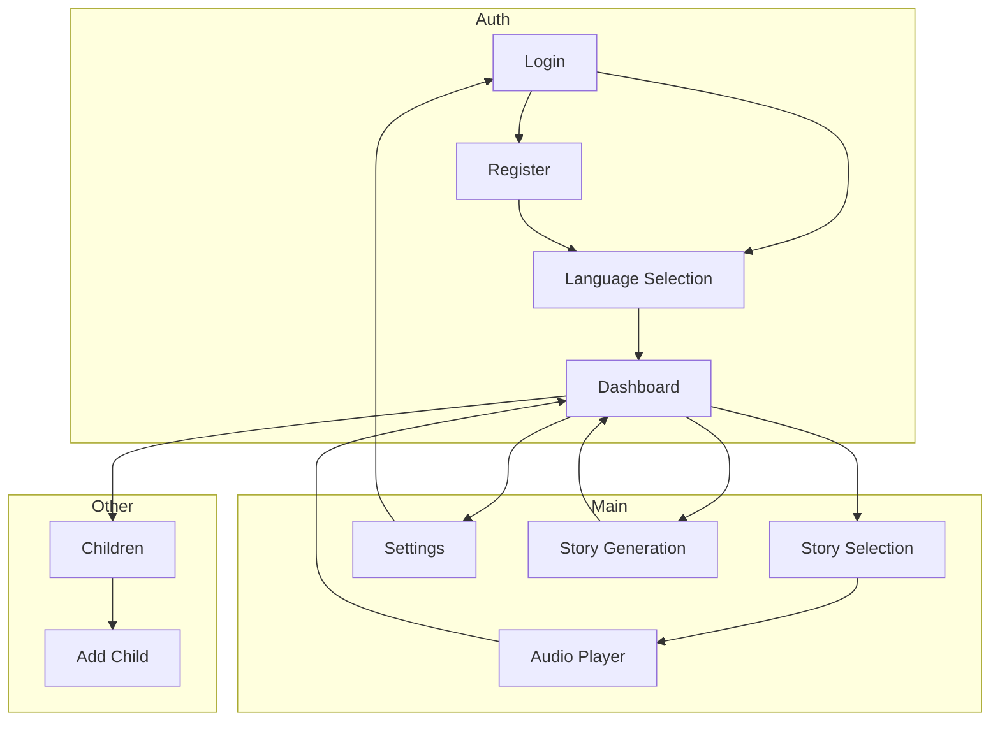
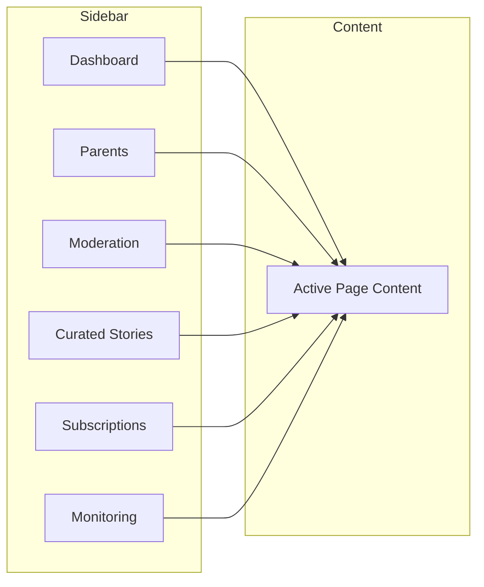
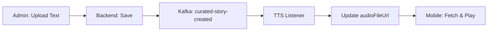

# Tamixa Dashboard Visualization

## Mobile App — Screen Flow

```
┌─────────────────────────────────────────────────────────────────────────────────┐
│                           TAMIXA MOBILE APP                                       │
└─────────────────────────────────────────────────────────────────────────────────┘

                                    ┌──────────────┐
                                    │    LOGIN     │
                                    └──────┬───────┘
                                           │
                    ┌──────────────────────┼──────────────────────┐
                    │                      │                      │
                    ▼                      ▼                      ▼
            ┌──────────────┐      ┌──────────────┐      ┌──────────────────┐
            │   REGISTER   │      │   LANGUAGE   │      │    DASHBOARD     │
            │              │      │  SELECTION   │      │  (Home / Stories) │
            └──────────────┘      │  (Tamil,     │      └────────┬─────────┘
                    │             │   Hindi,     │               │
                    │             │   English…)  │               │
                    └─────────────┴──────┬───────┴───────────────┤
                                        │                        │
                                        └────────────────────────┘
                                                 │
         ┌───────────────────────────────────────┼───────────────────────────────────────┐
         │                                       │                                       │
         ▼                                       ▼                                       ▼
┌─────────────────┐                   ┌─────────────────────┐              ┌─────────────────────┐
│  STORY SELECTION│                   │  STORY GENERATION   │              │      SETTINGS        │
│  (Browse stories│                   │  (Theme, child, age) │              │ (Language, dark)    │
│   + curated)    │                   │  AI → Tamil only     │              └──────────┬───────────┘
└────────┬────────┘                   └──────────┬──────────┘                         │
         │                                        │                                    │
         │                                        └──────────┬─────────────────────────┤
         │                                                   │                         │
         ▼                                                   ▼                         ▼
┌─────────────────┐                              ┌─────────────────────┐     ┌─────────────────────┐
│  AUDIO PLAYER   │◄────────────────────────────│  DASHBOARD (return) │     │       LOGOUT        │
│  (Play / Pause) │                              └─────────────────────┘     └─────────────────────┘
└─────────────────┘

         │
         └──────────────────┬─────────────────────────────────────────────────────────────────┐
                            │                                                                   │
                            ▼                                                                   ▼
                 ┌─────────────────────┐                                            ┌─────────────────────┐
                 │    CHILDREN LIST    │                                            │    VOICE UPLOAD     │
                 │    ADD CHILD        │                                            │    SUBSCRIPTION     │
                 └─────────────────────┘                                            └─────────────────────┘
```

### Mobile Dashboard (Home)

| Section | Content |
|---------|---------|
| **Header** | Greeting (e.g. Good evening), child name |
| **Categories** | All, Adventure, Animals, Bedtime, Folktales, Myths |
| **Story Cards** | AI-generated + Curated Tamil stories (theme, play) |
| **Actions** | New Story (AI), Settings, Refresh |

### Mobile Key Screens

| Screen | Route | Purpose |
|--------|-------|---------|
| Login | `/login` | Email/password or OTP |
| Language Selection | `/language` | Tamil, Hindi, English, Telugu, Kannada |
| Dashboard | `/dashboard` | Home, story grid, categories |
| Story Selection | `/stories` | Full list + Generate new |
| Audio Player | `/audio/{id}` | Play story (TTS or uploaded audio) |
| Story Generation | `/stories/generate` | Theme, child, age → AI Tamil story |
| Settings | `/settings` | Language, dark mode, logout |

---

## Admin Dashboard — Screen Flow

```
┌─────────────────────────────────────────────────────────────────────────────────┐
│                         TAMIXA ADMIN DASHBOARD                                    │
└─────────────────────────────────────────────────────────────────────────────────┘

                                    ┌──────────────┐
                                    │ ADMIN LOGIN  │
                                    │ (email/pwd)  │
                                    └──────┬───────┘
                                           │
                                           ▼
┌──────────────────────────────────────────────────────────────────────────────────┐
│  SIDEBAR (persistent)                    │  MAIN CONTENT AREA                    │
│  ─────────────────────                  │  ─────────────────                   │
│  • Dashboard                             │                                       │
│  • Parent management                     │  ┌─────────────────────────────────┐  │
│  • Story moderation                      │  │                                 │  │
│  • Curated stories         ◄───────────►│  │   [Active page content]        │  │
│  • Subscriptions                        │  │                                 │  │
│  • System monitoring                    │  │                                 │  │
│                                          │  └─────────────────────────────────┘  │
└──────────────────────────────────────────────────────────────────────────────────┘
```

### Admin Pages

| Page | Route | Content |
|------|-------|---------|
| **Dashboard** | `/dashboard` | KPIs, revenue chart, story usage, moderation flags |
| **Parent management** | `/dashboard/parents` | Parents table, search, pagination |
| **Story moderation** | `/dashboard/moderation` | AI-generated stories by status, Flag/Approve/Reject |
| **Curated stories** | `/dashboard/curated-stories` | Upload text → auto TTS, list, Refresh |
| **Subscriptions** | `/dashboard/subscriptions` | Plans, subscription table, invoices |
| **System monitoring** | `/dashboard/monitoring` | API latency, Kafka, Redis, error rate |
| **Stories** | `/dashboard/stories` | Story generation logs (status filter) |
| **Children** | `/dashboard/children` | Child profiles by parent |
| **Voice logs** | `/dashboard/voice-logs` | Voice upload audit |
| **Health** | `/dashboard/health` | DB, components status |
| **AI metrics** | `/dashboard/ai-metrics` | Story gens, cache hits, tokens |
| **Kafka** | `/dashboard/kafka` | Event stream (stub) |
| **Audit** | `/dashboard/audit` | Admin actions (stub) |

### Curated Stories Page (Admin)

| Section | Content |
|---------|---------|
| **Header** | "Curated Tamil stories" — "Upload story text only. Audio generated via TTS" |
| **Action** | Add curated story (dialog) |
| **Table** | ID, Title, Theme, Lang, Age, Words, Audio (Generated/Pending), Created |
| **Pagination** | Previous / Next |
| **Dialog** | Title, Theme, Content (Tamil), Age, Child name, Moral |

---

## Mermaid Flowcharts

### Mobile App Navigation



### Admin Dashboard Structure



### Curated Story Flow (End-to-End)



---

## Summary

| App | Entry | Primary Actions |
|-----|-------|-----------------|
| **Mobile** | Login → Language → Dashboard | Browse/play stories, generate AI story, settings |
| **Admin** | Login → Dashboard | Curated stories, parents, moderation, subscriptions |
