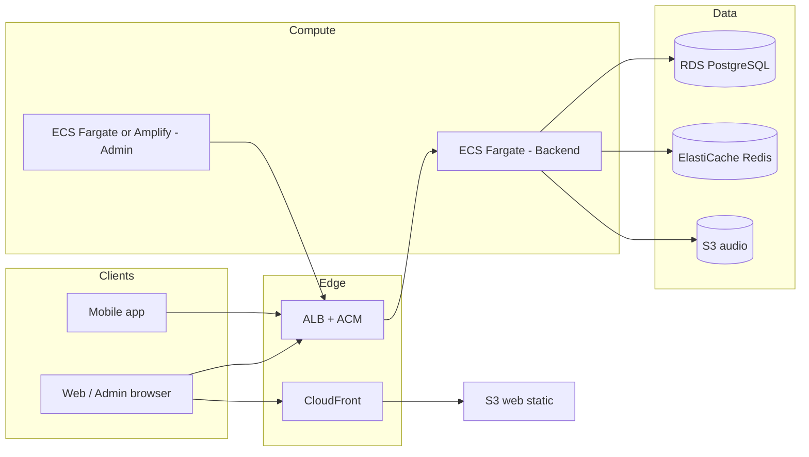

# Tamixa — AWS deployment plan

**Companion to:** [DEPLOYMENT_PLAN.md](DEPLOYMENT_PLAN.md) (generic phases, env vars, smoke tests).  
**Use this doc** when you want a concrete AWS layout: networking, data stores, compute, DNS, and secrets.

---

## 1. Target architecture (recommended MVP)



| Piece | AWS service | Notes |
|--------|-------------|--------|
| **API** | **ECS Fargate** + **Application Load Balancer** | Spring Boot on 8080; target group health → `/actuator/health` or `/api/v1/health` |
| **TLS** | **ACM** (certificate in same region as ALB) | Request cert for `api.yourdomain.com`; validate via DNS (CNAME at Squarespace or Route 53) |
| **DB** | **RDS PostgreSQL** (15+) | Private subnets; Flyway on ECS task startup or a **one-off migration task** before rolling out a release that needs new schema. Example: **V70** adds regenerate-prompt columns on `library_stories` — apply before new API/admin code. See [DEPLOYMENT_CHECKLIST.md](DEPLOYMENT_CHECKLIST.md#22-database-migrations-flyway). |
| **Redis** | **Elastiache Redis** (optional but matches prod.yml) | Rate limits, bulk jobs; same VPC as ECS |
| **Audio** | **S3** | Repo includes starter Terraform: `infra/terraform/s3/` — private bucket; backend uses IAM credentials or task role |
| **Web (Vite)** | **S3** + **CloudFront** | Static `dist/`; SPA error doc → `index.html` |
| **Admin (Next.js)** | **Amplify Hosting**, **ECS Fargate**, or **App Runner** | Needs Node at runtime if SSR/API routes; set `NEXT_PUBLIC_API_URL` at build time |
| **Images** | **ECR** | Push `docker build` output; ECS pulls from ECR |
| **Secrets** | **Secrets Manager** or **SSM Parameter Store** | `JWT_SECRET`, `DATABASE_*`, `OPENAI_API_KEY`, `GEMINI_API_KEY` (per `AI_LLM_PROVIDER` / features), etc. — inject as ECS secrets |
| **DNS** | **Route 53** *or* **Squarespace** | If DNS stays on Squarespace: **CNAME** `api.…` → ALB DNS name; **CNAME** `app.…` → CloudFront domain |

---

## 2. Phases (order of work)

### Phase A — Account & network

1. **Region** — Pick one (e.g. `us-east-1`) and stick to it for stateful resources.
2. **VPC** — New VPC with **2+ public subnets** (ALB) and **2+ private subnets** (ECS tasks, RDS, Redis).
3. **NAT Gateway** — So private subnets can pull images and call external APIs (OpenAI, Stripe, …). Cost-aware: single NAT for MVP.
4. **Security groups**
   - ALB: `443` (and `80` → redirect to 443) from `0.0.0.0/0`.
   - ECS tasks: allow **only** traffic from ALB SG on **8080**.
   - RDS / Redis: allow **only** from ECS task SG on DB/Redis ports.

### Phase B — Data layer

1. **RDS PostgreSQL** — Multi-AZ optional for prod; start with single-AZ + backups if budget-sensitive.
2. **ElastiCache** — Subnet group in private subnets; auth token in Secrets Manager.
3. **S3** — `terraform -chdir=infra/terraform/s3 init && apply` (adjust bucket name / CORS origins for your web admin origins instead of `*` when hardened).

### Phase C — Container registry & image

1. **ECR** repository e.g. `tamixa-backend`.
2. **Build & push** (from repo root, if `Dockerfile` is at root per [DEPLOYMENT_PLAN.md](DEPLOYMENT_PLAN.md)):

   ```bash
   aws ecr get-login-password --region YOUR_REGION | docker login --username AWS --password-stdin ACCOUNT.dkr.ecr.YOUR_REGION.amazonaws.com
   docker build -t tamixa-backend:prod .
   docker tag tamixa-backend:prod ACCOUNT.dkr.ecr.YOUR_REGION.amazonaws.com/tamixa-backend:prod
   docker push ACCOUNT.dkr.ecr.YOUR_REGION.amazonaws.com/tamixa-backend:prod
   ```

### Phase D — ECS Fargate (backend)

1. **Task execution role** — Pull from ECR, write logs to CloudWatch Logs.
2. **Task role** — `s3:GetObject` / `PutObject` on audio bucket (prefer IAM policy over long-lived keys if possible).
3. **Task definition** — Image from ECR; port **8080**; CPU/memory per load testing (e.g. 1 vCPU / 2 GB start).
4. **Environment** — Set `SPRING_PROFILES_ACTIVE=prod` and wire [Phase 2 env vars](DEPLOYMENT_PLAN.md#phase-2-backend-production-environment) from Secrets Manager / SSM.
5. **Service** — Desired count ≥ 1; attach to **ALB** target group; health check path `/actuator/health` or `/api/v1/health`.
6. **Prod hardening** — `SEED_ADMIN_ENABLED=false`, `CORS_ALLOWED_ORIGINS` exact HTTPS origins, trusted proxy so `X-Forwarded-For` is correct (ALB does this).

### Phase E — TLS & DNS

1. **ACM** — Request certificate for `api.tamixa.techadivas.com` (or your chosen API hostname).
2. **Validate** — DNS CNAME records ACM gives you (add in Squarespace).
3. **ALB listener** — HTTPS :443 with that cert; optional HTTP → HTTPS redirect.
4. **Public DNS** — CNAME **host** `api.tamixa` (if zone is `techadivas.com`) → **ALB DNS name** (ends with `elb.amazonaws.com`).  
   - NXDOMAIN usually means this record or nameservers are wrong — see troubleshooting in your DNS provider.

### Phase F — Web (static)

1. Build: `VITE_API_URL=https://api.tamixa.techadivas.com npm run build` (after [web API URL fix](DEPLOYMENT_PLAN.md#11-web-production-api-url-required) if not done).
2. S3 bucket (private); CloudFront origin = bucket; OAC (origin access control).
3. Default root `index.html`; custom error **403/404** → `/index.html` for SPA routing.
4. `app.…` CNAME → CloudFront distribution domain.

### Phase G — Admin (Next.js)

1. **Build-time:** `NEXT_PUBLIC_API_URL=https://api.tamixa.techadivas.com`.
2. **Host:** Amplify (connect Git + env vars) or Fargate behind same or second ALB host rule `admin.…`.
3. Lock down: IP allowlist, VPN, or strong org auth — per [DEPLOYMENT_PLAN.md](DEPLOYMENT_PLAN.md) Phase 6.

### Phase H — Observability & ops

- **CloudWatch** — Log groups for ECS; alarms on 5xx, CPU, memory, RDS connections.
- **Optional:** X-Ray, Contributor Insights, AWS WAF on ALB.
- **Backups** — RDS automated backups; S3 versioning (already in sample Terraform).

---

## 3. Environment variables → AWS mapping

| Concern | Where to set |
|--------|----------------|
| `DATABASE_*` | RDS endpoint in Secrets Manager; inject into ECS task |
| `REDIS_*` | ElastiCache primary endpoint |
| `JWT_SECRET`, `OPENAI_API_KEY` / `GEMINI_API_KEY`, … | Secrets Manager (`valueFrom` in task definition) |
| `S3_BUCKET`, `S3_REGION` | Task env; IAM task role for S3 |
| `CORS_ALLOWED_ORIGINS` | Plain env on task (comma-separated HTTPS origins) |
| `MAGIC_LINK_BASE_URL` | Your public web URL (`https://app.…`) |

Full list: [.env.example](../.env.example), [DEPLOYMENT_CHECKLIST.md](DEPLOYMENT_CHECKLIST.md).

---

## 4. What you can defer

- **Kafka / MSK** — App can run sync pipelines without Kafka initially ([DEPLOYMENT_PLAN.md](DEPLOYMENT_PLAN.md) risks).
- **Multi-AZ / read replicas** — Add when traffic justifies.
- **WAF** — Add before public marketing if abuse is a concern.

---

## 5. Smoke tests (AWS-specific)

```bash
# After DNS resolves
curl -sS "https://api.tamixa.techadivas.com/actuator/health"
curl -sS "https://api.tamixa.techadivas.com/api/v1/health"
```

Then run Phase 8 checks from [DEPLOYMENT_PLAN.md](DEPLOYMENT_PLAN.md#phase-8-post-deploy-verification).

---

## 6. Cost levers (high level)

- Fargate task size + count; RDS instance class; NAT Gateway count; ElastiCache node type; CloudFront egress; OpenAI/TTS usage (not AWS).

---

## 7. Related repo files

| Item | Path |
|------|------|
| S3 Terraform starter | `infra/terraform/s3/main.tf` |
| Backend prod profile | `backend/src/main/resources/application-prod.yml` |
| Docker image | `Dockerfile` (repo root per deployment doc) |
| Generic plan & commands | [DEPLOYMENT_PLAN.md](DEPLOYMENT_PLAN.md) |

---

## 8. DNS at Squarespace + API on AWS

- You do **not** need Route 53 if you keep the domain on Squarespace.
- Create **CNAME** for your API hostname → **ALB DNS name** (after ALB exists).
- **ACM validation** CNAMEs also go in Squarespace.
- Certificate must include the **exact** hostname (e.g. `api.tamixa.techadivas.com`).

If Squarespace will not accept a multi-part host like `api.tamixa`, use a **single-level** API host (e.g. `api.techadivas.com`) and point mobile/admin/web env vars to that instead.
