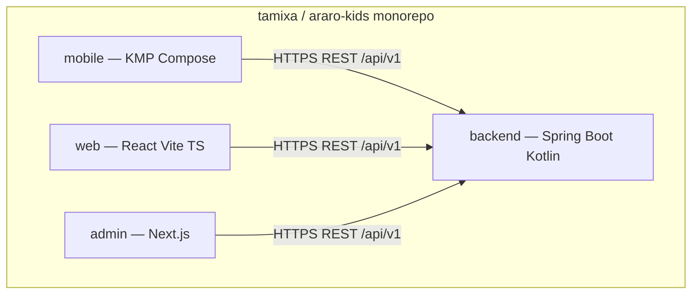
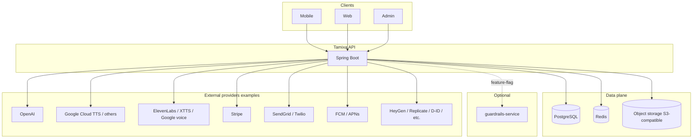
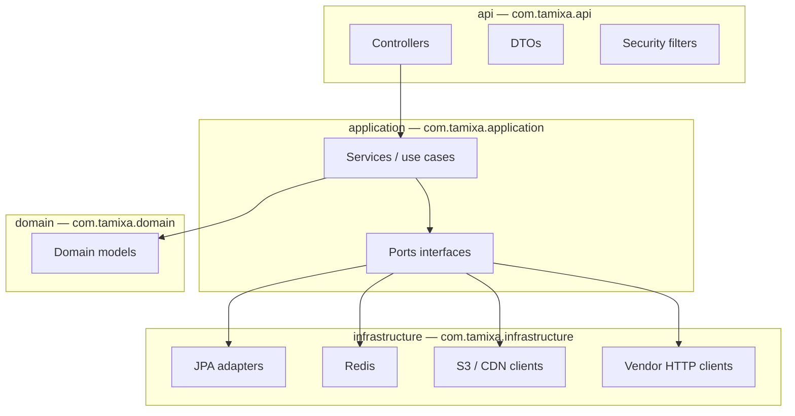
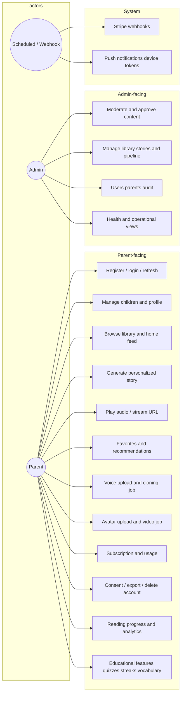
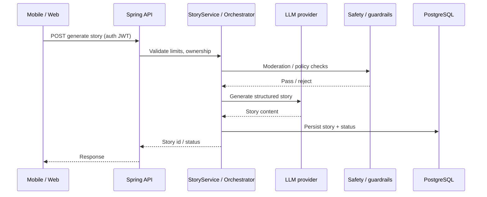
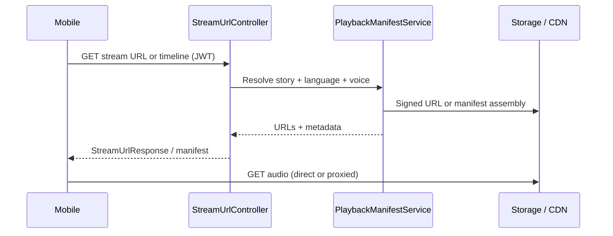
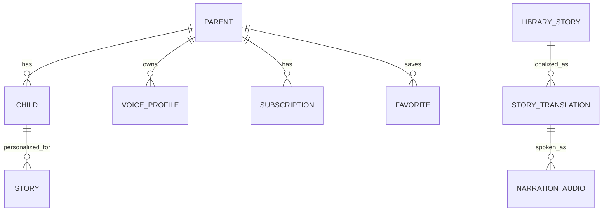
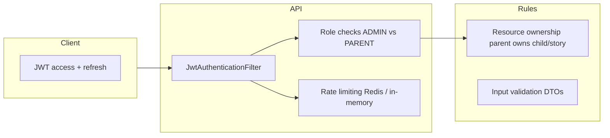
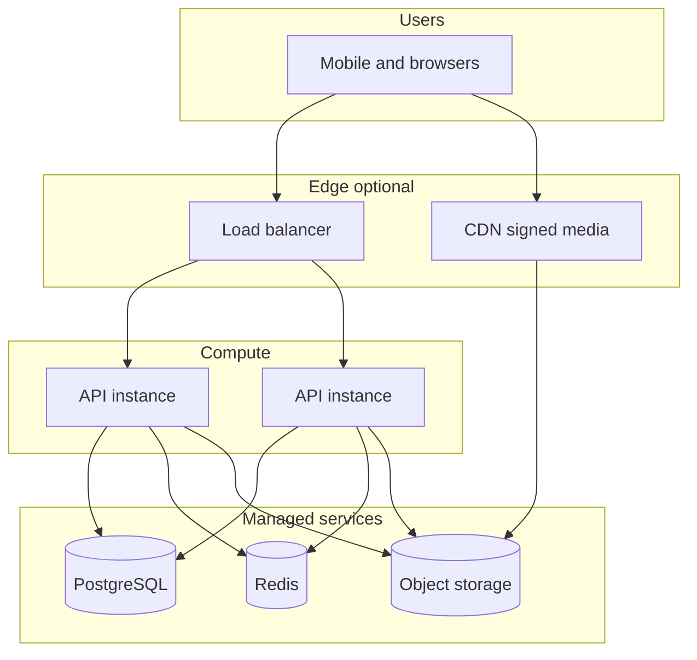

# Tamixa (araro-kids) — Project documentation

This document is the **single entry point** for understanding the Tamixa monorepo: what it is, who uses it, how pieces connect, and where to read more. It uses **Mermaid** diagrams (render in GitHub, GitLab, many IDEs, and Markdown preview tools).

**Related deep dives:** [ARCHITECTURE.md](ARCHITECTURE.md) (integrations map), [ARCHITECTURE_AND_FLOWS.md](ARCHITECTURE_AND_FLOWS.md) (mobile routes ↔ API), [backend/MODULAR_MONOLITH_STRUCTURE.md](backend/MODULAR_MONOLITH_STRUCTURE.md), [GETTING_STARTED.md](GETTING_STARTED.md). **Agentic SDLC:** [AGENTS.md](../AGENTS.md), [.github/prompts/](../.github/prompts/), [AGENTIC_SDLC_GOVERNANCE.md](AGENTIC_SDLC_GOVERNANCE.md), [MCP_POLICY.md](MCP_POLICY.md), [AI_EVALUATION_SYSTEM.md](AI_EVALUATION_SYSTEM.md), [AI_GOVERNANCE_E2E.md](AI_GOVERNANCE_E2E.md), [COST_GOVERNANCE.md](COST_GOVERNANCE.md), [CONTEXT_LIFECYCLE.md](CONTEXT_LIFECYCLE.md), [AGENT_EXECUTION_BOUNDARIES.md](AGENT_EXECUTION_BOUNDARIES.md), [TAMIXA_AI_CONTROL_PLANE.md](TAMIXA_AI_CONTROL_PLANE.md), [CONTROL_PLANE_ARCHITECTURE.md](CONTROL_PLANE_ARCHITECTURE.md), [METRICS_EXPORT.md](METRICS_EXPORT.md), [engineering-brain/README.md](engineering-brain/README.md), [context-packs/README.md](context-packs/README.md), [adr/README.md](adr/README.md), [specs/README.md](specs/README.md).

---

## 1. Product overview

**Tamixa** is an AI-assisted storytelling product for families: parents configure child-friendly profiles, browse a **story library**, generate **personalized stories**, listen with **TTS** (and optional **cloned parent voice**), and optionally use **avatar / video** experiences. An **admin** web app supports content operations, moderation, and pipeline tooling. A **parent web** client (React) complements the primary **mobile** app (Kotlin Multiplatform + Compose).

| Stakeholder | Primary surface | Goals |
|-------------|-----------------|--------|
| Parent / caregiver | Mobile (first), Web | Safe stories, personalization, subscription, voice/avatar setup |
| Child (via parent device) | Mobile | Listening, simple navigation within parent-controlled flows |
| Operations / content | Admin (Next.js) | Curated stories, approvals, users, health, revenue views |
| Platform / integrations | Backend | Auth, billing webhooks, AI/TTS vendors, storage, push |

---

## 2. Monorepo layout

Gradle includes **`backend`**, **`web`**, and **`mobile`** (see root `settings.gradle.kts`). **`admin`** is a sibling Node/Next.js app under `admin/` (not always wired as a Gradle submodule; run via `npm`).

| Path | Technology | Role |
|------|------------|------|
| `mobile/` | Kotlin Multiplatform, Compose, Ktor, Koin | Primary product: auth, library, generation, playback, subscriptions |
| `backend/` | Spring Boot 3, Kotlin, JPA, Flyway, Redis | Single REST API under `/api/v1`, integrations |
| `web/` | React, Vite, TypeScript | Parent web; dev proxy to API |
| `admin/` | Next.js 14, Tailwind, Radix | Internal dashboard; BFF-style proxy to API in places |
| `guardrails-service/` (optional submodule) | Python, FastAPI | Optional HTTP sidecar for structured JSON checks |

---

## 3. System context

External systems and data stores the **backend** coordinates. Clients only talk to the API (not directly to most vendors).

---

## 4. Backend internal architecture (hexagonal / layered)

The backend follows a **modular monolith**: one deployable, boundaries via **ports** (`application.port`) and **adapters** (`infrastructure`).

**Typical request path:** HTTP → controller → application service → port → adapter → DB / Redis / S3 / external API → DTO response.

---

## 5. Use cases (logical)

Actors and major capabilities (not every endpoint). **Parent** is the authenticated principal on mobile/web; **Admin** uses role-gated dashboard APIs.

---

## 6. Sequence: personalized story generation (simplified)

High-level flow; actual steps vary by **story source** (generated vs library) and feature flags.

Narration (TTS), translation, and avatar pipelines are often **asynchronous jobs** tracked via entities such as `processing_job` and related services—see [backend/NARRATION_ARCHITECTURE.md](backend/NARRATION_ARCHITECTURE.md).

---

## 7. Sequence: playback (stream URL)

---

## 8. API surface (domains)

REST is versioned under **`/api/v1`**. Illustrative controller areas (see `com.tamixa.api` for the full set):

| Domain | Examples |
|--------|----------|
| Auth | `AuthController` |
| Stories | `StoryController`, `StoriesApiController`, `LibraryStoryController` |
| Playback / stream | `StreamUrlController`, `AudioStreamProxyController`, `NarrationController` |
| Voice / avatar | `VoiceController`, `VoiceCloningController`, `FamilyAvatarController` |
| Subscription | `SubscriptionController`, webhooks |
| Parent / profile | `ProfileController`, `HomeController` |
| Analytics / progress | `PlaybackPositionController`, `StoryAnalyticsController`, `ListeningProgressController` |
| Admin | `AdminController`, `AdminUserController` |
| Education | `QuizController`, `ReadingLevelController`, `ReadingStreakController`, `VocabularyController`, `TeacherController` |
| Compliance | `ConsentController`, `DataExportController` |
| Ops | `HealthController`, `DeviceController` |

Swagger/OpenAPI is available in dev as described in the root [README.md](../README.md).

---

## 9. Conceptual data model (ER sketch)

Not every table is shown; this captures core relationships for storytelling.

Exact table names match Flyway migrations under `backend/src/main/resources/db/migration/`.

---

## 10. Security model (high level)

- **Admin** routes require elevated roles/permissions (see `AdminAuth`, `AdminPermission`).
- **Secrets** come from environment variables; never commit `.env` (see [.env.example](../.env.example) and [ENV_REFERENCE.md](ENV_REFERENCE.md)).

---

## 11. Deployment view (generic)

Concrete AWS/GCP steps live in [DEPLOYMENT_CHECKLIST.md](DEPLOYMENT_CHECKLIST.md), [PRODUCTION_UPGRADE.md](PRODUCTION_UPGRADE.md), and related plans.

---

## 12. Mobile navigation vs backend (reference)

The mobile app’s **screens and API alignment** are documented in [ARCHITECTURE_AND_FLOWS.md](ARCHITECTURE_AND_FLOWS.md) (route → `*Controller`). Folder layout: [mobile/FOLDER_STRUCTURE.md](mobile/FOLDER_STRUCTURE.md).

---

## 13. Documentation map

| Topic | Document |
|--------|----------|
| Integrations and optional guardrails | [ARCHITECTURE.md](ARCHITECTURE.md) |
| Narration / TTS pipeline | [backend/NARRATION_ARCHITECTURE.md](backend/NARRATION_ARCHITECTURE.md) |
| Voice cloning | [VOICE_CLONING_ARCHITECTURE.md](VOICE_CLONING_ARCHITECTURE.md) |
| Avatar video | [AVATAR_VIDEO.md](AVATAR_VIDEO.md) |
| Security | [SECURITY.md](SECURITY.md) |
| Env vars | [ENV_REFERENCE.md](ENV_REFERENCE.md) |
| AI guardrails | [AI_GUARDRAILS.md](AI_GUARDRAILS.md) |
| Admin UI / pipeline | [admin/](admin/) |
| Cursor / agent rules | [AGENTS.md](../AGENTS.md), [CURSOR_AGENTS_GUIDE.md](CURSOR_AGENTS_GUIDE.md) |

---

## 14. Revision note

Implementation evolves; if a diagram disagrees with code, **code and Flyway migrations win**. Prefer updating this file when you add major domains (new controller packages, new clients, or deployment topology changes).
