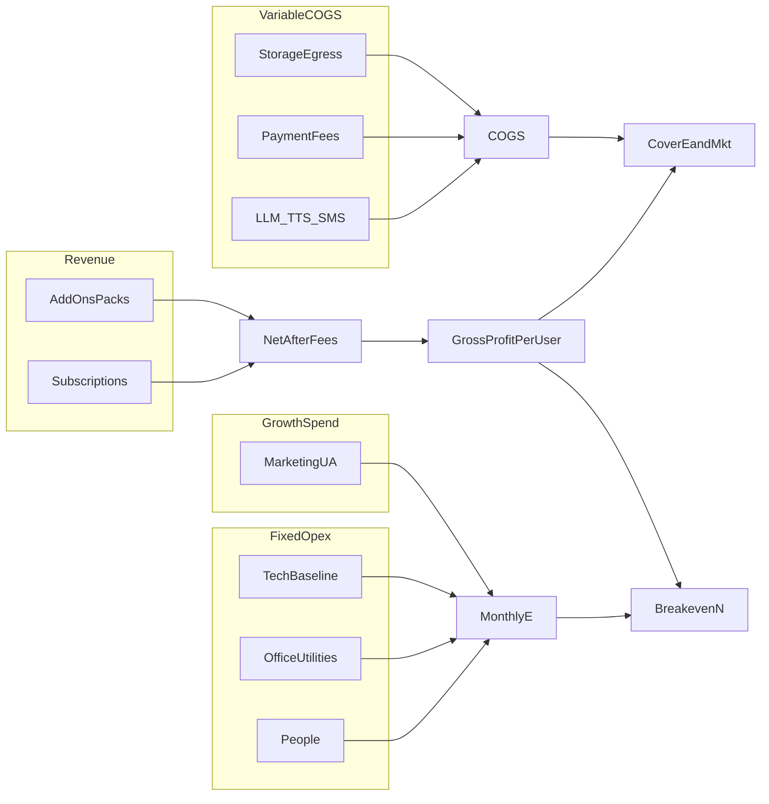

# Tamixa — cost estimation and marketing plan

**Purpose:** Assumption-driven operating model for Tamixa (mobile-first kids/parents app, Spring Boot API, Stripe/Zoho subscriptions, OpenAI + optional Google TTS, Twilio SMS, S3 storage, optional avatar/voice providers). **Replace placeholder ₹ amounts** with your real quotes and payroll.

**Related docs:** [Deployment plan](DEPLOYMENT_PLAN.md) (hosting and rollout), [Environment reference](ENV_REFERENCE.md) (feature flags and cost-driving env vars), root [.env.example](../.env.example) (full integration surface).

---

## Part A — Cost estimation

### A1. Cost taxonomy

Split monthly spend into four buckets so scenarios stay comparable:

| Bucket | What belongs here | Examples |
|--------|-------------------|----------|
| **Variable COGS (per usage)** | Scales with stories, listening, and transactions | LLM tokens, moderation/translation, TTS characters/minutes, SMS OTP, payment processing fees, S3 storage + egress for audio |
| **Fixed tech** | Baseline to run the product | Compute (containers/VMs), PostgreSQL, Redis, load balancer / CDN, domains, TLS, backups, logs/metrics/tracing |
| **Fixed company opex** | People and overhead unrelated to a single API call | Salaries, rent, utilities, CA/legal/insurance, workspace and support tools |
| **Growth** | Paid acquisition and brand | Paid social/search, creators, creative production, experiments — often budgeted **separately** from “core fixed opex” so Lean/Base/Scale stay readable |

**Hosting note:** You can map “fixed tech” to a reference stack (e.g. Fargate + RDS + ElastiCache + S3 + CloudFront, or equivalent on another cloud) without committing to a single vendor in this doc.

### A2. Scenario tables (single place to edit)

Three scenarios — **all figures in ₹/month**. Adjust rows to match your team and suppliers.

#### Lean (validation / small team)

| Line item | ₹/month | Notes |
|-----------|--------:|-------|
| People | *e.g. 2,50,000* | Founders + 0–1 contractor |
| Office | *e.g. 15,000* | Coworking or home office stipend |
| Connectivity | *e.g. 5,000* | Internet, phones |
| Marketing | *e.g. 50,000* | ASO + organic-heavy |
| Tech fixed | *e.g. 35,000* | Small RDS/Redis, minimal observability |
| Variable COGS | *model below* | LLM + TTS + SMS + fees + storage |
| **Subtotal (excl. variable)** | *sum* | |
| **Variable (estimated)** | *calc* | See variable model |

#### Base (post-PMF, modest scale)

| Line item | ₹/month | Notes |
|-----------|--------:|-------|
| People | *e.g. 4,00,000* | Small eng + part-time support |
| Office | *e.g. 40,000* | |
| Connectivity | *e.g. 10,000* | |
| Marketing | *e.g. 1,00,000* | Mix of paid + organic |
| Tech fixed | *e.g. 80,000* | HA DB, Redis, CDN, logging |
| Variable COGS | *model below* | |
| **Subtotal (excl. variable)** | *sum* | |
| **Variable (estimated)** | *calc* | |

#### Scale (higher MAU / heavier pipelines)

| Line item | ₹/month | Notes |
|-----------|--------:|-------|
| People | *e.g. 8,00,000* | Eng, content ops, support |
| Office | *e.g. 80,000* | |
| Connectivity | *e.g. 15,000* | |
| Marketing | *e.g. 3,00,000* | UAC + partnerships |
| Tech fixed | *e.g. 2,00,000* | Multi-AZ, reserved capacity, enterprise observability |
| Variable COGS | *model below* | |
| **Subtotal (excl. variable)** | *sum* | |
| **Variable (estimated)** | *calc* | |

#### Variable COGS model (plug in your unit costs)

Use one consistent driver, e.g.:

**Option A — per story:**  
`monthly variable ≈ (₹/story) × (stories generated/month)`  
Derive ₹/story from: average prompt+completion tokens × OpenAI price, plus average TTS minutes × TTS price, plus allocated moderation/translation, plus a small share of SMS if OTP-heavy.

**Option B — per 1K tokens + TTS:**  
Split LLM, TTS, SMS, and payment fees into separate mini-lines and sum.

Include **payment processing** as % of gross subscription revenue (Stripe/Zoho), not as part of “₹/story” unless you fold it into **G** (recommended: keep fees in **G** definition below).

### A3. Subscription economics and breakeven

**Definitions**

- **G** = net revenue per **paying** user per month, **after** payment processing and platform fees, **minus** variable COGS attributable to that user (LLM/TTS/SMS/storage share you allocate to payers).
- **E** = total monthly **fixed** opex you want subscriptions to cover — typically people + office + connectivity + **fixed tech** + any baseline tools. (If you treat marketing as fixed for a given quarter, include it in **E**; if you treat marketing as discretionary, model it separately.)
- **Breakeven payers:**  
  \[
  N \approx \frac{E}{G}
  \]
- **Target profit Π (monthly):**  
  \[
  N \approx \frac{E + \Pi}{G}
  \]

**Worked example — E = ₹4,00,000/month**

| G (₹/payer/month) | Approx. payers N to break even (N = E / G) |
|-------------------|-------------------------------------------|
| 150 | ~2,667 |
| 200 | ~2,000 |
| 250 | ~1,600 |
| 300 | ~1,333 |
| 400 | ~1,000 |

If you also need **₹1L/month profit** with the same **G**, use \(N = (4,00,000 + 1,00,000) / G\) (e.g. at G = 250 → **2,000** payers).

### A4. Plan-level guardrails (product reality)

Entitlements and caps are grounded in code and config:

- **Plans:** [`SubscriptionPlan.kt`](../backend/src/main/kotlin/com/tamixa/domain/SubscriptionPlan.kt) — `FREE`, `STARTER`, `PREMIUM_*`, `FAMILY`, `VOICE_PREMIUM`. Comments in code note e.g. FREE = 5 stories/month, STARTER = 15/month and no voice/avatar (India INR positioning).
- **Configurable limits:** [`AppProperties.kt`](../backend/src/main/kotlin/com/tamixa/infrastructure/config/AppProperties.kt) → `SubscriptionProperties` defaults (overridable via env in [`application.yml`](../backend/src/main/resources/application.yml)):
  - `freeStoriesPerMonth` — default **5** (`SUBSCRIPTION_FREE_STORIES_PER_MONTH`)
  - `starterStoriesPerMonth` — default **15** (`SUBSCRIPTION_STARTER_STORIES_PER_MONTH`)
  - `freeVoiceGenerationsPerMonth` — default **5** (`SUBSCRIPTION_FREE_VOICE_GENERATIONS_PER_MONTH`)
  - `trialDays` — default **7**, `gracePeriodDays` — default **3**

**Additional usage guardrails** (affect COGS and abuse risk):

- **AI token limits:** `AiTokenLimitProperties` — per-parent daily and system-wide daily caps; circuit breaker spike threshold.
- **Narration / TTS:** `NarrationProperties` — daily token limit, max narration tokens, concurrent TTS and job limits.
- **Story content:** `StoryProperties` — max words, safety score threshold, theme allowlists.
- **Rate limits:** `RateLimitProperties` — general API, auth, story generation buckets (free vs paid vs suspicious).

**“Unlimited” premium and usage risk**

Marketing “unlimited” or very high caps **increases tail risk** on LLM/TTS bills if a small number of accounts automate or share usage. Recommendation:

1. Monitor **OpenAI and TTS usage** against MAU and paying users (admin metrics you already expose along OpenAI-heavy paths).
2. Define **fair-use** in parent-facing terms and enforce softly (warnings) then technically (caps or throttles) if needed.
3. Keep **Starter vs Premium** positioning honest: Starter’s lower story cap is a natural COGS hedge; Premium should still align with sustainable **G** under your scenario tables.

---

## Part B — Marketing plan

### B1. Positioning (non-negotiable narrative)

- **Avoid** anchoring primarily to mass-market OTT annual pricing (e.g. broad “₹699/year” entertainment bundles). That frame undervalues **personalized, child-specific** story + audio value and parent trust work.
- **Prefer** anchors that match the product:
  - **Personalized AI + audio for *this* child** (name, interests, reading level where relevant).
  - **Regional / multilingual** value (Tamil, Hindi, and other supported languages).
  - **Parent trust:** safety, transparency, healthy screen-time framing (audio-first bedtime, co-listening).

**Competitive frame (directional — refresh prices from official sites):**

- **Audio catalog apps** (e.g. Storytel, Spotify audiobooks band): large libraries, limited personalization.
- **General AI software** (e.g. consumer ChatGPT tiers): powerful but not a **child-safe, parent-governed** story product.

Tamixa sits as **specialized family software**, not a commodity video streamer.

### B2. ICP and geography

| Segment | Profile |
|---------|---------|
| **Primary ICP** | Urban / semi-urban **Indian parents**, comfortable in **English + at least one regional language**, smartphone-first, children roughly **3–10** |
| **Secondary** | Diaspora families; gift buyers (grandparents) — lower priority for v1 GTM messaging |

### B3. Channel mix (0–12 months)

| Phase | Focus | Tactics |
|-------|--------|---------|
| **0–3 mo** | Learn + cheap proof | ASO (title, screenshots, Tamil/Hindi keywords), organic short clips (app + child delight), parent communities (Reddit/FB — **value posts, not spam**), **20–50 parent interviews** for messaging |
| **3–6 mo** | Scalable acquisition | Meta/Google UAC (small budgets, creative testing), micro-influencers (mom/dad/education; **clear disclosure**), school/daycare **partnerships** where permitted (flyers, demo days), referral incentives if product supports them |
| **6–12 mo** | Retention + LTV | Email/WhatsApp **opt-in** journeys, seasonal campaigns, win-back for churned payers, optimize paywall (Starter vs Premium) |

### B4. Budget allocation (templates)

If total company spend is on the order of **~₹4L/month**, **do not** hard-code a global marketing % in this doc — pick a band per season.

**Bootstrapped**

- Marketing roughly **₹50k–₹1.5L/month** + heavy organic (ASO, community, founder-led content).

**Growth**

- Marketing **20–40%** of **target net revenue**, *or* a fixed **₹2L–₹5L/month** with explicit **stop-loss ROAS** rules and weekly caps.

**Split guidance (starting point):**

- ~**40%** paid social/search  
- ~**25%** creators  
- ~**20%** creative + tools  
- ~**15%** experiments / partnerships  

### B5. KPIs and guardrails

| Area | Metrics |
|------|---------|
| **Acquisition** | CPI (install), CAC (paid subscriber), install → trial, trial → paid |
| **Unit economics** | **G**, payback months ≈ CAC / G, churn, monthly retention |
| **Product** | Stories per user, voice/avatar attach rate, support tickets per 1k MAU |
| **Compliance** | Children’s marketing sensitivity: no deceptive dark patterns; subscription copy aligned with **App Store / Play** policies and clear parent-facing renewal terms |

### B6. 90-day execution calendar (minimum bar)

| Week | Actions |
|------|---------|
| **1** | ASO baseline: title, subtitle, keyword set, first screenshot set |
| **2** | Parent interview sprint (5–8 calls); document top 3 pains and 3 delights |
| **3** | Ship **3 creative angles** (e.g. bedtime calm, bilingual pride, “their name in the story”) for organic + future paid |
| **4** | Landing/paywall hypothesis **#1** (headline + primary CTA) |
| **5** | Hypothesis **#2** (Starter vs Premium emphasis) |
| **6** | Small paid test budget with **weekly spend cap**; track CPI and signup quality |
| **7–8** | Double down on best angle; kill losers |
| **9** | First **monthly review**: CAC vs **G**, creative refresh plan |
| **10–11** | Community / partnership outreach (2–3 concrete conversations) |
| **12** | Retention hooks: onboarding email/WhatsApp **opt-in** copy; churn reason survey |

---

## How cost and marketing connect

---

## Optional follow-ups (out of scope unless requested)

- Internal dashboard row: **estimated COGS this month** from existing usage metrics (backend/admin work).
- Localized paywall copy experiments on mobile (separate UI plan).
